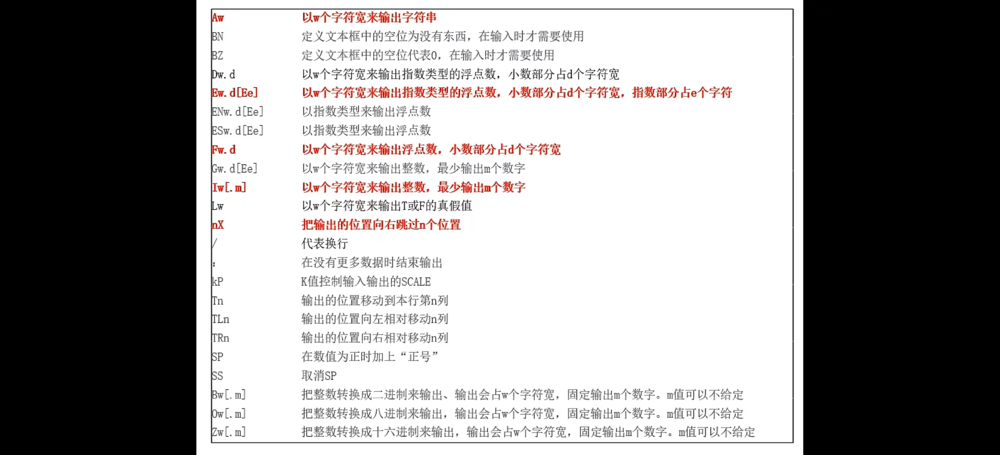

## 字符串函数
- INDEX(string,key[,.true.])
- 返回字符串key在string中第一次出现的位置，第三个变量为真从右起。
```
 string ="Have a nice day nice"
 substring ="nice"
 write (*,*) index (string ,substring)
 write (*,*) index (string ,substring,.true.)
```
- ADJUSTL (string)
将字符串左端对齐，即去掉左端空格
- ADJUSTR ( string )
- 将字符串右端对齐，即去掉右端空格
```
 string =" Have a nice day nice "
 adjustl 结果为"Have a nice day nice "
 adjustr 结果为" Have a nice day nice"
```

## 逻辑变量 (LOGICAL)
- 在逻辑判断时使用，通常编译器自行选择保存空间大小
 logical a 
- 它只用来保存两种数值："真"或"假" 
1. a =.true.  !设置为真值，注意前后要加上两个点 
2. b =.false.  !设置为假值，注意前后要加上两个点
用 write 显示时只会出现一个" T "或" F "
```
 write (*,*) a 
 write (*,*) b 
```

## 格式化输入输出(FORMAT)
- 格式化输出的目的就是把数据经过"有计划"的版面设计显示出来
- 某些情况下要读取数据时，要设置恰当的输入格式

### FORMAT 命令可以用来设置输出格式
```
 program ex0420
 integer a 
 a =100
 write (*,*) a   !默认输出格式
 write (*,100) a   !使用编号为100的行设定的格式来输出
100 format (I4)    !把这一行代码设定编号为100
End
``` 
>I4:格式设定为使用4个字符宽来输出整数

- write (*,"(1X,I5)") a 
- 优点：
1. 减少程序行数
2. 阅读清楚明了
3. 可避免在代码中使用行号
- 缺点：
1. 输出格式很复杂时，编写较麻烦
2. 在不同地方使用相同的输出格式时，代码会重复


## 详论格式化输出
" I 、 F 、 E 、 A 、 X "。是最常用的几个格式
```
 I ( Integer )﹣整型
 F ( Float )--小数
 E ﹣科学计数法小数
 A ﹣字符
 X ﹣空格
```

### Iw [.m]
以 w 个字符长来输出整数，至少输出 m 个数字
- write (*,"(I5)")100:以5个字符的长度来输出一个整数,输出结果前面会补2个空格
- write (*,"(I3)")1000:输出格式设置位数不足时，会输出 *
- write (*,"(I5.3)")10:以5个字符的长度来输出一个整数，至少输出3个数字，位数不足补0,输出结果前补2个空格，1个0

### Fw.d 
以 w 个字符长来输出实数，小数部分占 d 个字符
- write (*,"(F9.3)")123.45:以9个字符长度来输出实数，小数部分占3个位数,总长度不足9位，前面补空格，小数部分不足3位，后面补0
- write (*,"(F6.3)")123.45:总长度减小数部分与小数点长度后，整数部分长度不足会输出 *
- write (*,"(F9.1)")123.45:以9个字符长度来输出实数，小数部分占1个位数,小数部分超过1位，舍入

### Ew.d[Ee]
用科学计数法，以 w 个字符长来输出实数，小数部分占 d 个字符长，指数部分最少输出 e 个数字
- write (*,"(E15.7)")123.45:使用15个字符长度，小数部分占7位,总长度不足15位，前面补空格；小数部分不足7位，后面补0;指数部分包括正负号与2位数字
- write (*,"(E9.2E3)")12.34:含空格共输出9个字符，其中2位小数，指数部分有3位数字
- write (*,"(E11.7)")12.345:使用11个字符长度，小数部分占7位,小数部分长度（含小数点）与指数部分长度（含 E 符号）之和大于总长度，输出 *

### Aw 
以 w 个字符长来输出字符串
- write (*,"(A10)")" Hello ":使用10个字符长度输出字符串,总长度不足10位，前面补空格
- write (*,"(A3)")" Hello ":使用3个字符长度输出字符串,超过3个字符的部分会被省略掉（从左侧写起）

### nX 
输出位置向右移动 n 位（输出 n 个空格）
- write (*,"(5X,I3)")100:先填5个空格，再输出整数,前面5个空格是从格式5X中得到

### Lw 
以 w 个字符长来输出 T 或 F 的真假值
- write (*,"(L4)").true.:使用4个字符长度输出逻辑变量,输出3个空格和1个T

### Gw.d 
 以 w 个字符长来输出所有类型的数据， d 不一定会使用，但不能省略 
 
 用来输入／输出字符／整数／逻辑数时，Gw.d=Aw/Iw/Lw,d必须随便给一个数字，不能省略
 
 用来输入／输出实数时，Gw.d=Fw.d或Ew.d ,n<0.1-0.5*10的(-d-1)次方或n>=10的d次方-0.5时，等于Ew.d其他情况等于(Fa.b,4X)，其中a=w-4,b＝剩余位数
```
 write (*,"(G9.4)")123.0   !G9.4=F5.1,4X
 write (*,"(G9.2)")123.0   !G9.2=E9.2
```

### 换行输出
```
 write (*,"(I3//I3)")10,10。  !／代表换行
 write (*,"(I3,/,/,I3)")10,10 !可以中间加逗号
```
结果得到3行输出，每一个"I"会换一行然在该行继续输出

### Tc 
把输出的位置移动到本行的第 c 个字符
```
 write (*,"(T3,13)")100  ！把输出位置移动到第3个字符
 write (*,"(10X,T3,I3)")100   ！输出位置向右移动10个字符后，移动到第3个字符
```
两行程序得到同样的输出结果，输出位置都移动到第3个位置
 
- TLn 
 write (*,'(1X,A10,TL3,I3)')'Call 119',110
 
 输出： Call 110

- TRn 
输出位置相对向右移动 n 个字符

- 可以重复地以同样的格式输出数据
write (* ,"(3(1X,F5.2))")1.0,2.0,3.0  !连续以3个1X,F5.2的格式来输出3个实数
write (*,'(3I3)')1,2,3    !连续以3个I3的格式来输出3个整数

- 可以放进要输出的字符串
```
 write (*,"('3+4=',I1)")3+4   ！用单引号封装字符
 write (*,'(''3+4='',I1)')3+4 ！用两个单引号封装字符
 write (*,'("3+4=",I1)')3+4   ！用双引号封装字符
 write (*,('3+4=',I1)')3+4    ! error 
 write (*,"("3+4=",I1)")3+4   ! error 
```
- 可以把输出格式放在字符串变量中
```
 program ex0425
 character ( len =10) fmtstring 
 fmtstring ="(12)"
 write (*, fmtstring )3
 end 
```
>可以通过更改字符串的值来动态改变输出格式：fmtstring (3:3)="5"
- 使用输出格式时，注意"类型"是否正确，有时逗号可以省略
```
 write (* ,"(1XI5)")5     ！空格格式后的逗号可以省略 
 write (*,"(I5,f5.1)")a,b ！逗号不能省略
```

## PRINT的用法和WRITE类似，只是不能指定输出位置
```
 print *, a 
 print 100, a    ！使用行代码100的 format 输出
 print "(A10)"," Hello "   ！把格式字符串写在print中
```
- 输出格式可以在输入命令 READ 中使用
- 字符串可以作为" unit "来使用
```
 character*10 s 
 real*8 p 
 write ( s ,*)'3.1415926'！把数据写入字符串变量 s
 read ( s ,*) p   ！将 s 中的内容读入到实型变量 p
```

## 关于声明的其他事项
变量名称的取名策略
- 变量的名字可以使用字符集英文26个字母，0~9这10个数字以及下划线"_"，首字母必须是英文字母
- 变量的名字最好是取一个有意义的英文单词，这样可以减少程序编写时出错的机会

## IMPLICIT 命令
变量并不一定要经过程序的声明才能使用，编译器会根据变量名称的第一个字母来自动决定这个变量的类型。
- 第1个字母为 I 、 J 、 K 、 L 、 M 、 N 的变量会被视为整数类型
- 其他字母打头会被认为是实数

### 可以用 IMPLICIT 命令来设置"默认类型"
不经过声明，由变量的第一个字母决定变量类型设置
- 以 A 、 B 、 C 开头的变量都视为整型数：
 implicit integer ( A , B , C )
- 设置 A 到 F 及 I 、 K 开头的变量都视为整型数：
 implicit integer ( A - F , I , K )
- 设置 M 到 P 开头的变量都视为实型数：
 implicit real ( M - P )

### 变量不经声明使用，容易发生"人为错误"
```
 program ex0428
 i =123+321
 write (*,"('123+321=',l4)") j 
 end 
```
- IMPLICIT NONE 
关闭"默认类型"功能，所有变量必须进行声明，否则会出错
- IMPLICIT 命令必须放在 PROGRAM 命令的下一行

## 常数的声明方法
- 程序中有些数据是永远固定、不会改变的常数。
- 常数只能在声明时通过 parameter 来设置数值，而且只能设置一次
```
 real pi 
 parameter ( pi =3.14159)
或者
 real , parameter :: pi =3.14159    ! pi 前面的冒号不能省
```
"::"表示形容词已经形容完毕，准备要开始给定变量名称

## 设置变量的初值
变量可以在声明时同时给予初值
```
 integer :: a =1
 real :: b =2.0
 complex :: c =(1.0,2.0)
 character ( len =20):: str =" Fortran 90"
```
或者使用 DATA 语句
 DATA a , b , c , str /1,2.0,(1.0,2.0)," Fortran 77"/

## 等价声明(EQUIVALENCE )
- 把两个以上的变量，声明使用同一内存地址，就是"等价声明"。
- 使用同一内存位置的变量，只要改变其中一个变量，就会同时改变其他变量的数值
- 等价声明的方法
```
 integer a , b 
 equivalence ( a , b )    ! a , b 使用同一内存空间
```
- 优点
1. 节省内存：声明一些暂时使用的变量
2. 精简代码： equivalence ( array (1,1,5), a )
2人正在看

### 声明在程序中的结构
- 声明的位置应该放在程序代码的可执行命令之前。
- 在程序代码开始出现数值计算和输入输出命令时，就不能再声明变量。
- DATA 也算声明的一部分
```
 program main 
 implicit none 
 声明变量
 可执行命令（赋值、计算、输入输出等）
end 
```

## 混合运算
- 混合运算是指在算式中参与计算的数字或变量的类型不完全相同。
- 进行混合运算时，最好先经过类型转换的工作，把数据类型都统一起来。
- 编译器会自动做一些类型转换的工作，但不一定能正确达到要求。
- 为避免意外，当算式变量类型不统一时，最好由程序员自行来完成数据转型的工作。

转为整型int

转为单精实型real

转为双精实型 dble

## 自定义数据类型
自定义数据类型： Fortran 能够自由组合一些基本数据类型，创造出一个更复杂类型组合的功能" TYPE "。
```
 type :: person   ！开始创造一个叫 person 的数据类型
 character ( len =30):: name   ！记录姓名
 integer :: age    ！记录年龄
 integer :: length ！记录身高
 integer :: weight ！记录体重
 character ( len =80):: address   ！记录姓名\
end type person   ！自定义数据类型结束
```
- 使用方法：
- 注意：如果有自定义数据类型，应该首先进行
```
 type ( person ):: a    ！声明一个 person 类型的变量
 read (*,*) a%name 
 write (*,*) a%name
``` 
- 可以直接设置所有元素
 a = person (" Peter ",20,170,60," Qingdao , China ")
- 使用方法：
1. 声明时应用
2. 可以先使用 Fortran 90库函数来判断所要记录的数值范围所需要的 KIND 值
```
 selected_int_kind(n)返回能够记录 n 位整数，所应声明的 kind 值。返回﹣1时，表示无法提供所需的值域范围
 selected_real_kind( n , e )返回能够记录 n 位有效位数、指数达到 e 位的实数时，所应声明的 kind 值。返回﹣1时，表示无法满足所需有效位数；返回﹣2时，表示无法满足所需指数位数；返回﹣3时，表示两者都无法满足
```
在数字后面加下划线，赋值所要使用的 KIND 值
