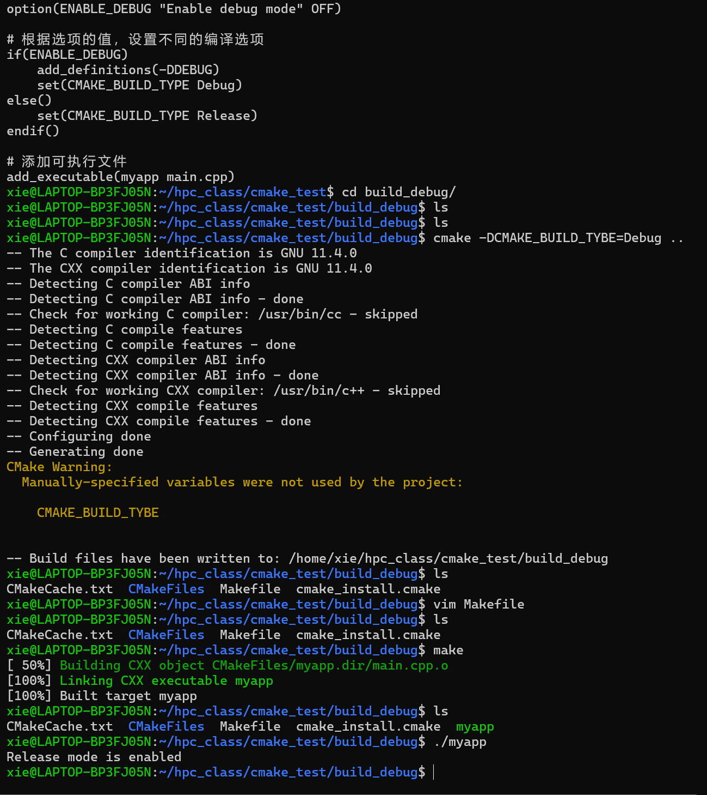

## 编译链接 
### 预处理：
- gcc -E hello.c -o hello.i:
>(预处理器会处理源代码中的预处理指令（以 # 开头的行），例如包含头文件 (#include)、宏替换 (#define) 等。它会将头文件 stdio.h 的内容插入到 hello.c 中，并进行其他的文本替换工作。)
- gcc -E -DUSE_INT add.c add.i
>(-E表示仅进行预处理，-DUSE_INT相当于在代码中定义USE_INT宏，所以预处理后DATA会被替换为int,预处理 结果会输出到add.i文件)
- gcc -E add.c add.i
>(仅进行预处理，由于没有定义USE_INT宏，预处理后DATA会被替换为long long，预处理结果输出到add.i文件)
### 编译
- gcc -s hello.i -o hello.s
>(编译器将预处理后的C代码hello.i翻译成特定于目标机器的汇编语言代码)

https://godbolt.org/(可以查看代码生成的汇编代码)

*编译器重要的原因是:编译器优化*

- gcc -S -O0 add.i -o add.s
>(-S告诉gcc在预处理，编译之后,停止在汇编阶段,然后生成汇编代码文件，-O0表示不进行编译器优化。编译器优化会对代码进行各种调整来提升执行效率、减少资源占用等，关闭优化功能让生成的汇编代码更贴近原始C代码逻辑，便于理解)
- gcc -S -O3 add.i -o add.s
>(-O3代表进行level3等级的编译器优化。其会开启大量优化选项，如循环展开、指令重排、常量折叠等，可以提升代码的执行效率)
### 汇编
- ld hello.o -o a.out -lc -nostdlib -e main -static
>(ld:GNU的连接器，负责将文件和库文件连接成可执行文件，lc:指定链接C标准库，c代表C标准库，-nostdlib:告诉链接器不使用标准系统启动文件和标准库，一般适用于自定义启动代码等特殊场景，-e指定程序的入口带你为main函数，即程序从main函数开始执行，-static表示静态链接)
1. gcc -E hello.c hello.i
2. gcc -S hello.i -o hello.s
3. as hello.s -o hello.o
>(as是汇编器，将汇编代码文件hello.s汇编成目标文件 hello.o)
4. ld hello.o -o a.out -lc -nostdlib -e main -static
#### 编译器优化
- O0 / -O1 / -O2 / -O3 / -Ofast 优化等级
- funroll-loops: 启用循环展开优化，可以减少循环控制的开销，提高程序执行效率。
- finline-functions: 启用函数内联优化，将小函数直接嵌入到调用处，减少函数调用的开销。
- ffast-math: 优化数学运算，允许编译器对数学运算进行更激进的优化，但这可能导致不符合严格 IEEE 标准的数学运算行为。
- march=native: 生成针对当前主机 CPU 架构优化的代码，充分利用处理器的特定指令集和特性，提升性能。

### make&cmake
#### make
- 是一种自动化构建工具
- 用于自动编译、链接和管理项目
- 经过读取一个名为Makefile(或makefile)的文件来执行构建任务、文件之间的依赖关系以及如何更新目标
```
example:linux安装和卸载软件
mkdir bulid
cd bulid
cmake ..
（这里的 ..表示上一级目录中，即源码所在目录。该命令会读取上一级目录中的CMakeLiss.txt文件，其中定义了项目的源文件、依赖库等构建信息，生成适合当前系统的编译配置文件）
sudo make install
（make是一个自动化构建工具，根据cmake生成的配置文件来编译项目）
在源码文件夹中，建立bulid文件夹，用cmake进行编译，然后安装
```
```
卸载方法
cd build
sudo make uninstall
```
#### makefile
```makefile
CXX = g++ 
（定义变量CXX，指定使用g++作为C++编译器。）

CXXFLAGS = -g -fopenmp 
（CXXFLAGS用于设置编译器选项。-g选项表示在生成的可执行文件中包含调试信息，方便调试程序；-fopenmp用于启用OpenMP支持，实现多线程并行计算）

INCLUDE = -I./include
（INCLUDE变量指定头文件搜索路径，-I选项表示添加头文件目录，这里指定为当前目录下的include文件夹）

SRC = src/main.cpp src/file_operations.cpp src/matrix_operations.cpp 
（定义SRC变量，列出项目的源文件路径 ）

OBJ = $(SRC:.cpp=.o) 
（通过模式替换，将SRC变量中所有.cpp后缀的源文件替换为对应的.o 后缀的目标文件）

TARGET = matmul_main
（定义最终要生成的可执行文件名为matmul_main）

all: $(TARGET) 
            @echo"编译完成，$(TARGET)为最后生成目标"

【all是默认目标，依赖于$(TARGET)，即matmul_main。执行make命令时，默认会构建这个目标】

$(TARGET): $(OBJ)   
           $(CXX) $(CXXFLAGS) -o $@ $^  

【 $(TARGET)：表示生成可执行文件（matmul_main）依赖于所有的目标文件$(OBJ)。命令$(CXX) $(CXXFLAGS) -o $@ $^ 表示使用定义的编译器$(CXX)（g++）和编译选项$(CXXFLAGS)，通过-o选项指定输出文件为$@（目标文件，即matmul_main），$^表示所有的依赖文件（即$(OBJ)中的目标文件）。】

%.o: %.cpp
        $(CXX) $(CXXFLAGS) -c $< -o $@ $(INCLUDE)

【模式规则，用于将.cpp源文件编译成.o目标文件。命令$(CXX) $(CXXFLAGS) -c $< -o $@ $(INCLUDE)表示使用编译器和选项,-c选项表示只进行编译不链接,$< 表示第一个依赖文件（即.cpp源文件），-o选项指定输出为$@ （目标文件，即.o文件），并带上头文件搜索路径】

clean:
        rm -f $(OBJ) $(TARGET) result.txt

【clean目标用于清理项目生成的文件。命令rm -f $(OBJ) $(TARGET) result.txt表示删除所有目标文件$(OBJ)、可执行文件$(TARGET)以及名为result.txt的文件，-f选项表示强制删除，不提示】
```
#### makefile存在的问题
1. 不管是开发还是维护工作量都非常大
2. 在大项目中的编译规则复杂，造成makefile文件混乱
3. 规则死板，mkefile确定后就无法改变

### CMake
> 用于定制化生成makefile
支持多种操作系统，如windows、Linux、macOS等。它可以根据不同的操作系统生成相应的构建文件，如Makefile、Visual Studio项目文件等。

支持多种架构，X86、ARM,在不同的计算平台都可以使用

#### CMakeLists.txt 项目的构建规则文件，通常放在项目根目录
```cmake
cmake_minimum_required(VERSION 3.10)
#指定运行此脚本所需的最低CMake版本为3.10。
project(MyProject)
#定义项目名称为MyProject
option (ENABLE_DEBUG"Enable debug mode" OFF)
#定义一个选项，用于控制是否启用调试模式
if(ENABLE_DEBUG)
    add_definitations(-DDEBUG)
    set(CMAKE_BUILD_TYPE Debug)
else()
    set(CMAKE_BUILD_TYPE Release)
end if()
#根据选项的值，设置不同的编译器
add_executable(myapp main.cpp)
#添加可执行文件
```
option() 命令在 CMake 中非常有用,它允许开发者提供灵活的构建配置,使构建过程可以根据用户的需求进行定制,通过定义选项，可以控制项目的各种特性

> option(variable "help string" [initial value])
- variable:选项的名称
- "help string"：选项的帮助信息
- [initial value]：选项的初值


#### 不同的编译器

|GNU GCC|Intel OpeAPI|AMD  AOCC|
|------|------|------|
|gcc|icx|clang|
|g++|icpx|clang++|
|gfortran|ifx|flang|

### 性能分析
Intel VTune是英特尔开发的一款强大的性能分析工具，主要功能如下：
 
1. 热点分析
 
通过确定应用程序中占用CPU时间最多的函数和代码区域，开发者能聚焦于优化关键部分。例如，在大型软件项目中，找出消耗大量CPU资源的核心算法或循环体，有针对性地改进代码逻辑、优化算法，提升整体性能。
 
2. CPU分析
 
收集CPU周期、指令执行、线程状态等数据，让开发者深入了解CPU使用情况。如知晓指令执行的频率、时长，判断是否存在指令冗余或执行效率低下的问题；监测线程的创建、调度、等待等状态，排查线程阻塞等影响性能的因素。
 
3. 内存分析
 
剖析程序的内存访问模式与使用状况，可检测内存泄漏（动态分配的内存未释放，导致内存占用不断增加 ）、内存访问冲突（多个线程同时访问同一内存区域引发错误 ）、cache miss（缓存未命中，导致从主存读取数据，影响速度 ）等问题。优化内存存取效率，能减少程序运行时的等待时间，提升响应速度。
 
4. 多线程性能分析
 
识别线程效率问题，像线程争用（多个线程竞争同一资源 ）、死锁（线程相互等待资源形成僵局 ）、过度同步（同步机制使用过多影响并行性 ）等。通过优化线程的执行逻辑和同步机制，可充分利用多核处理器优势，提高程序并行处理能力和响应速度。
 
5. 微架构分析
 
借助硬件性能计数器，收集缓存未命中、分支预测失败、指令执行周期等微架构层面的事件信息。基于这些信息，开发者可针对特定硬件架构进行代码优化，比如调整数据访问模式减少缓存未命中，优化条件判断语句提升分支预测准确率，从而提高程序在目标硬件上的运行效率。