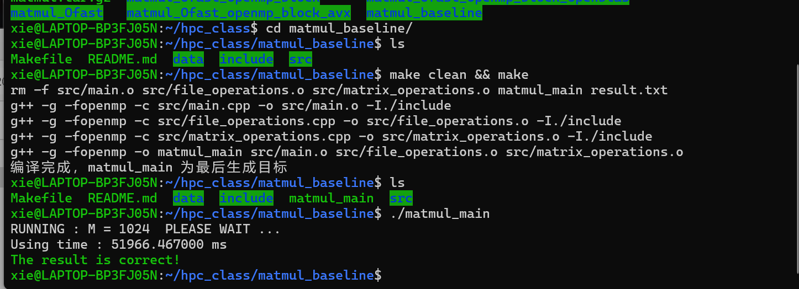
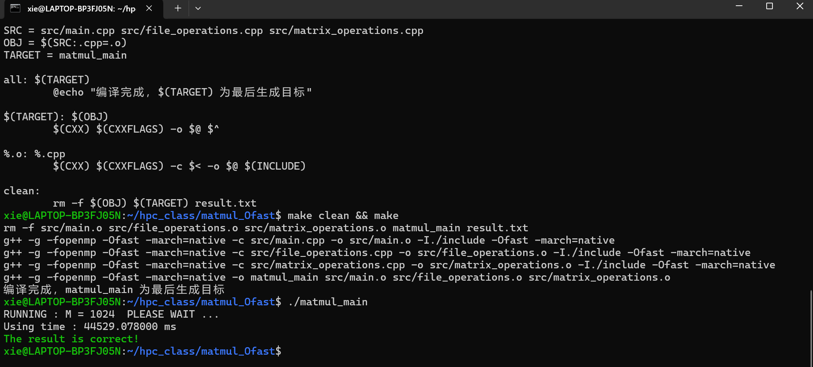
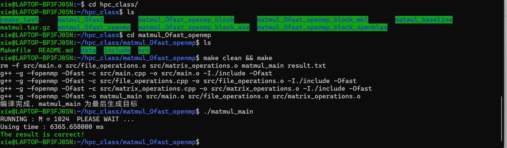
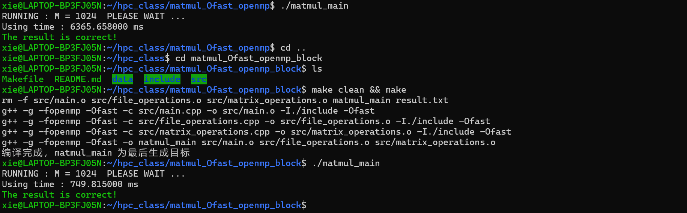
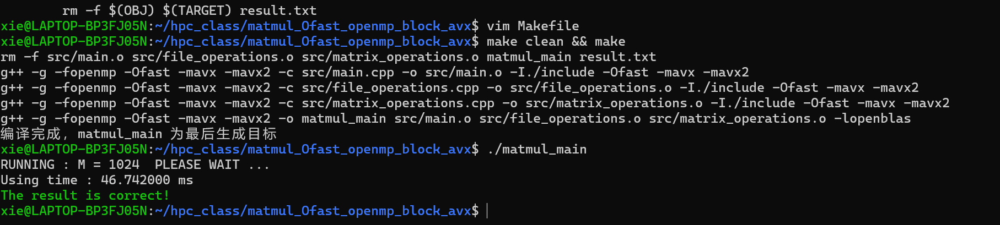
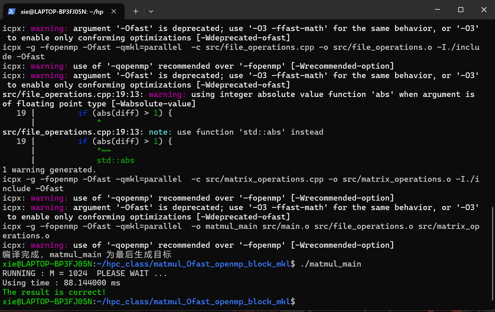
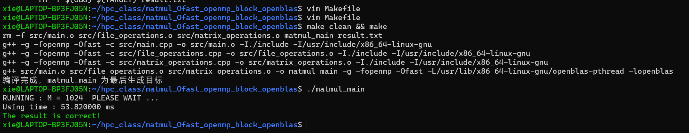

## matmul
“matmul” 通常指矩阵乘法（Matrix Multiplication ），在数学、计算机科学等多领域应用广泛：

### 数学定义
对于两个矩阵A和B,若A是m_n矩阵(m行n列),B是n_p矩阵（n行p列）,它们的乘积C=AB是一个m_p矩阵。C中元素 C_{ij} 计算方式为A的第i行与B的第j列对应元素乘积之和。
 
### 计算机实现
 
- 算法基础:编程实现时,常通过嵌套循环遍历矩阵元素来计算。以C++为例：
```cpp
#include <iostream>
#include <vector>
using namespace std;
vector<vector<double>> matmul(vector<vector<double>> A, vector<vector<double>> B) {
    int m = A.size();
    int n = A[0].size();
    int p = B[0].size();
    vector<vector<double>> C(m, vector<double>(p, 0));
    for (int i = 0; i < m; ++i) {
        for (int j = 0; j < p; ++j) {
            for (int k = 0; k < n; ++k) {
                C[i][j] += A[i][k] * B[k][j];
            }
        }
    }
    return C;
}
```
- 性能优化：因计算量随矩阵规模增长迅速，常需优化。比如利用OpenMP实现并行计算加速,像Makefile中开启OpenMP支持（-fopenmp），能将矩阵乘法计算任务分配到多个线程并行执行；还可采用分块矩阵乘法，将大矩阵划分成小矩阵块计算，减少内存访问开销、提高缓存命中率 。
 
### 应用领域
- 机器学习和深度学习：神经网络训练和推理中，大量参数更新、前向传播和反向传播计算都涉及矩阵乘法。如多层感知机（MLP）中，神经元间连接权重更新依赖矩阵乘法；卷积神经网络（CNN）中卷积操作可转化为矩阵乘法加速计算 。
 0
- 图形学：用于图形变换，如三维模型的旋转、缩放、平移等操作，通过矩阵乘法实现模型顶点坐标变换，进而渲染出不同视角和形态图形 。
 
- 科学计算：在物理、工程等领域数值模拟中，求解线性方程组、计算特征值和特征向量等常需矩阵乘法操作。

### 文件夹理解
- matmul_baseline:表示矩阵乘法的基础实现版本，可能是未经过任何优化的原始代码版本 。
 

- matmul_Ofast:Ofast是编译器优化选项，此版本可能是使用了编译器的Ofast优化级别对矩阵乘法代码进行编译优化后的版本,Ofast会启用激进的优化策略来提升程序运行速度。

```
不同：CXXFLAGS =  -g -fopenmp -Ofast -march=native
INCLUDE = -I./include -Ofast -march=native
-Ofast是优化选项，启用激进的优化策略以提高程序运行速度，但可能牺牲一些标准合规性；
-march=native使编译器针对当前运行机器的CPU架构生成优化代码
```

 
- matmul_Ofast_openmp:在Ofast优化基础上，引入了OpenMP（一种共享内存并行编程模型），利用多线程并行计算来加速矩阵乘法运算 。

 
- matmul_Ofast_openmp_block:可能是在matmul_Ofast_openmp的基础上，采用了分块（blocking）技术。分块技术通过将大矩阵划分为小的子矩阵块进行计算，能提高缓存命中率，减少内存访问开销，进一步提升性能 。


- matmul_Ofast_openmp_block_avx:在此版本中，除了前面的优化手段，还利用了AVX（Advanced Vector Extensions，高级矢量扩展）指令集。AVX 指令集可实现单指令多数据（SIMD）操作，能同时处理多个数据，提升向量运算效率，加快矩阵乘法计算 。
 

- matmul_Ofast_openmp_block_mkl:mkl指英特尔数学核心函数库（Intel Math Kernel Library），集成了大量高效的数学运算函数。此版本借助MKL库中针对矩阵运算优化的函数，结合前面的优化策略，进一步优化矩阵乘法性能 。

 
- matmul_Ofast_openmp_block_openblas：可能是在前面优化基础上，结合了OpenBLAS（一个优化的BLAS实现，BLAS是基本线性代数子程序库）等相关线性代数库进行优化.
 
 
- matmul.tar.gz:是一个压缩存档文件，可能包含了上述与矩阵乘法相关的代码文件、配置文件等内容，用于项目的打包、分发和备份 。
### Ofast
“Ofast” 通常是指编译器的一种优化选项：
 
- 基本概念：
Ofast是GCC、ICC（英特尔C++编译器 ）等编译器提供的优化级别选项。它在优化过程中启用了一系列优化策略，旨在最大程度地提高程序的运行速度，但可能会牺牲一定的标准合规性。
 
#### 优化内容
- 指令级优化：会开启一些针对特定CPU指令集的优化比如针对支持SSE（Streaming SIMD Extensions ）、AVX（Advanced Vector Extensions ）等指令集的CPU，利用这些指令集的并行计算能力，加速向量运算、矩阵运算等操作。例如在处理大规模数组运算时，通过AVX指令集可以同时对多个数据元素进行相同操作，大幅提升计算效率。
- 浮点运算优化：对浮点运算进行特殊处理。它允许编译器假设浮点运算满足一些非标准的数学属性，比如忽略浮点运算的严格IEEE 754标准中的某些规则（如不严格要求精确的舍入模式等 ），从而让编译器生成更激进的优化代码，加快浮点运算速度。像在科学计算、图形渲染等涉及大量浮点运算的程序中，能有效提升性能。
- 内联优化：积极将短小的函数调用展开为内联代码。这样可以减少函数调用的开销（如函数调用时的栈操作、参数传递等开销 ），让指令执行更加紧凑高效。例如对于频繁调用的简单辅助函数，展开后能提升程序运行速度。
 
#### 注意事项
- 标准合规性：由于Ofast为追求速度可能会放宽对一些标准的遵循，在一些对计算精度、运算规则严格遵循标准的场景中，可能会导致结果不准确。例如在金融计算、高精度科学实验数据处理等场景，不建议使用Ofast优化级别，以免因浮点运算规则的调整等导致数据错误。
- 代码调试：经过Ofast优化后，代码的执行流程可能变得复杂，生成的汇编代码也更加紧凑和优化，这会增加调试难度。在开发调试阶段，一般不建议使用该优化级别，可在测试和发布阶段，在确保结果正确的前提下使用，以提升最终产品的性能。