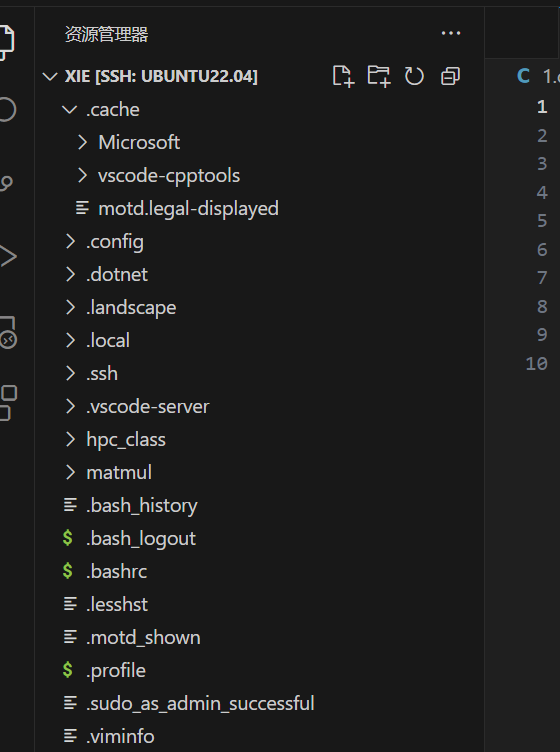
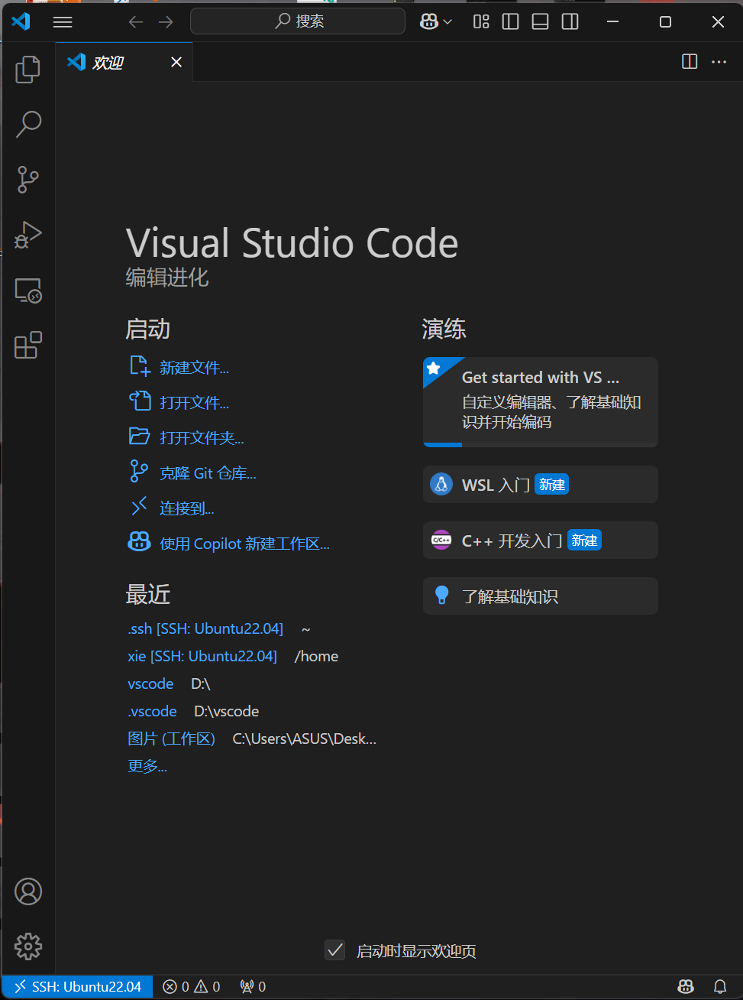

### 0.6 用好你的电脑3：小知识串讲，网络资源获取
#### 磁盘监控工具
| 系统 | 工具 | 命令/操作 | 功能 |
|------|------|----------|------|
| **Windows** | CrystalDiskInfo | 图形界面 | 健康状态监测 |
| **Linux** | smartctl | `sudo smartctl -a /dev/sda` | 原始SMART数据 |
| 通用 | 文件管理器 | - | 空间占用可视化 |

#### 系统故障排查
- 蓝屏:

| 原因类型 | 具体表现 | 典型案例 |
|----------|----------|----------|
| **驱动问题** | 系统服务异常 | 新安装显卡/外设驱动 |
| **恶意软件** | 关键进程崩溃 | 病毒破坏系统文件 |
| **硬件故障** | 机器检查异常 | 内存条/硬盘损坏 |
| **系统冲突** | 资源访问冲突 | 安全软件互斥 |

- 系统可启动时:
msconfig → 引导 → 安全启动 → 最小化 → 应用

- 系统无法启动时
1. 强制断电3次触发自动修复
2. 选择：疑难解答 → 高级选项 → 启动设置 → 重启
3. 按F4进入安全模式

#### Linux内核恐慌(Panic)
常见原因：驱动故障/init进程崩溃
调试方法：
journalctl -k -b -1  # 查看上次启动内核日志
dmesg | grep panic   # 筛选panic信息

#### 应用故障处理
- 崩溃报告要素：
1. 软件版本号
2. 操作系统版本
3. 复现步骤
4. 相关日志(附件形式)
5. 核心转储(如有)

- ## 调试建议 ##
+ 优先使用官方调试符号包
+ 干净环境重现问题
- 避免直接反汇编逆向

#### 系统级快捷键

|功能	|Windows|	macOS	|Linux(GNOME)|
|------|------|------|------|
|任务管理|	Ctrl+Shift+Esc|	Cmd+Opt+Esc	|System Monitor
|截图	|PrtSc|	Cmd+Shift+4	|Shift+PrtSc|
|应用切换|	Alt+Tab|	Cmd+Tab|	Alt+Tab|

#### Shell通用快捷键

|快捷键|	作用	|等效Windows CMD|
|------|------|------|
|Ctrl+C|	终止进程|	同|
|Ctrl+D|	输入结束|	Ctrl+Z,Enter|
|Ctrl+Z|	挂起进程|	同|

### 0.7 用好你的电脑4：网络安全
#### 1.1 URL组成解析
https://search.bilibili.com/all?keyword=test&source=web

- 协议：http://
- 域名 : search.bilibili.com  
- 路径: /all 
- 查询参数?keyword=test&source=web

能表示在 url 中的请求都以 xxx=yyy 的 键值对 形式出现，并用 & 连接多个键值对。

#### 隐私泄露风险点
查询参数可能包含：
- 用户搜索记录
- 来源追踪标识
- 会话信息

防护建议：分享链接时删除?后所有参数

### 隐私保护实践

|场景|	风险	|解决方案|
|------|------|------|
|线下消费|	过度收集信息|	提供最小必要信息|
|社交软件|	陌生人获取隐私|	关闭"允许陌生人查看朋友圈"|
|公开论坛	|信息被关联收集|	使用不同用户名|

#### 账户安全强化
- 进阶安全措施
多因素认证(2FA)：短信+验证器App
密码管理器：Bitwarden/1Password

#### 代理技术解析
- 代理类型对比

|类型|	功能|	典型应用|
|------|------|------|
|正向代理|	客户端匿名|	突破访问限制|
|反向代理|	服务器防护|	Nginx负载均衡|
|VPN|	加密隧道	|远程访问内网|

- 安全注意事项
选择可信代理服务
敏感操作禁用代理
定期检查网络流量

### 0.8 用好你的电脑5：操作系统和编程语言
#### 操作系统的核心功能
- **资源管理**：CPU/内存/设备分配
- **抽象接口**：系统调用API
- **并发控制**：进程/线程调度
- **错误隔离**：防止单进程崩溃影响系统

#### 用户界面类型
| 类型 | 特点 | 典型应用 |
|------|------|----------|
| CLI | 纯命令行交互 | 服务器管理 |
| TUI | 文本图形界面 | Vim/Emacs |
| GUI | 图形化操作 | 桌面系统 |

#### 开发工具对比
- 2.1 IDE vs 文本编辑器
    - IDE：
    1. 集成编译调试
    2. 项目管理
    3. 代码补全
    - 文本编辑器：
    1. 轻量快速
    2. 插件扩展
    3. 终端集成

#### 命令式语言特性
- 基于图灵机模型
- 核心要素：
int x = 0;       // 状态定义
while(x < 10) {  // 控制流
    x++;         // 状态改变
}

#### 编译型 vs 解释型

|特性|	C++	|Python|
|------|------|------|
|执行方式|	预编译二进制|	逐行解释|
|类型系统|	静态强类型|	动态弱类型|
|典型性能|	快(纳秒级)|	慢(微秒级)|
|错误检查|	编译时|	运行时|

#### 调试技巧
- 阅读报错：
1. 定位错误文件和行号
2. 理解错误类型(segfault/type error等)
3. 追溯调用栈(Traceback)

- 调试工具：
gdb ./program    # C++调试
python -m pdb script.py  # Python调试
---
### 0.9 Linux基础知识：Linux 101
#### 核心设计理念
- **一切皆文件**：设备、进程、网络连接都抽象为文件
- **最小接口原则**：CLI优先，最大化计算资源利用率
- **模块化设计**：组合小工具完成复杂任务

#### 初体验示例
- 更新软件源
sudo apt update
- 安装ASCII小火车
sudo apt install -y sl
- 运行演示
sl

#### 命令格式解析
text
- apt:程序
- install：子命令
- -y：选项
- sl：对象

#### 帮助系统
|命令|	功能|	示例|
|------|------|------|
|-h/--help|	快速帮助|	apt -h|
|man|	完整手册|	man apt|
|tldr|	实用示例|	tldr apt|
- ## 停下来想一想 ##
tar 是 Linux 下常用的压缩解压缩工具，试试看怎么创建一个 tar 压缩包，然后解压缩它
停下来想一想

#### 路径操作

|符号|	含义|	示例|
|------|------|------|
|.|	当前目录|	./script.sh|
|..|	上级目录|	cd ..|
|~|	家目录|	ls ~/Downloads|
|/|	根目录|	cd /|

#### 试一试
1. 在自己机器上的 / 路径下面逛逛。

2. 查找资料并回答：/proc 和 /dev 是什么？哪个文件可以获取 CPU 的核心频率？

|目录	|类型	|作用	|示例文件/功能|
|------|------|------|------|
|/proc|	虚拟文件系统|	内核运行时信息的动态接口（进程、硬件、系统配置等），文件内容实时生成，不占磁盘空间。|	/proc/cpuinfo（CPU信息）|
|/dev	|设备文件目录|	存储硬件设备或虚拟设备的接口文件（如磁盘、键盘、GPU），通过文件与设备交互（读写即操作硬件）。	|/dev/sda（磁盘）、/dev/null（黑洞）|

3. 查阅 scp 和 rsync 的 manual，可以了解如何与远程主机之间进行文件传输。、

#### 权限表示法
- 读:4
- 写:2
- 执行：1

#### 权限修改
- 添加执行权限
chmod +x script.py

#### 设置精确权限
chmod 750 file

#### 文件链接机制

|特性|	硬链接	|软链接\
|------|------|------|
|跨文件系统|	❌	|✅|
|链接目录	|❌	|✅|
|原文件删除|	仍可访问	|失效|
|创建命令	|ln source link	|ln -s source link|

### 1.0 Linux基础知识：虚拟机安装和常用操作
- linux安装：（已安装）
- linux使用：
- 切换到root用户
su -

- 添加用户到sudo组（Debian/Ubuntu）
usermod -aG sudo username

- 编辑sudoers文件（安全方式）
visudo

- 备份原有源
sudo cp /etc/apt/sources.list /etc/apt/sources.list.bak

- 更新软件索引
sudo apt update && sudo apt upgrade

#### 文件操作命令

|命令|	功能|	常用参数|
|------|------|------|
|ls|	列出文件|	-l(详情) -a(隐藏文件) -h(易读大小)|
|cd	|切换目录	|~(家目录) |..(上级目录)|
|mkdir|	创建目录|-p(递归创建)|
|cp	|复制文件	|-r(递归) -i(交互确认)|
|mv|	移动/重命名	|-b(备份) -n(不覆盖)|
|rm|	删除文件|	-rf(强制递归删除) ⚠️慎用|

#### 软件安装
- 搜索软件包
apt search package

- 查看软件信息
apt show package

- 安装/卸载
sudo apt install package
sudo apt remove package

- 清理无用包
sudo apt autoremove

#### 其他安装方式
- 安装deb包
sudo dpkg -i package.deb
sudo apt install -f  # 修复依赖

- 源码安装通用流程
./configure
make
sudo make install

#### 文本编辑 (Vim)
- vi: 文书编辑器，所有的类 Unix 系统中都内建有 vi vim: 由 vi 发展出来的文本编辑器。拥有代码补全、编译及错误跳转的功能。
- vi/vim 分为三种模式：命令模式（普通模式）、输入模式、命令行模式（底线命令模式）

#### 实用操作
dd - 删除当前行
yy - 复制当前行
p - 粘贴
/pattern - 搜索
:%s/old/new/g - 全局替换
:wq - 保存退出
:q! - 强制退出

#### 实用技巧
- 将错误输出重定向到文件:command 2> error.log
- 将输出追加到文件:command >> output.log
- 管道组合命令:ps aux | grep python | less
#### 系统信息查看
- 查看内存使用:free -h
- 查看磁盘空间:df -h
- 查看CPU信息:lscpu

##### 虚拟机的配置及使用
wsl:已经安装并配置完成。

- 查看 WSL 
wsl -l -v
- 输出示例：
  NAME      STATE           VERSION
* Ubuntu    Running         2
  Debian    Stopped         1

- wsl --shutdown：⚠️ 强制终止所有运行中的WSL实例
- wsl --set-version Ubuntu 2：版本转换
- wsl --set-default Debian：设置默认发行版
- wsl --export Ubuntu D:\WSL\ubuntu_backup.tar：导出实例（备份）
- wsl --import NewUbuntu D:\WSL\NewUbuntu D:\WSL\ubuntu_backup.tar --version 2：导入实例（恢复）（NewUbuntu：新实例名称、D:\WSL\NewUbuntu：存储位置、--version 2：指定WSL版本）
- wsl --unregister Ubuntu：注销实例。
⚠️ 危险操作：永久删除实例数据、不可恢复、操作前建议先导出备份

- 临时运行命令：	wsl -d Debian -e ls /
- 指定用户运行：	wsl -u root
- 终止特定实例：	wsl -t Ubuntu
#### 虚拟机的安装
#### 远程连接与远程文件传输
#### 组件构成
    Client[SSH客户端] -->|加密通道| Server[SSH服务端]
    Server -->|响应| Client
#### 安装方法
- Debian/Ubuntu
sudo apt install openssh-client openssh-server
- CentOS/RHEL
sudo yum install openssh-clients openssh-server
- 检查服务状态
systemctl status sshd

#### IP 地址查询

|系统|	命令|	输出关键字段\
|Windows|	ipconfig|	IPv4| 地址|
|Linux	|ip |addr	|inet (IPv4)|
|Linux	|ifconfig	|需安装net-tools|

#### 基本连接
- 连接命令格式
ssh username@hostname -p port
- 示例：
ssh admin@192.168.1.100 -p 2222
- 首次连接验证
text
The authenticity of host 'hostname' can't be established.
ECDSA key fingerprint is SHA256:...
Are you sure you want to continue (yes/no)?
✅ 输入yes将密钥加入已知主机列表

#### 文件传输
- SCP 命令速查
1. 本地 → 远程
scp -P 22 file.txt user@host:/path/
2. 远程 → 本地
scp -r user@host:/remote/dir /local/path
3. 跨服务器传输
scp user1@host1:/file user2@host2:/path

#### SFTP 交互命令

sftp
sftp> put localfile.txt ~/remote/
sftp> get /remote/file.txt ./local/
sftp> ls -l
sftp> bye

#### 密钥认证配置
1. ssh-keygen -t rsa -b 4096
- 生成文件：
- ~/.ssh/id_rsa      (私钥)
- ~/.ssh/id_rsa.pub  (公钥)
2. 设置权限
chmod 600 ~/.ssh/id_rsa*

- 公钥部署方法
1. 方法1：ssh-copy-id（推荐）
ssh-copy-id -i ~/.ssh/id_rsa.pub user@host
2. 方法2：手动追加
cat ~/.ssh/id_rsa.pub | ssh user@host "mkdir -p ~/.ssh && cat >> ~/.ssh/authorized_keys"
3. 验证权限
ssh user@host "chmod 700 ~/.ssh; chmod 600 ~/.ssh/authorized_keys"

#### 使用 WSL 扩展连接到 WSL 子系统

