# 学习笔记

## 目录
1. [学习目标](#学习目标)
2. [主要内容](#主要内容)
   - [0.1 搜索和知识获取](#01-搜索和知识获取)
   - [0.2 计算机基本知识概览1：软硬件和操作系统](#02-计算机基本知识概览1：软硬件和操作系统)
   - [0.3 计算机基本知识概览2：计算机的评价](#03-计算机基本知识概览2：软硬件和操作系统)
   - [0.4 用好你的电脑1：环境配置，常用软件选择、安装与卸载](#04-用好你的电脑1：环境配置，常用软件选择、安装与卸载)
   - [0.5 用好你的电脑2：版本控制，Git和文件备份](#05-用好你的电脑1：版本控制，Git和文件备份)
   - [0.6 用好你的电脑3：小知识串讲，网络资源获取](#06-用好你的电脑3：小知识串讲，网络资源获取)
   - [0.7 用好你的电脑4：网络安全](#07-用好你的电脑4：网络安全)
   - [0.8 用好你的电脑5：操作系统和编程语言](#08-用好你的电脑5：操作系统和编程语言)
   - [0.9 Linux基础知识：Linux 101](#09-Linux基础知识：Linux101)
   - [1.0 Linux基础知识：虚拟机安装和常用操作](#10-Linux基础知识：虚拟机安装和常用操作)
   - [1.1 文本编辑：Markdown,LaTeX,Typst和Beamer](#11-文本编辑：Markdown,LaTeX,Typst和Beamer)
   - [1.2 Windows 入门指南](#12-Windows入门指南)
   - [0.1 进阶：运维方向，Linux文件系统](#01-进阶：运维方向，Linux文件系统)
3. [参考资料](#参考资料)

---

## 学习目标
- 了解如何进行有效的提问及知识获取，哪些搜索引擎和大模型更加方便有效。
- 计算机知识概览，学习计算机软硬件及基本体系结构等的简要介绍。
- 充分利用计算机，包含计算机的环境配置、文件版本控制、网络安全等多方面内容。
- 掌握 Linux 基础使用，包含虚拟机创建、环境配置以及部分常用操作等内容。
- 认识一些文本编辑与写作工具，包含对于 Markdown, LaTeX, Typst, Beamer 等 pre 和论文写作时常用工具。
---

## 主要内容

### 0.1 搜索和知识获取
本章节介绍了一些对于学习搜索知识较为优秀的搜索引擎，以下是一些关键点：
- **为什么笔者推荐优先使用 Google 搜索，其次是 Bing 搜索的国际版和国内版？**  
1.  因为国内像百度等搜索引擎，搜索页面充斥着各种打着“正版网站”旗号的广告，官方网站甚至没能挤进首页。
2.  对于Bing搜索，国内版仍会出现少量的广告，但官方网站通常会出现在首页，国际版广告会更少，搜索结果也更准确。
3.  Google搜索，作为全球最大的搜索引擎，其搜索结果往往较为准确，直接且全面。

- **如何搜索？**  
1.   使用关键词进行组合来描述你的问题，能够帮助你更快地找到你需要的信息以及更好的利用搜索引擎的算法优化网页。
2.   英文作为国际通用语言，使用英文关键词搜索能获取来自全球范围内的最新信息，而不仅仅局限于中文社区
3.   若有需要，也可以尝试使用一些高级搜索选项（一些高级搜索选项关键字：ext、filetype、inanchor或inbody或intitle、ip、language、loc或位置、首选、site、feed、hasfeed、url)
。

- **试一试**

The Book 几乎是学习 Rust 语言的必读书目。你能尝试找到其英文原版的官方网站主页地址吗？


- **官方文档**
- 最权威的技术信息来源
- 包含完整API参考、使用示例和最佳实践
- 通常由技术维护团队直接编写
- Python: [python.org/doc](https://www.python.org/doc)
- LaTeX: [latex-project.org/help](https://www.latex-project.org/help)


- **stack Overflow\Github\wikipedia**

|平台| 特点  | 最佳用途  |
| ------------ | ------------ | ------------ |
| Stack Overflow  | 编程问答  | 解决具体报错问题  |
| GitHub  |  代码托管 | 快速了解技术背景  |
| Wikipedia  | 知识概述  |  快速了解技术背景 |

-**W3Schools\OI Wiki \ CTF Wiki \ HPC Wiki\cs自学指南**

|平台| 特点  | 最佳用途  |
| ------------ | ------------ | ------------ |
| W3Schools | 教学，适合初学者  | 学习各种编程语言的教程  |
| OI Wiki \ CTF Wiki \ HPC Wiki |  有趣易理解 | 比赛参考资料  |
| cs自学指南  | 自学  |  包含多个领域 |

- **哪里找比较好用的大模型**
- Github Copilot：GitHub Copilot 是由 GitHub 和 OpenAI 联合开发的 AI 编程助手，为多种编程语言提供智能代码补全和生成。
- OpenAI:可以在 OpenAI 的官网上找到大量关于如何使用 OpenAI 的文档和教程.
- Azure：由于微软与 OpenAI 的关系，你同样可以在 Azure 平台上使用 OpenAI 的大模型。（对学生最友好）
- Deepseek:以极具竞争力的价格和较良好的性能脱颖而出.

(在向大模型提出问题时需要尽可能地详细且完整地描述你的问题，注意明确性与简单化)

---
### 0.2 计算机基本知识概览1：软硬件和操作系统
1. **硬件**：计算机、冯诺依曼架构、CPU、内存、硬盘、其他你可能听说过或没有听说过的存储设备、常见存储设备对比、存储层次结构、GPU、主板、电源、外设
2. **软件**：保护和抽象、操作系统概述、Windows、Linux、其他操作系统、移动操作系统、应用程序、程序的执行、开机、软件的许可
3. **计算机网络**：OS/I 七层模型、TCP/IP 协议、DNS 协议。
---
#### 冯诺依曼架构：
- 冯诺依曼提出一种实现形式，由运算器、控制器、存储器、输入输出设备组成。控制器根据一条条指令控制处理器中的各个状态。
#### CPU:
- CPU 是整个计算机的核心，承担着运算和控制的功能.
#### ISA：
- 定义了程序员如何使用CPU，如处理器有哪些指令、指令编码方式和功能、寄存器的大小数量和功能等等各种约定（一些常见的SIA：x86\ARM\RiscV\Loongarch\MIPS\PowerPc）现代的ISA一般都设计保护功能，即在不同的模式下（特权模式和非特权模式）有不同的功能。ISA还提供虚拟内存的功能。
#### 内存：
- 断电丢失数据的随机存储器，有时指硬盘。是处理器CPU能够直接访问到的数据存储器。面向使用的程序员，内存被简化抽象为一个个存储单元，每个存储单元大小一个字节，或者说 8 比特。随机存储器中“随机”的意思是不论拿什么编号来找数据，所需时间总是差不太多的。内存访问速度比其他外部存储要快，但是随着处理器的发展(由几 MHz 如 8086 的 5MHz 发展至几 GHz)，内存速度的提升却跟不上处理器速度提升的步伐。
#### 硬盘：
- 断电数据不丢失的可以反复改写的存储设备，目前市面上主要有两种硬盘，一种是机械硬盘 HDD，另一种是固态硬盘 SSD。一般来说，固态硬盘较贵，速度较快，抗振动辐射，而机械硬盘较为廉价，但速率较低，不过相对固态硬盘数据存放稳定性较好。
#### 其他你可能听说过或没有听说过的存储设备:
- U盘/存储卡/光盘/软盘/磁带
#### 常见存储设备对比：

|  种 类|单盘最大容量|密度|容量/价格|单盘带宽|延迟|可靠性|维护成本|
|------|------|------|------|------|------|------|------|
|HDD	  |   24 TB|	  中|	8 GB/RMB	| 300 MB/s| 	10 ms|	 高 |   低|
|SSD    |	60 TB|	极高|	2 GB/RMB	|6000 MB/s|	   50 μs|     中|	  低|
|Blu-ray|  100 GB|	  低|5.5 GB/RMB|	35 MB/s|   100 ms|	很高|   中|
|Tape   |	18 TB|	极高|	45 GB/RMB| 750 MB/s|  loooong|	很高|	极高|

#### 存储层次结构：
存储器有很多种类，速度、容量单价、稳定性都各有不同。划为
- 处理寄存器（processor registers）
- 处理器缓存（processor cache）
- 随机存取存储器（random access memory）
- 闪存/USB存储器（flash/USB memory）
- 硬盘驱动器（hard drives）
- 磁带备份（tape backup）

|存储类型|	速度|	容量|	成本|	易失性|	刷新需求|	可见性|
|------|------|------|------|------|------|------|
|寄存器	|最快（1周期）|	极小（B级）|	极高|	是|	否（SRAM）|	程序员可见|
|缓存	|快（几~几十）	|小（MB级）|	高	|是	|否（SRAM）|	硬件透明|
|内存	|较慢（百~千）	|大（GB级）	|较低	|是	|是（DRAM）	|程序员间接管理|

以上三种存储都属于易失性存储（volatile），也就是断电后数据将会在短时间内消失.
#### GPU：
- Graphics Processing Unit, 也叫做显卡，有独立显卡和集成显卡两种，前者以一种通过 PCIe 接口连接的扩展卡或直接独立集成在主板(通常存在于笔记本或者一体机内)的形式存在，而后者直接存在于处理器 SoC 内部(故名集成)。GPU 用于图形处理加速和视频输出和大规模并行计算。
#### 主板：
- 将各种硬件连接在一起，形成一个电路系统，为主芯片的工作提供各类条件支持(如供电降压，数据的传输，机械支撑，芯片工作顺序的控制等)，提供固件进行硬件自我检查和系统初始化，保存各个硬件的配置等。
#### 外设:
- 提供计算机对外的数据接口，如有线或无线网卡可以使计算机连接到以太网，鼠标、键盘、显示器和声卡是人机交互的接口，而众人熟知的 USB 接口是各类外部设备与计算机进行交互的标准实现.(PCLe:是计算机总线的一个重要分支，用于 CPU 系统与其他设备比如 GPU、网卡、固态硬盘的连接，也可以延伸到芯片组间的连接)

#### 保护和抽象：

|机制|	实现手段|	作用|
|------|------|------|
|保护|	特权模式、虚拟内存、特权指令限制|	隔离用户程序，防止越权访问或破坏系统。|
|抽象|	虚拟地址空间、统一设备接口|	简化编程，隐藏硬件复杂性，提升安全性。|

- 进程：一个进程包含了一个程序运行的全部状态和属性，操作系统对各个进程分配资源，相互隔离并不断地进行时分复用。
- 线程：线程(Thread)是轻量级的进程，一个进程可建立多个线程子程序任务同时执行。
#### 操作系统概述：
- 操作系统就是一个管理者，为上层应用提供资源和服务，根据其权限和当前系统资源利用情况处理上层应用的请求。其中最常用的是windows和linux系统。Windows 是微软公司开发的图形化操作系统，具有成熟的图形界面。目前说 Linux 操作系统，一般指的是基于 Linux 内核衍生的各大发行版。大多发行版采用了来自 GNU 这个组织制作的各类辅助基础设置，故全名为 GNU/Linux。Linux 发行版为 Linux 内核配置了一系列用户态程序，再加上其本身是一个“操作系统内核”才构成一个完整的操作系统。

- 与 Windows 内核（名字是 NT 内核）不同，Linux 内核并不直接提供图形界面，只提供了最基本的各个接口，Linux 发行版的图形界面属于用户态程序，且是选配的。与 Windows 不同，在 Linux 发行版中，Linux 内核和系统的其他组建完全都是由一个个软件包组成的。
#### 其它操作系统：
- macOS: 苹果专用，符合 POSIX（可移植操作系统接口） 标准的 Unix 系统，老版本可在 Intel 机器安装，内核叫 Darwin，修改自 BSD 系内核，内核部分开源
- FreeBSD: 符合 POSIX 标准的类 Unix 系统，和 Linux 只是内核不同，FreeBSD 带有完整的用户态程序，同时其采用更宽松的许可协议，而不是 Linux 的 GPLv2。
- MSDOS: 古老的操作系统，无图形界面，已不使用，微软近期开源了几个版本的 DOS。FreeDOS 则是由其他志愿者实现的开源版本替代。
#### 移动操作系统：
- Android: Google 开发的基于 Linux 内核的操作系统，Google 自己在上面开发了 AOSP 一套基础设施环境。
- iOS: 苹果公司的产品，2007 年随 iPhone 横空问世，基于 Darwin 内核开发，封闭性较强。
#### 应用程序：

   1. 桌面程序：有漂亮的图形界面进行人机交互。

   2. 命令行程序：只能处理字符流的输入输出。

   3. 库：大部分库都为应用程序使用。库作为一种特殊的应用程序，可以是以源代码形式或者封装好的机器码的形式存在，可以是在程序编译时一同编译并连接，也可以是提前编译好，并在程序编译后以静态或者动态的方式与程序链接在一起。
#### 程序的执行：
   1. 机器码：处理器直接执行的二进制指令，编写难度大  
   2. 汇编语言：与机器码一一对应的助记符表示，把汇编语言翻译成机器码的过程叫做汇编，而与之相反的过程则叫做反汇编。  
  - 示例：x86架构中  
    - `mov` - 数据移动指令  
    - `add` - 加法指令  
#### 执行高级语言编写的代码的两种思路：

   1. 编译型语言：先翻译为汇编语言，再翻译为机器语言再执行  

   2. 解释型语言：通过解释器逐行解释执行  
- 注意：现代编程中很少需要手写汇编，但阅读能力很重要  

#### 链接过程
- 将编译后的目标文件与库函数连接  
- 处理内存地址引用  
- 两种链接方式：  
  - 静态链接：所有代码合并到最终可执行文件  
  - 动态链接：运行时加载共享库  

#### 可执行文件格式
| 操作系统 | 文件格式 |  
|---------|---------|  
| Windows | PE (Portable Executable) |  
| Linux   | ELF (Executable and Linkable Format) |  
| macOS   | Mach-O |  

#### 动态链接库
| 系统    | 扩展名  |  
|---------|--------|  
| Windows | .dll   |  
| Linux   | .so    |  
| macOS   | .dylib |  

#### 程序生命周期
1. 操作系统检查权限  
2. 加载到内存  
3. 动态链接(如需要)  
4. 跳转到入口点执行  
5. 正常退出或被强制终止  

#### 启动流程
1. 电源接通，待机电路激活  
2. 按下电源键，CPU复位取消  
3. CPU从BIOS（基本输入输出系统）芯片读取第一条指令  
4. POST(上电自检)过程：  
   - 内存初始化  
   - CPU功能初始化  
   - 关键设备检查  
5. 显示LOGO，搜索引导程序  
6. 移交控制权给操作系统  

#### 授权类型对比
| 类型 | 源代码获取 | 分发限制 | 衍生作品要求 |  
|------|-----------|---------|-------------|  
| 专有软件 | 限制 | 严格限制 | 通常禁止修改 |  
| 开源软件 | 开放 | 自由分发 | 需遵守许可证条款 |  

#### Copyleft许可证特点
- 要求保留原作者信息  
- 衍生作品必须使用相同或兼容许可证  
- 典型代表：GPL许可证  

#### OSI七层模型(简化)
| 层数 | 名称       | 主要协议示例       |  
|-----|------------|-------------------|  
| 7   | 应用层     | HTTP, FTP, DNS    |  
| 4   | 传输层     | TCP, UDP          |  
| 3   | 网络层     | IP, ICMP          |  
| 2   | 数据链路层 | Ethernet, WiFi    |  
| 1   | 物理层     | 电缆, 光纤, 无线电 |  

#### IP协议比较
| 特性        | IPv4                  | IPv6                      |  
|------------|-----------------------|---------------------------|  
| 地址长度    | 32位(4字节)           | 128位(16字节)             |  
| 地址表示    | 点分十进制(如192.168.1.1) | 冒号分隔十六进制(如2001:db8::1) |  
| 地址空间    | 约42亿                | 3.4×10³⁸                 |  
| 特殊地址    | 127.0.0.1(回环)等     | ::1(回环)等               |  

**练习**：114.514.1919.810不是有效IPv4地址，因为：  
1. 514 > 255  
2. 1919 > 255  
3. 810 > 255  

#### TCP与UDP对比
| 特性        | TCP            | UDP            |  
|------------|----------------|----------------|  
| 连接方式    | 面向连接(三次握手) | 无连接         |  
| 可靠性      | 可靠(确认重传)   | 不可靠         |  
| 顺序保证    | 保证            | 不保证         |  
| 流量控制    | 有             | 无             |  
| 典型应用    | 网页,邮件       | 视频流,DNS查询 |  

#### DNS解析过程
1. 查询本地缓存  
2. 向根域名服务器查询顶级域(如.com)  
3. 向顶级域服务器查询二级域  
4. 递归查询直到获得最终IP  
5. 结果缓存供后续使用  

**优化建议**：可更换公共DNS如1.1.1.1(Cloudflare)或8.8.8.8(Google)以获得更好解析体验

 ---

### 0.3 计算机基本知识概览2：计算机的评价

#### 能耗与功耗
- **核心概念对比**

| 概念 | 定义 | 应用场景 |
|------|------|----------|
| **功耗** | 单位时间消耗的电能 | 散热设计/电源容量限制 |
| **能耗** | 单位电能完成的工作量 | 续航评估/数据中心能效 |

- 在比较处理器之间的价值，能耗指标效果更好。功耗通常被作为计算机设计的约束条件，在各类场景下，其有着不同的数值。
#### 现实约束
- **移动设备**：
  - 电流限制：≤15A
  - 过热影响用户体验
- **桌面/服务器**：
  - 电流范围：几十A至几百A
  - 限制因素：
    - 散热方案上限（风冷<水冷）
    - 主板供电能力
- **边际效应**：性能提升与能耗增长呈非线性关系

#### 性能评估体系

- **性能公式**：
总时间 = 指令数 × (1 / (频率 × IPC))

- **IPC**：Instructions Per Cycle，每个周期平均运行的指令数，对于不同的电脑，如果架构不同，程序的指令数量通常不一样。

#### 优化悖论
- ✅ **有效优化**：
  - 循环展开
  - 向量化等通用技术
- ❌ **无效优化**：
  - 针对性对抗测试的特定hack

#### 基准测试(Benchmark)

| 测试工具 | 测试方向 | 典型负载 |
|---------|---------|----------|
| Spec2017 | CPU综合 | GCC编译/H.264编解码 |
| Cinebench | 渲染 | 3D建模渲染 |
| Geekbench | 跨平台 | 混合工作负载 |

#### 异构计算案例

- **GPU vs CPU对比**

| 指标 | GPU | CPU |
|------|-----|-----|
| 并行能力 | ★★★★★ | ★★ |
| 通用性 | ★ | ★★★★★ |
| 能效比 | 视频处理>100x | 常规计算 |
| 典型应用 | 深度学习/图形渲染 | 通用计算 |

#### 成本模型分析
- 成本包括制造成本和运作成本
   1. 制造成本：制造成本主要是指购买一件设备的单次投资，通常其包含了生产的成本与其他的支持成本(如配套的操作系统和软件的研发与生态的维护)
   2. 运作成本：在互联网大型数据中心是极为重要的，其包括电费，网费，冷却的费用(如空调费)，地皮空间的租金，以及设备损毁更换的开销等。

#### 采购策略
1. **需求分析**（如：深度学习→显卡投资）
2. **生命周期评估**（3k5用1年 vs 5年）
3. **边际成本计算**（性能提升% / 价格增长%）

#### 生态系统的力量

- 优化技术对比

| 技术 | 加速比 | 开发成本 |
|------|--------|----------|
| 编译器优化 | 2-3x | 低 |
| SIMD向量化 | 4-8x | 中 |  
| 多线程 | 核数倍数 | 高 |
| GPU加速 | 10-100x | 极高 |

**通过程序员手工进行并行化编程，程序可以获得非常高的提升：如采用 SIMD 向量指令，即单个指令可以对一个向量内每个元素进行相同操作，从而单位时间计算量增加。或采用多核系统，无关的任务(比如开视频的同时进行微信聊天)之间不存在关联被分布于多个核上从而实现并行加速，而同一程序则可以通过各个线程分而执行相互同步，以提高性能。**

#### 生态壁垒案例
- **CUDA生态优势**：
  - 丰富的库(NVIDIA cuDNN)
  - 完善的文档
- **Rocm困境**：
  - 工具链不完善
  - 社区资源少

#### 计算机设计哲学

- 层次化设计三原则
1. **简单性**：
   - 分治复杂问题
   - 例：OSI网络七层模型
2. **模块化**：
   - 芯片设计：IP核复用(ARM Cortex)
   - 软件开发：动态链接库
3. **标准化**：
   - 硬件：PCIe接口规范
   - 软件：POSIX API

#### 产业分工模式
- **Fabless模式**：
  - 设计公司（如AMD）
  - 代工厂（如台积电）
- **IDM模式**：
  - 英特尔等传统大厂

#### 关键定律
1. **摩尔定律**：
   - 晶体管数量18-24个月翻倍，性能也将提升一倍
   - 现状：已趋缓
2. **登纳德缩放**：
   - 功耗随工艺进步下降  
   - 现状：失效
3. **阿姆达尔定律**：
   - 并行加速上限公式：1/(1-P+P/N)

---

### 0.4 用好你的电脑1：环境配置，常用软件选择、安装与卸载
#### C++环境配置
- **主流C++编译器对比**

| 编译器 | 平台 | 特点 | 推荐场景 |
|--------|------|------|----------|
| GCC/MinGW | 跨平台 | 标准兼容性好 | 课程作业/开源项目 |
| Clang/LLVM | 跨平台 | 编译速度快 | macOS开发 |
| MSVC | Windows | 微软生态集成 | Windows应用开发 |

#### 编译器的选择
- **评测系统**：GCC编译器
- **语言标准**：C++17
- **开发建议**：
  - Windows: MinGW-w64 (GCC 14.1.0)
  - macOS: Homebrew安装原生GCC

#### Windows环境配置
- 什么是环境变量？path是什么？
环境变量是包含关于系统及当前登录用户的环境信息的字符串,一些软件程序使用此信息确定在何处放置、使用文件。path是一个环境变量。
- **安装流程**
1. **安装VS Code**：
   - 官网下载：https://code.visualstudio.com
   - 推荐插件：
     - C/C++ (ms-vscode.cpptools)
     - C/C++ Extension Pack

2. **配置MinGW**：
环境变量配置：
系统属性 → 高级 → 环境变量 → 系统变量Path → 新建C:\mingw64_14.1.0\bin


3. **VS Code工作区配置**


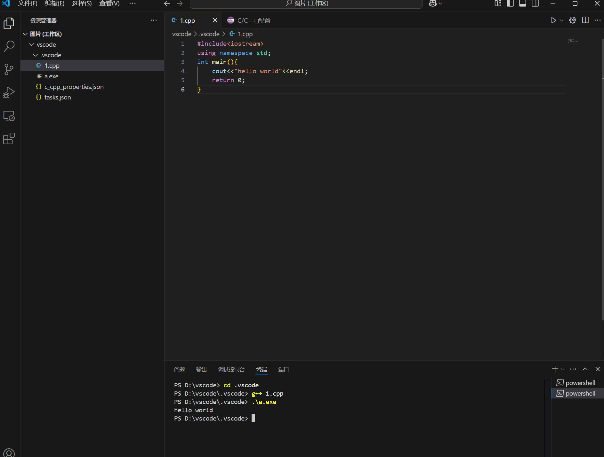

#### Python环境配置
- **Conda 是什么？**
- 跨平台开源软件包和环境管理系统
- 支持 Windows/macOS/Linux
- 快速安装、更新软件包及依赖
- 管理多个 Python 版本和虚拟环境

- **为什么推荐 Conda？**
- 版本隔离
- 环境独立
- 便捷管理

- **Miniforge 安装指南**
推荐使用 Miniforge：
✔️ 体积更小  
✔️ 包含 mamba  
✔️ 适合个人使用  

- **安装步骤**
1. 访问 [Miniforge官网](https://github.com/conda-forge/miniforge)
2. 下载对应系统安装包
3. 双击安装并配置环境变量
4. 终端验证：`conda -V`


- **环境管理**

|命令|	说明|
|------|------|
|mamba env list|	查看环境|
|mamba list| 查看安装包名称|
|mamba create -n名称 python=版本|	创建环境|
|mamba activate 名称|	激活环境|

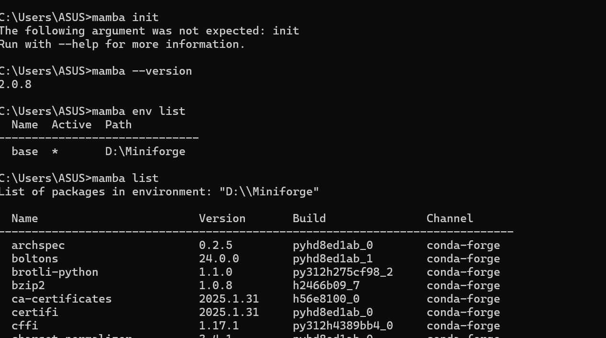

- **虚拟环境内包的安装**
1. 换源，执行以下命令：pip config set global.index-url https://mirrors.pku.edu.cn/pypi/web/simple

2. pip的常用命令：
- pip show：查看包的具体信息。例如 pip show pip。

- pip list：查看已经安装的包。

- pip install：安装指定的包。后面要接包名。

- pip freeze > requirements.txt：把包列表输出到文本文件。

- pip install -r requirements.txt：根据文本文件批量安装包。

- pip uninstall：卸载包。

- pip install --upgrade 包名称==版本号：更新包。

- python -m pip install --upgrade pip：更新 pip。


#### 终端环境配置：
- **Windows终端配置**
- PowerShell推荐理由：
-  微软官方开发的现代化命令行工具
-  深度集成Windows系统功能
-  语法更符合人类直觉
-  强大的扩展和定制能力

#### 1. 修改执行策略
Set-ExecutionPolicy RemoteSigned
#### 2. 配置文件操作
在powershell中输入start $PROFILE

#### 创建新配置(如果不存在)

|策略等级|	安全性|	适用场景|
|------|------|------|
|Restricted|	🔒🔒🔒🔒|	最高安全要求|
|AllSigned|	🔒🔒🔒|	企业环境|
|RemoteSigned|	🔒🔒	|推荐日常使用|
|Unrestricted|	🔒	|开发测试|
|Bypass|	🚫	|危险/临时使用|

#### 常用快捷键和一些指令

| 快捷键 | 功能 | 备注 |
|--------|------|------|
| `Ctrl+Shift+C/V` | 终端复制/粘贴 | Windows通用 |
| `Ctrl+C` | 终止程序 | SIGINT信号 |
| `Ctrl+Z` | 暂停程序 | 可`fg`恢复 |
| `Ctrl+A` | 全选内容 | 快速复制用 |
| **鼠标滚轮+拖动** | 多行选择 | 批量缩进调整 |

#### 实用指令示例

- ## 一些好用指令 ##
- ./a.out < in > output.txt： 把一个文件内容传送到另一个文件（**注意:这回删除out文件中的原来内容**）
- get-content in | .\a.exe > out：功能同上。（在 Windows PowerShell 中使用）
- cd：更改终端所在目录。

#### 文件系统精要
- ## 文件本质 ##
所有文件本质都是二进制序列
文本文件通过编码映射（ASCII/UTF-8等）转换为可读字符
示例：A → ASCII 01000001

- ## 文件后缀解析 ##

|类型	|常见后缀|	说明|
|------|------|------|
|文本	|.txt, .md|	纯文本内容|
|办公	|.docx, .xlsx|	Office文档|
|代码	|.cpp, .py	|源代码文件|
|媒体	|.mp4, .jpg	|音视频/图片|
|可执行|	.exe, .app	|应用程序|、

⚠️ 注意：修改后缀不改变文件内容，但可能影响打开方式

#### 文件系统的一些概念
- 目录（文件夹）：是包含文件和子目录的特殊文件，用于组织和管理文件。
- 文件路径：
1. 绝对路径：从根目录开始的完整路径，例如 /home/user/document.txt。
2. 相对路径：相对于当前工作目录的路径，例如 document.txt。
- 元数据：文件系统存储文件和目录的元数据，包括文件名、大小、创建时间、修改时间、权限等。

#### 文件系统的部分功能如下：
- 管理文件权限：
1. 文件系统管理文件和目录的访问权限，通常包括读取、写入和执行权限。
2. 在类 Unix 系统中，文件权限由所有者、所属组和其他用户的权限组成。
- 文件操作：文件系统提供基本的文件操作，如创建、删除、读取、写入、重命名、复制等。
- 挂载和卸载：文件系统可以挂载到操作系统的目录树中，使其内容可访问。卸载文件系统会断开这种连接。

- **文件系统对比**

|系统类型|	特点|	适用场景|
|------|------|------|
|NTFS|	Windows默认，支持大文件|	本地磁盘|
|ext4|	Linux主流，高性能|	服务器|
|APFS|	Apple优化，支持加密|	Mac/iOS|
|FAT32|	通用性强|	U盘/SD卡|

#### 文本
- 纯文本：各类系统中用 txt后缀区分
- **文本的编码**
编码：将字符转换为二进制数据的规则。保存文本文件和打开文本文件时，分别需要选择一种编码格式
- **文本的常见字体**
微软雅黑、宋体、黑体、Consolas。
- **各类文本和文档**
Word 文本、Excel 表格、PowerPoint 幻灯片、PDF、Markdown、LaTeX。、

#### GutHub上软件的下载
- 下载正确版本
- 查找Release资源
1. 项目主页 → "Releases"栏目
2. 展开"Assets"部分
- 架构选择指南

| 系统平台 | 处理器类型 | 应选文件特征 |
|----------|------------|--------------|
| **Windows** | Intel/AMD | `x64`/`amd64` + `.exe`/`.msi` |
| **macOS** | Intel芯片 | `x64` + `.dmg` |
| **macOS** | M1/M2芯片 | `aarch64`/`arm64` + `.dmg` |
| **Linux** | 通用 | `.deb`(Ubuntu)/`.tar.gz`(通用) |

- **安装注意事项**
 Windows系统正确做法：
- 仔细检查每个安装步骤
- 取消勾选捆绑软件
- 修改默认安装路径（尤其大型软件）
- 安装完成后再次检查

### 0.5 用好你的电脑2：版本控制，Git和文件备份
#### 系统类型对比
| 类型 | 代表工具 | 工作方式 | 特点 |
|------|----------|----------|------|
| **中心化** | SVN | 单服务器集中管理 | 依赖网络，权限控制严格 |
| **去中心化** | Git | 分布式版本库 | 本地完整历史，支持离线工作 |

> 📌 Git ≠ GitHub/GitLab：前者是工具，后者是托管平台

#### Git核心设计
- 核心抽象模型
graph TD
    A[Commit A] --> B[Commit B]
    A --> C[Commit C]
    B --> D[Commit D]
    C --> D
有向无环图(DAG)结构

#### 配置Git
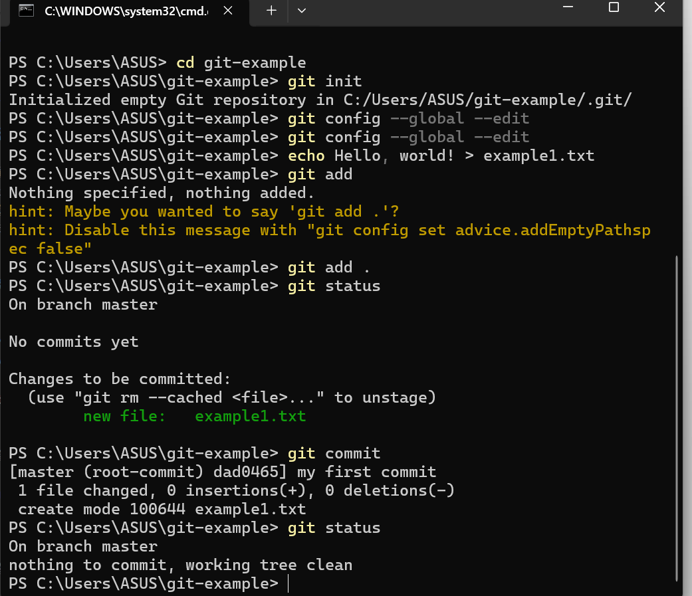
---

---
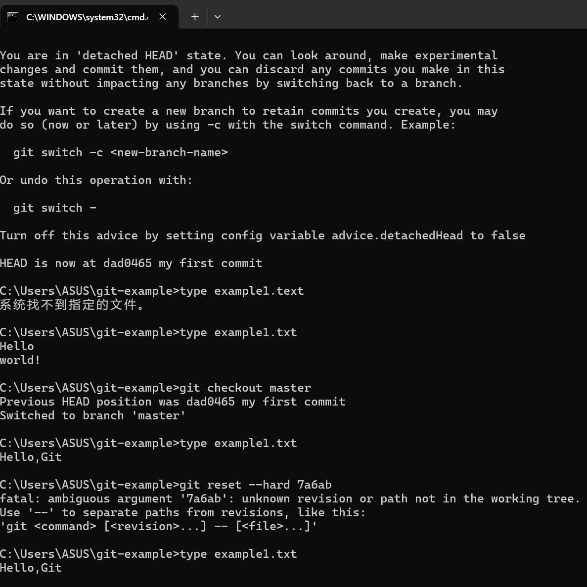
---
#### 排除特定的文件


---
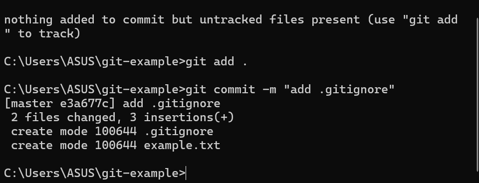

#### 分支管理


---
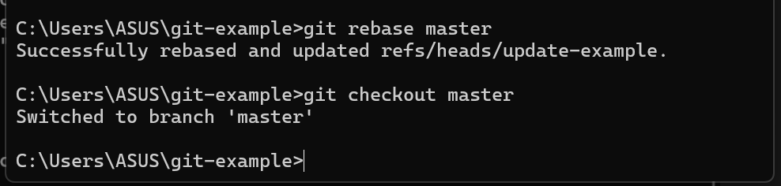
---

#### 合并分支与冲突解决


---

#### Git服务器与多人合作
1. 克隆仓库：git clone url://path/to/be/cloned
2. 拉取代码：有时候远端代码库已经更新，你需要更新本地代码（git pull）
3. 推送代码：在工作完成，提交完成之后，可以用这个子命令（git pull）将修改推送至远端

#### 分叉使用场景
- 无原仓库写权限时贡献代码
- 独立实验性开发
- 创建衍生项目

#### 分叉特性
+ 保留原仓库提交历史
+ 可自主管理分支策略
! 原仓库删除后变为独立仓库
- 默认分支(main/master)不建议直接修改

#### 合并请求(MR/PR)流程
- 发起请求步骤
- 在分叉仓库创建功能分支
- 开发并推送变更
- 平台创建PR/MR界面
- 选择目标仓库/分支
- 填写变更说明

#### 合并策略对比

|合并方式|	命令	|历史影响	|适用场景|
|------|------|------|------|
|Merge|	--no-ff|	保留完整提交历史|	标准协作流程|
|Rebase|	--rebase|	线性历史	|需要整洁提交记录|
|Squash|	--squash|	单提交点	|简化次要修改|

#### 图形化工具的使用
1. VScode:VSCode 自带 Git 管理功能，可以使用该功能进行可视化编辑和提交.
2. gitg:Gnome 桌面的 git 管理软件
3. kommit:KDE 桌面的 git 管理软件

### 0.6 用好你的电脑3：小知识串讲，网络资源获取
#### 磁盘监控工具
| 系统 | 工具 | 命令/操作 | 功能 |
|------|------|----------|------|
| **Windows** | CrystalDiskInfo | 图形界面 | 健康状态监测 |
| **Linux** | smartctl | `sudo smartctl -a /dev/sda` | 原始SMART数据 |
| 通用 | 文件管理器 | - | 空间占用可视化 |

#### 系统故障排查
- 蓝屏:

| 原因类型 | 具体表现 | 典型案例 |
|----------|----------|----------|
| **驱动问题** | 系统服务异常 | 新安装显卡/外设驱动 |
| **恶意软件** | 关键进程崩溃 | 病毒破坏系统文件 |
| **硬件故障** | 机器检查异常 | 内存条/硬盘损坏 |
| **系统冲突** | 资源访问冲突 | 安全软件互斥 |

- 系统可启动时:
msconfig → 引导 → 安全启动 → 最小化 → 应用

- 系统无法启动时
1. 强制断电3次触发自动修复
2. 选择：疑难解答 → 高级选项 → 启动设置 → 重启
3. 按F4进入安全模式

#### Linux内核恐慌(Panic)
常见原因：驱动故障/init进程崩溃
调试方法：
journalctl -k -b -1  # 查看上次启动内核日志
dmesg | grep panic   # 筛选panic信息

#### 应用故障处理
- 崩溃报告要素：
1. 软件版本号
2. 操作系统版本
3. 复现步骤
4. 相关日志(附件形式)
5. 核心转储(如有)

- ## 调试建议 ##
+ 优先使用官方调试符号包
+ 干净环境重现问题
- 避免直接反汇编逆向

#### 系统级快捷键

|功能	|Windows|	macOS	|Linux(GNOME)|
|------|------|------|------|
|任务管理|	Ctrl+Shift+Esc|	Cmd+Opt+Esc	|System Monitor
|截图	|PrtSc|	Cmd+Shift+4	|Shift+PrtSc|
|应用切换|	Alt+Tab|	Cmd+Tab|	Alt+Tab|

#### Shell通用快捷键

|快捷键|	作用	|等效Windows CMD|
|------|------|------|
|Ctrl+C|	终止进程|	同|
|Ctrl+D|	输入结束|	Ctrl+Z,Enter|
|Ctrl+Z|	挂起进程|	同|

### 0.7 用好你的电脑4：网络安全
#### 1.1 URL组成解析
https://search.bilibili.com/all?keyword=test&source=web

- 协议：http://
- 域名 : search.bilibili.com  
- 路径: /all 
- 查询参数?keyword=test&source=web

能表示在 url 中的请求都以 xxx=yyy 的 键值对 形式出现，并用 & 连接多个键值对。

#### 隐私泄露风险点
查询参数可能包含：
- 用户搜索记录
- 来源追踪标识
- 会话信息

防护建议：分享链接时删除?后所有参数

### 隐私保护实践

|场景|	风险	|解决方案|
|------|------|------|
|线下消费|	过度收集信息|	提供最小必要信息|
|社交软件|	陌生人获取隐私|	关闭"允许陌生人查看朋友圈"|
|公开论坛	|信息被关联收集|	使用不同用户名|


#### 账户安全强化
- 进阶安全措施
多因素认证(2FA)：短信+验证器App
密码管理器：Bitwarden/1Password

#### 代理技术解析
- 代理类型对比

|类型|	功能|	典型应用|
|------|------|------|
|正向代理|	客户端匿名|	突破访问限制|
|反向代理|	服务器防护|	Nginx负载均衡|
|VPN|	加密隧道	|远程访问内网|

- 安全注意事项
选择可信代理服务
敏感操作禁用代理
定期检查网络流量

### 0.8 用好你的电脑5：操作系统和编程语言
#### 操作系统的核心功能
- **资源管理**：CPU/内存/设备分配
- **抽象接口**：系统调用API
- **并发控制**：进程/线程调度
- **错误隔离**：防止单进程崩溃影响系统

#### 用户界面类型
| 类型 | 特点 | 典型应用 |
|------|------|----------|
| CLI | 纯命令行交互 | 服务器管理 |
| TUI | 文本图形界面 | Vim/Emacs |
| GUI | 图形化操作 | 桌面系统 |

#### 开发工具对比
- 2.1 IDE vs 文本编辑器
    - IDE：
    1. 集成编译调试
    2. 项目管理
    3. 代码补全
    - 文本编辑器：
    1. 轻量快速
    2. 插件扩展
    3. 终端集成

#### 命令式语言特性
- 基于图灵机模型
- 核心要素：
int x = 0;       // 状态定义
while(x < 10) {  // 控制流
    x++;         // 状态改变
}

#### 编译型 vs 解释型

|特性|	C++	|Python|
|------|------|------|
|执行方式|	预编译二进制|	逐行解释|
|类型系统|	静态强类型|	动态弱类型|
|典型性能|	快(纳秒级)|	慢(微秒级)|
|错误检查|	编译时|	运行时|

#### 调试技巧
- 阅读报错：
1. 定位错误文件和行号
2. 理解错误类型(segfault/type error等)
3. 追溯调用栈(Traceback)

- 调试工具：
gdb ./program    # C++调试
python -m pdb script.py  # Python调试
---
### 0.9 Linux基础知识：Linux 101
#### 核心设计理念
- **一切皆文件**：设备、进程、网络连接都抽象为文件
- **最小接口原则**：CLI优先，最大化计算资源利用率
- **模块化设计**：组合小工具完成复杂任务

#### 初体验示例
- 更新软件源
sudo apt update
- 安装ASCII小火车
sudo apt install -y sl
- 运行演示
sl


#### 命令格式解析
text
- apt:程序
- install：子命令
- -y：选项
- sl：对象

#### 帮助系统
|命令|	功能|	示例|
|------|------|------|
|-h/--help|	快速帮助|	apt -h|
|man|	完整手册|	man apt|
|tldr|	实用示例|	tldr apt|
- ## 停下来想一想 ##
tar 是 Linux 下常用的压缩解压缩工具，试试看怎么创建一个 tar 压缩包，然后解压缩它
停下来想一想


#### 路径操作

|符号|	含义|	示例|
|------|------|------|
|.|	当前目录|	./script.sh|
|..|	上级目录|	cd ..|
|~|	家目录|	ls ~/Downloads|
|/|	根目录|	cd /|

#### 试一试
1. 在自己机器上的 / 路径下面逛逛。
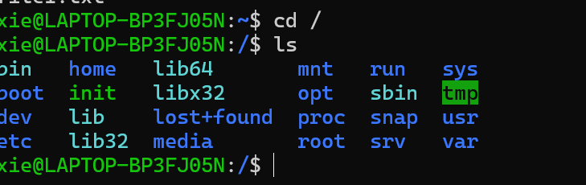
2. 查找资料并回答：/proc 和 /dev 是什么？哪个文件可以获取 CPU 的核心频率？

|目录	|类型	|作用	|示例文件/功能|
|------|------|------|------|
|/proc|	虚拟文件系统|	内核运行时信息的动态接口（进程、硬件、系统配置等），文件内容实时生成，不占磁盘空间。|	/proc/cpuinfo（CPU信息）|
|/dev	|设备文件目录|	存储硬件设备或虚拟设备的接口文件（如磁盘、键盘、GPU），通过文件与设备交互（读写即操作硬件）。	|/dev/sda（磁盘）、/dev/null（黑洞）|

3. 查阅 scp 和 rsync 的 manual，可以了解如何与远程主机之间进行文件传输。、


#### 权限表示法
- 读:4
- 写:2
- 执行：1

#### 权限修改
- 添加执行权限
chmod +x script.py

#### 设置精确权限
chmod 750 file

#### 文件链接机制

|特性|	硬链接	|软链接\
|------|------|------|
|跨文件系统|	❌	|✅|
|链接目录	|❌	|✅|
|原文件删除|	仍可访问	|失效|
|创建命令	|ln source link	|ln -s source link|

### 1.0 Linux基础知识：虚拟机安装和常用操作
- linux安装：（已安装）
- linux使用：
- 切换到root用户
su -

- 添加用户到sudo组（Debian/Ubuntu）
usermod -aG sudo username

- 编辑sudoers文件（安全方式）
visudo

- 备份原有源
sudo cp /etc/apt/sources.list /etc/apt/sources.list.bak

- 更新软件索引
sudo apt update && sudo apt upgrade

#### 文件操作命令

|命令|	功能|	常用参数|
|------|------|------|
|ls|	列出文件|	-l(详情) -a(隐藏文件) -h(易读大小)|
|cd	|切换目录	|~(家目录) |..(上级目录)|
|mkdir|	创建目录|-p(递归创建)|
|cp	|复制文件	|-r(递归) -i(交互确认)|
|mv|	移动/重命名	|-b(备份) -n(不覆盖)|
|rm|	删除文件|	-rf(强制递归删除) ⚠️慎用|

#### 软件安装
- 搜索软件包
apt search package

- 查看软件信息
apt show package

- 安装/卸载
sudo apt install package
sudo apt remove package

- 清理无用包
sudo apt autoremove

#### 其他安装方式
- 安装deb包
sudo dpkg -i package.deb
sudo apt install -f  # 修复依赖

- 源码安装通用流程
./configure
make
sudo make install

#### 文本编辑 (Vim)
- vi: 文书编辑器，所有的类 Unix 系统中都内建有 vi vim: 由 vi 发展出来的文本编辑器。拥有代码补全、编译及错误跳转的功能。
- vi/vim 分为三种模式：命令模式（普通模式）、输入模式、命令行模式（底线命令模式）

#### 实用操作
dd - 删除当前行
yy - 复制当前行
p - 粘贴
/pattern - 搜索
:%s/old/new/g - 全局替换
:wq - 保存退出
:q! - 强制退出

#### 实用技巧
- 将错误输出重定向到文件:command 2> error.log
- 将输出追加到文件:command >> output.log
- 管道组合命令:ps aux | grep python | less
#### 系统信息查看
- 查看内存使用:free -h
- 查看磁盘空间:df -h
- 查看CPU信息:lscpu

##### 虚拟机的配置及使用
wsl:已经安装并配置完成。

- 查看 WSL 
wsl -l -v
- 输出示例：
  NAME      STATE           VERSION
* Ubuntu    Running         2
  Debian    Stopped         1

- wsl --shutdown：⚠️ 强制终止所有运行中的WSL实例
- wsl --set-version Ubuntu 2：版本转换
- wsl --set-default Debian：设置默认发行版
- wsl --export Ubuntu D:\WSL\ubuntu_backup.tar：导出实例（备份）
- wsl --import NewUbuntu D:\WSL\NewUbuntu D:\WSL\ubuntu_backup.tar --version 2：导入实例（恢复）（NewUbuntu：新实例名称、D:\WSL\NewUbuntu：存储位置、--version 2：指定WSL版本）
- wsl --unregister Ubuntu：注销实例。
⚠️ 危险操作：永久删除实例数据、不可恢复、操作前建议先导出备份

- 临时运行命令：	wsl -d Debian -e ls /
- 指定用户运行：	wsl -u root
- 终止特定实例：	wsl -t Ubuntu
#### 虚拟机的安装
#### 远程连接与远程文件传输
#### 组件构成
    Client[SSH客户端] -->|加密通道| Server[SSH服务端]
    Server -->|响应| Client
#### 安装方法
- Debian/Ubuntu
sudo apt install openssh-client openssh-server
- CentOS/RHEL
sudo yum install openssh-clients openssh-server
- 检查服务状态
systemctl status sshd

#### IP 地址查询

|系统|	命令|	输出关键字段\
|Windows|	ipconfig|	IPv4| 地址|
|Linux	|ip |addr	|inet (IPv4)|
|Linux	|ifconfig	|需安装net-tools|

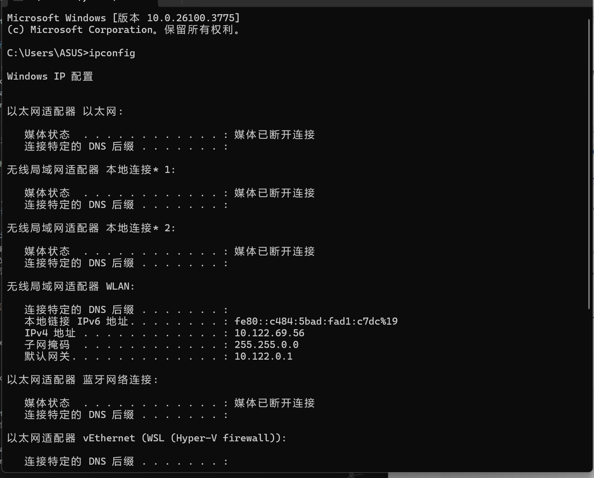
#### 基本连接
- 连接命令格式
ssh username@hostname -p port
- 示例：
ssh admin@192.168.1.100 -p 2222
- 首次连接验证
text
The authenticity of host 'hostname' can't be established.
ECDSA key fingerprint is SHA256:...
Are you sure you want to continue (yes/no)?
✅ 输入yes将密钥加入已知主机列表


#### 文件传输
- SCP 命令速查
1. 本地 → 远程
scp -P 22 file.txt user@host:/path/
2. 远程 → 本地
scp -r user@host:/remote/dir /local/path
3. 跨服务器传输
scp user1@host1:/file user2@host2:/path

#### SFTP 交互命令

sftp
sftp> put localfile.txt ~/remote/
sftp> get /remote/file.txt ./local/
sftp> ls -l
sftp> bye

#### 密钥认证配置
1. ssh-keygen -t rsa -b 4096
- 生成文件：
- ~/.ssh/id_rsa      (私钥)
- ~/.ssh/id_rsa.pub  (公钥)
2. 设置权限
chmod 600 ~/.ssh/id_rsa*

- 公钥部署方法
1. 方法1：ssh-copy-id（推荐）
ssh-copy-id -i ~/.ssh/id_rsa.pub user@host
2. 方法2：手动追加
cat ~/.ssh/id_rsa.pub | ssh user@host "mkdir -p ~/.ssh && cat >> ~/.ssh/authorized_keys"
3. 验证权限
ssh user@host "chmod 700 ~/.ssh; chmod 600 ~/.ssh/authorized_keys"

#### 使用 WSL 扩展连接到 WSL 子系统


### 1.1 文本编辑：Markdown,LaTeX,Typst和Beamer
#### markdown(略)、
#### LATEX
- 1.1 文档结构模板
```latex
\documentclass{article} % 文档类型
\usepackage[UTF8]{ctex} % 中文支持包
\begin{document}
\title{文档标题}
\author{作者}
\date{\today}
\maketitle
\section{第一节}
这里是正文内容...
\end{document}
```

#### 常用文本格式

|功能|	语法|	示例|
|------|------|------|
|加粗|	\textbf{}|	\textbf{粗体}|
|斜体|	\textit{}|	\textit{斜体}|
|下划线|	\underline{}|	\underline{下划线}|
|强调|	\emph{}|	\emph{强调}|

#### 数学公式排版
- 公式环境对比
```latex
% 行内公式
勾股定理 $a^2 + b^2 = c^2$
% 单行公式
\[ E = mc^2 \]
% 多行对齐
\begin{align}
    f(x) &= x^2 + 2x + 1 \\
         &= (x + 1)^2
\end{align}
```

- 常用数学符号

|符号|	LaTeX|	符号|	LaTeX|
|------|------|------|------|
|α	|\alpha|	×	|\times|
|÷	|\div	|∑	|\sum|
|∫	|\int	|√	|\sqrt{}|

#### 核心功能包
```latex
\usepackage{graphicx} % 图片插入
\usepackage{listings} % 代码排版
\usepackage{algorithm2e} % 伪代码
\usepackage{hyperref} % 超链接
```
#### 配置示例
```latex
% 代码排版配置
\lstset{
    language=Python,
    basicstyle=\ttfamily\small,
    numbers=left
}
```
#### Beamer 幻灯片
```latex
\documentclass{beamer}
\usetheme{Berlin}
\begin{document}
\begin{frame}
\frametitle{标题}
\begin{itemize}
    \item 第一点
    \item 第二点
\end{itemize}
\end{frame}
\end{document}
```
#### Report 长文档
```latex
\documentclass{report}
\usepackage{tocloft} % 目录美化
\begin{document}
\tableofcontents
\chapter{引言}
\section{研究背景}
...
\end{document}
```
#### ModernCV 简历
```latex
\documentclass[11pt]{moderncv}
\moderncvtheme{classic}
\name{John}{Doe}
\title{简历标题}
\begin{document}
\makecvtitle
\section{教育背景}
\cventry{年份}{学位}{学校}{成绩}{}{描述}
\end{document}
```
#### 编译工作流
```bash
pdflatex main.tex     # 首次编译
bibtex main           # 参考文献处理
pdflatex main.tex     # 二次编译
pdflatex main.tex     # 最终编译
```

### 1.2 Windows 入门指南
- 启用超级管理员账户
```powershell
# 激活Administrator账户
net user administrator /active:yes
# 设置密码（可选）
net user administrator *
```
警告：慎用Administrator账户，操作不当可能导致系统崩溃

- UAC控制级别

|级别|	安全度|	便利度|	适用场景|
|------|------|------|------|
|最高|	🔒🔒🔒|	⚠️|	高风险环境|
|默认	|🔒🔒	|⚠️⚠️	|日常使用|
|关闭|	🔒|	⚠️⚠️⚠️|	开发测试|

#### 环境变量管理
```powershell
# 临时添加PATH
$env:Path += ";C:\Program Files\mingw64\bin"
# 永久修改系统变量（需要管理员）
[System.Environment]::SetEnvironmentVariable(
    "Path",
    [System.Environment]::GetEnvironmentVariable("Path", "Machine") + ";C:\new\path",
    "Machine"
)
```

#### 终端替代方案

|终端|	特点|	安装命令|
|------|------|------|
|Windows Terminal|	现代化多标签|	微软商店|
|PowerShell 7|	跨平台改进|	winget install PowerShell|
|Git Bash	|Linux命令兼容	|随Git安装|

#### Winget基础用法
```powershell
# 搜索软件
winget search python
# 安装软件
winget install Python.Python.3.11
# 升级所有软件
winget upgrade --all
# 导出已安装列表
winget export -o packages.json
```
#### 必备开发工具
```powershell
winget install Microsoft.VisualStudioCode
winget install Git.Git
winget install Python.Python.3.11
winget install Docker.DockerDesktop
```
### 0.1 进阶：运维方向，Linux文件系统
#### 1. 核心概念架构

- 设备识别

|设备类型|	设备文件|	查看命令|
|------|------|------|
|SATA/SCSI	|/dev/sdX	|lsblk|
|NVMe SSD|	/dev/nvme0n1|	lspci|
|虚拟磁盘|	/dev/vda	|fdisk -l|

- 分区工具对比
```bash
# 传统MBR分区
sudo fdisk /dev/sdb
# GPT分区（>2TB）
sudo parted /dev/nvme0n1
```

- 常见文件系统特性

|类型|	最大文件|	日志|	快照|	适用场景|
|------|-------|------|------|------|
|ext4	|16TB	|✓	|✗	|通用|
|xfs|	8EB|	✓	|✗	|大文件|
|btrfs	|16EB	|✓	|✓|	高级存储|
|NTFS|	16EB|	✓	|✗	|Windows兼容|

- 创建与检查
```bash
# 创建ext4
sudo mkfs.ext4 -L "DATA" /dev/sdb1
# 检查xfs
sudo xfs_repair /dev/sdc1
```

- 手动挂载示例
```bash
sudo mkdir /mnt/storage
sudo mount -t xfs -o noatime /dev/sdb1 /mnt/storage
```
- /etc/fstab配置
```ini
# 设备标识   挂载点   类型   选项       dump fsck
UUID=123... /data    ext4   defaults   0     2
LABEL=BACKUP /backup xfs    noatime    0     1
```
- 常用命令
```bash
# 扩展逻辑卷
sudo lvextend -L +5G /dev/vg01/lv_data
sudo resize2fs /dev/vg01/lv_data
```

- 常见问题解决
```bash
# 修复无法挂载
sudo fsck -y /dev/sdb1
# 查找大文件
sudo du -h --max-depth=1 / | sort -h
# 释放inode
sudo find / -xdev -type f | cut -d "/" -f 2 | sort | uniq -c | sort -n
```

- 应急恢复
```bash
# 只读模式挂载
mount -o remount,ro /
# 修复fstab错误
mount -n -o remount,rw /
```
- 最佳实践建议
- 分区策略：
1. /boot: 1GB (ext4)

2. /: 20-50GB (xfs/ext4)

3. /home: 剩余空间 (btrfs)

#### 附录
- ext4 文件系统
```bash
# 创建文件系统
sudo mkfs.ext4 -L "DATA_EXT4" /dev/sdb1
# 检查修复
sudo fsck.ext4 -f /dev/sdb1
# 调整大小（需先调整分区）
sudo resize2fs /dev/sdb1
```
- xfs 文件系统
```bash
# 创建文件系统
sudo mkfs.xfs -f -L "DATA_XFS" /dev/sdc1
# 检查修复
sudo xfs_repair /dev/sdc1
# 扩展容量（不支持缩小）
sudo xfs_growfs /mnt/xfs_data
```
- btrfs 文件系统
```bash
# 创建文件系统
sudo mkfs.btrfs -L "DATA_BTRFS" /dev/sdd1
# 子卷管理
sudo btrfs subvolume create /mnt/btrfs/subvol1
sudo btrfs subvolume snapshot /mnt/btrfs/subvol1 /mnt/btrfs/snap1
# 平衡空间
sudo btrfs filesystem balance /mnt/btrfs
```
#### LVM常用操作命令
```bash
# 物理卷操作
sudo pvcreate /dev/sde1
sudo pvdisplay
# 卷组管理
sudo vgcreate vg_data /dev/sde1
sudo vgextend vg_data /dev/sdf1
# 逻辑卷操作
sudo lvcreate -L 50G -n lv_home vg_data
sudo lvextend -L +10G /dev/vg_data/lv_home
sudo resize2fs /dev/vg_data/lv_home
```

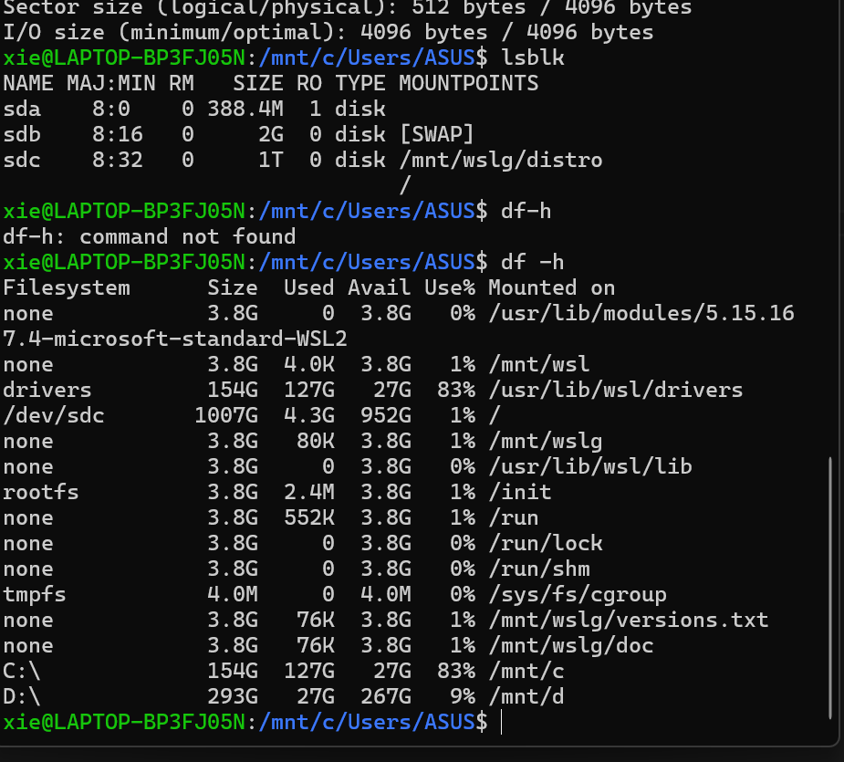
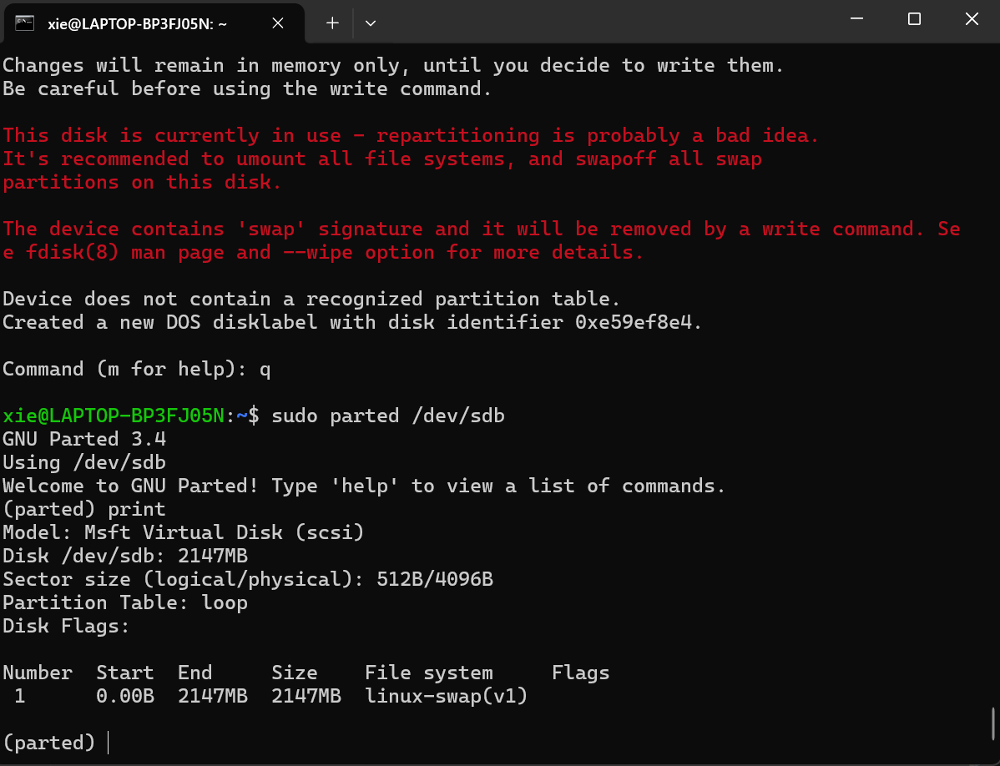
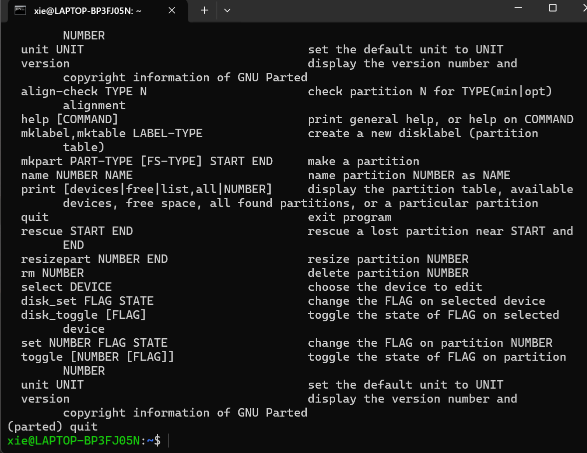
