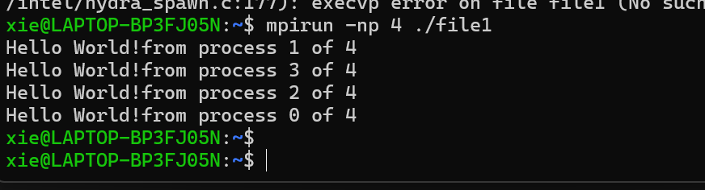

## 并行计算
### 简单定义：
- 使用并行计算机，例如多核计算机、计算机集群或其他先进的并行/分布式计算系统，以高速解决高级计算问题
- 并行计算机的性能通常以每秒浮点运算次数（FLOPS）来衡量
- 例如，千兆（10^9）FLOPS，太兆（10^12）FLOPS，拍兆（10^15）FLOPS，艾克兆（10^18）FLOPS
- 单个CPU的理论峰值FLOPS可以计算
基本计算公式：理论峰值 FLOPS (每核)=核心频率 (Hz)×每周期可执行的浮点运算数
- 并行计算的工作原理是将一个大任务分成多个小任务，然后将每个小任务分配给一个处理器
>注意：在计算过程中，这些小任务可能需要协调，从而使并行计算变得更加复杂
- 需要考虑的问题：
1. 如何将一个任务分成多个小任务？
2. 我们如何将任务分配给进程/线程？
3. 如果进程/线程需要共享部分结果怎么办？
4. 并行程序的性能如何？
### 为什么要并行计算
1. 技术推动：现在我们的笔记本电脑或手机都是并行计算机，计算机也使并行计算机
2. 应用驱动：许多现代应用，如大数据分析、人工智能和深度学习，都在很大程度上依赖于并行计算
### 技术限制
1. “频率墙”：增加频率和更深的管道在性能上已达到收益递减
2. “功率墙”：如果运行得更快（更高的时钟频率），芯片会熔化
3. “ILP墙”：在寻找更多ILP（指令级并行性）方面收益递减
4. 摩尔定律依然存在，然而，无法显著提高频率以提升性能。
### 多核技术
1. P∝CV^2f （功耗正比于 电容 × 电压平方 × 频率）
2. f∝V （频率正比于 电压）
3. P∝f^3（功耗正比于 频率的立方）
- 对于单核，频率增加50%，我们将获得1.5倍的性能，但功耗为3.3倍 
- 使用两个核心，为了增加相同的峰值性能，我们实际上可能将频率降低25%，然后将功耗减少到0.8倍。
### 大数据（数据分析）
- 数据洪流在许多领域中普遍存在，例如天文学、粒子物理学、智慧城市和电子健康
- 数据量的急剧增加也需要大量的计算能力，以将原始数据转化为有意义的信息，这要求使用并行和分布式计算策略
- 这些苛刻的要求导致了高级编程模型的开发，例如MapReduce，以简化在多台机器上进行数据密集型计算的并行化。
### 深度学习
- 深度学习或深度神经网络是一类机器学习算法，其灵感来源于人类大脑的结构和功能
- DNN通过分析大量数据进行训练，以实现分类和预测
- 目前，它已成功应用于各种实践中，并在我们日常生活中发挥着越来越重要的作用
- 然而，之所以取得如此巨大的成功，主要是因为可用的训练数据越来越多，计算资源越来越强，使我们能够训练更大、更深的神经网络。
### 并行计算机组织
#### 三类实体组织
1. 多核
- 多个内核共享
- 小规模（高端约100个内核）
2. 群组
- 多个处理单元(PE) ,配备多核和GPU的独立计算机，通过互联网连接起来
- 大规模，几乎所有超级计算机都是集群
3. GPU
- 附加加速器-最初设计用于图形处理
- 如今，它可以作为一种更通用的GPU，用于常规计算和数据模式的应用，尤其是机器学习应用
### 多核
- 现在所有的计算机都是多核计算机系统
1. 若干处理器或内核
2. 片上高速缓存
3. 共享全局内存空间（外部高速缓存和DRAM）
### 计算机集群
- 通过互联网络连接多台独立计算机
- 每台独立计算机都是多核系统，拥有自己的本地内存
- 大多数超级计算机都是一种计算机集群
1. 每个计算节点不仅包含多个内核，还包含GPU
2. 例如，目前世界上速度最快的超级计算机“前沿”由9472个计算机节点组成，每个节点由一个64核CPU和四个GPU组成
### 现代图形处理器
每个GPU包含
- 多个SM-流式多处理器
1. 多个SP-流处理器（“标量处理器内核”）（又称“线程处理器”）
2. 注册文件
3. 共享内存
- 恒定缓存（SM只读）
- 纹理缓存（SM只读）
- 设备内存
#### 新一代GPU，如GeForce RTX 4090
- 每个流失多处理器（SM）
1. 128个内核（流处理器或SP）
2. 16MB共享内存
3. 32MB寄存器文件
4. 4个用于机器学习的张量内核
- 该芯片有128个SM，或16,384个核心，512个张量核心，还有72MB L2缓存。
### 互连网络
- 互连网络是计算机系统中最关键的组件之一，它对应用程序的性能有显著影响，尤其是在大规模计算系统中
- 两种类型的网络：静态和动态
- 在静态网络中，消息必须沿着已建立的链接进行路由
- 这意味着单个消息必须通过中间处理器才能到达其目的地
- 当信息沿链路和交换机传输时，动态网络会在两个或多个节点之间即时建立连接
#### 完全连接的网络是一个静态网络
- 每个处理器都连接到每个其他处理器
- 网络中的链接数量按 O(𝑝²) 进行扩展，其中𝑝是处理器的数量
- 尽管性能扩展得很好，但硬件复杂性在大值的𝑝下是不可实现的。
#### 交叉开关是一个交换网络
- p个处理器的交叉开关成本随着O(𝑝²) 增长
- 通常对于大值的𝑝来说，扩展是困难的。
### Frontier是世界上第一台外量级超级计算机（10^18 FLOPS），托管在美国橡树岭领导计算设施
- 它使用9,472个计算节点
- 每个节点由一个64核CPU和4个GPU组成（因此总共有606,208个核心和37,888个GPU）
- 计算节点通过最先进的Slingshot网络互连
- Slingshot互连网络的核心是Rosetta交换机
- 默认拓扑是Dragonfly——一种分层直接拓扑。
### Rosetta交换机
- 有64个端口，速度为200 Gb/s，连接计算节点或其他交换机以形成不同的互连网络
- 端口分为32个模块，每个模块有2个端口
- 模块组织成4行8个模块
- 同一行的模块通过每行16个总线连接,行总线用于将数据从相应的端口发送到行上的其他端口
- 同一列的模块通过每个模块的交叉开关连接,每个模块的交叉开关有来自行上16个端口的16个输入和通往列上8个端口的8个输出
- 从一个端口到另一个端口最多需要2跳（直径=2）。
### Dragonfly是一个分层直接拓扑
- 交换机被分组：通常按机柜分组
- 在每个组中，交换机通过电连接（铜缆）以完全（或完备）连接的图形连接
- 组之间也通过光连接（光缆）以完全连接的图形连接。
- 优势：
1. 低延迟：由于组内和组间的全连接，Dragonfly的直径为3个交换机到交换机的跳数
2. 低成本：与其他大型系统的拓扑相比，最大限度地减少了长光纤电缆
3. 高度模块化和可扩展。
### 计算机分类
#### 实体组织
- 目前，平行计算机基本上可以分为三类
1. 共享内存机器（MIMD）
- 例如，具有共享内存的多核
- 小规模，高端单节点计算服务器仅包含几十个核心
2. 分布式内存机器（MIMD）
- 多个计算节点，每个节点都有自己的本地内存
- 高度可扩展
- 所有超级计算机都是分布式内存机器
3. 加速器
- SIMD（单指令多数据）用于数据并行计算
- 例如，GPU，TPU
大规模现代平行计算机是上述的组合，例如，一个计算机集群由多个具有分布式内存的计算节点组成，每个节点包含多个具有共享内存的核心，并且可能还有一个或多个加速器。
### 并行编程模型
#### 逻辑组织
（或并行计算平台）– 提供了一种思考并行程序组织的方法
- 基于分类，我们有三种并行计算平台：
1. 共享内存
2. 分布式内存
3. SIMD（数据并行）和多线程
- 如何编程
1. 共享内存平台与OpenMP
2. 分布式内存平台与MPI
### EduCoder（头歌平台）
- 熟悉EduCoder
- 编译并运行两个“Hello World!”程序
- omp_hw.c
1. 编译：gcc –fopenmp –o omp_hw omp_hw.c
2. 运行：./omp_hw

- mpi_hw.c
1. 编译：mpicc –o mpi_hw mpi_hw.c
2. 运行：mpirun –np x mpi_hw– x是一个整数，表示将创建多少个进程,您可以使用不同的x多次运行程序。
