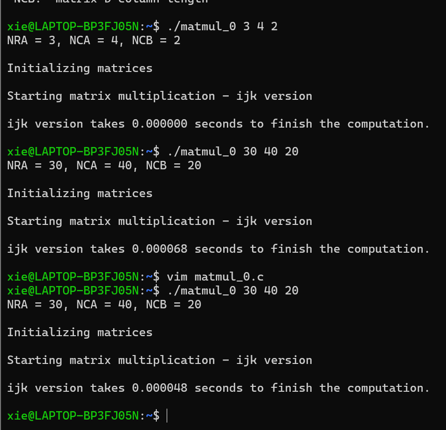
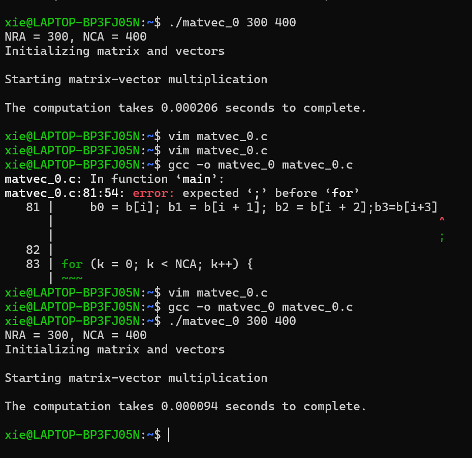
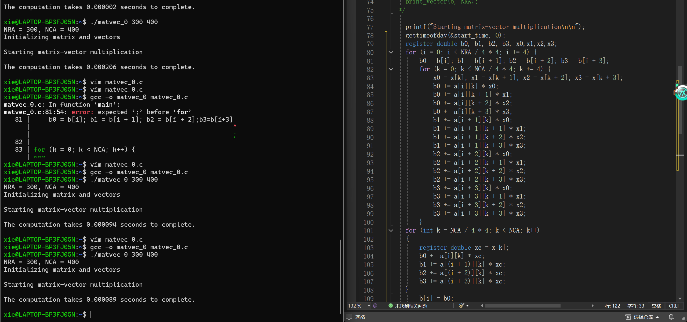
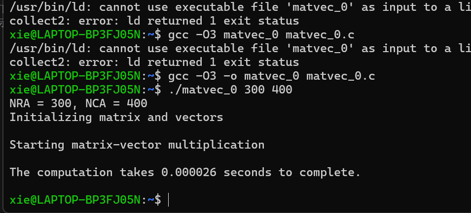
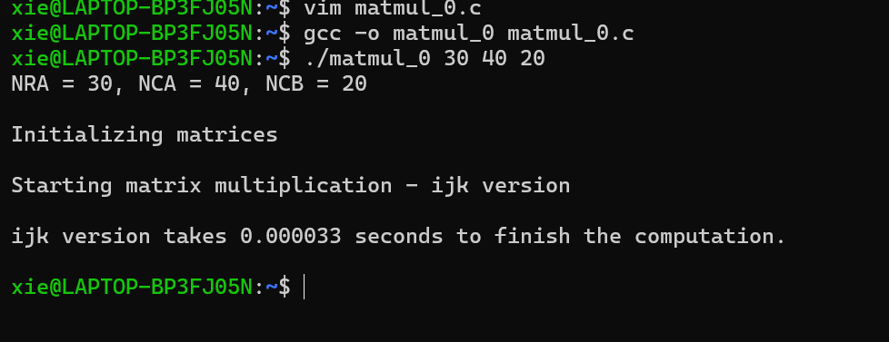

## 内存层次结构
- 大多数未经优化的并行程序的运行速度不到机器“峰值”性能的10
- 在单处理器上会损失大部分性能
- 大部分损失来自记忆系统
- 缓存、寄存器和ILP由硬件和编译器管理
- 有时，他们做的是最好的事情，但有些时候他们不会
- 我们需要编写程序，让硬件和编译器更清楚地了解情况，从而更好地优化代码，性能
- 在计算机内存系统中，我们有寄存器、缓存、主内存和次级内存，它们共同形成了内存层次结构。
### 内存层次结构金字塔
1. 寄存器：
- 位于金字塔顶端，代表计算机中最快的存储单元。
- 特点是低延迟（lower latency）、高带宽（higher bandwidth），但容量非常小（smaller capacity）。它用于临时存储来自一级缓存（L1）的数据字。
2. 一级本地缓存（local L1）:
- 速度仅次于寄存器。
- 用于存储从二级缓存（L2）获取的缓存行（cache line）。
3. 二级本地缓存（local L2）：
- 速度比L1缓存慢，容量相对更大。
- 用于存储从三级缓存（L3）获取的缓存行。
4. 共享三级缓存（shared L3）：
- 速度比L2缓存更慢，容量进一步增大。
- 用于存储从主存（main memory）获取的缓存行。
5. 主存（main memory）：
- 也就是通常所说的随机存取存储器（RAM）。
- 速度相对缓存更慢，容量较大，用于存储从辅助存储器（secondary memory）获取的数据块。
6. 辅助存储器（secondary memory）：
- 位于金字塔底端，包含硬盘、固态硬盘（SSD）等存储设备。
- 特点是高延迟（higher latency）、低带宽（lower bandwidth），但容量非常大（larger capacity） 。

### 大多数程序表现出高度的局部性
- 空间局部性：访问之前访问过的附近项
- 时间局部性：重用之前访问过的项

### 利用内存层次结构来提高性能：
- 将值保存在小而快速的内存（缓存或寄存器）中并重用它们————时间局部性
- 将一块连续的数据加载到缓存（或向量寄存器）中并使用整块————空间局部性。

## 计算强度
- 假设内存层次中只有2个级别，快和慢
- 所有数据最初在慢内存中
- 还假设：
- 𝑚=在快内存和慢内存之间移动的内存元素（字）的数量
- 𝑡𝑚=每次慢速内存操作的时间
- 𝑓=算术操作的数量
- 𝑡𝑓=每次算术操作的时间 ≪𝑡𝑚.
- 当所有数据在快速内存中，最小可能时间=𝑓×𝑡𝑓 
- 实际时间 =𝑓×𝑡𝑓+𝑚×𝑡𝑚=𝑓×𝑡𝑓×(1+𝑡𝑚/𝑡𝑓× 1/𝑞) 
- 其中𝑞=𝑓/𝑚是每次慢速内存访问的平均浮点运算次数————计算强度（算法效率的关键） 
- 更大的𝑞意味着时间更接近最小值𝑓×𝑡𝑓 
- 𝑡𝑚/𝑡𝑓————机器平衡（机器效率的关键） 
- 为了达到至少一半的峰值速度𝑞≥𝑡𝑚/𝑡𝑓。
### 提高单台机器的性能： 
- 增加计算强度 
1. 降低缓存未命中率————1.连续内存访问2.阻塞 
2. 高效利用寄存器————循环展开。
## 矩阵乘法 
### ijk 版本 
```C
for (i=0; i<n; i++)
    for (j=0; j<n; j++)
        for (k=0; k<n; k++)
            C(i,j) = C(i,j) + A(i,k) * B(k,j);
```
对于ijk版本，慢速内存引用次数m大致为n^3(读取B的每列n次) +n^2(读取A的每行1次)+2n^2(读写C的每个元素2次)。 

因此，m=n^3+3n^2。 

浮点运算次数 f=2n^3(每次乘法加一次加法)。 

计算强度q=f/m=(2n^3)/(n^3+3n^2)≈2(当n很大时)。 


这存在一个问题：快内存可能太小，无法容纳矩阵 B。 

矩阵乘法的总数据量是3n^2。理想的q值应接近O(n),即2n^3/4n^2.这表明有很大的改进空间。 

在矩阵乘法中，所有乘法可以独立完成，并且加法具有结合律和交换律。这意味着循环顺序可以改变而不影响最终的乘法结果。 

### ikj 版本 
```C
for (i=0; i<n; i++)
    for (k=0; k<n; k++)
        for (j=0; j<n; j++)
            C(i,j) = C(i,j) + A(i,k) * B(k,j);
```
连续内存访问对于减少缓存未命中率和增加计算强度非常重要，因为数据是以缓存行的形式在缓存和主内存之间传输的。在C语言中，二维矩阵按行主序存储。 

在 ikj 版本中,C和B是按行引用的。假设缓存行包含L个字，那么访问每行只需要n/L次慢速内存访问。 

慢速内存引用次数 m 为： 
- n^2/L读取A的每个元素一次。 
- n^3/L读取B的每行n次。 
- 2n^2/L读写 C 的每行两次。所以，m=n^2/L+n^3/L+2n^2/L=n^3/L+3n^2/L。计算强度 q= f/m=(2n^3)/(n^3/L+3n^2/L) ≈2L. 这是一个巨大的改进。

### 分块技术 (Blocking Technique) 
分块是将数据划分为块，使每个块能够适应缓存，从而在数据被替换出缓存之前多次使用该块中的数据。 

分块矩阵乘法： 

将 n×n 的矩阵A,B,C视为N×N的b×b子块矩阵,其中b=n/N是块大小。 
```C
for i = 1 to N
    for j = 1 to N
        {read block C(i,j) into fast memory}
        for k = 1 to N
            {read block A(i,k) into fast memory}
            {read block B(k,j) into fast memory}
            //matrix multiply on b-by-b blocks
            C(i,j) = C(i,j) + A(i,k) * B(k,j)
        {write block C(i,j) back to slow memory}
```
慢速内存引用次数 m 为： 
- N×n^2读取B的每个块N^3次 (N^3×b^2=N^3×(n/N)^2 =N×n^2)。 
- N×n^2读取A的每个块 N^3次。 
- 2n^2读写C的每个块一次。所以,m=2N×n^2+2n^2。  
分块矩阵乘法的计算强度q=f/m=(2n^3)/(2Nn^2+2n^2)≈n/N=b通过增加块大小b（只要3b^2小于快内存大小），性能可以得到提高。 

### 循环展开 (Loop Unrolling) 
循环展开是一种循环转换技术，有助于优化程序的执行时间。 
- 减少分支开销：减少控制循环的指令，例如指针算术和每次迭代的“循环结束”测试。 
- 有效利用多个寄存器：通过将数据项预加载到寄存器中，减少对内存带宽的需求。 
- 增加计算强度：将数据项加载到寄存器中，然后多次使用它们。 
### 卷积示例： 
原始循环：
```C
Initialize s[i] = 0;
for (i = 0; i <= N-L; i++)
    for (j = 0; j < L; j++)
        s[i] += h[j] * a[i+j];
改变循环顺序：
```
```C
Initialize s[i] = 0;
for (j = 0; j < L; j++)
    for (i = 0; i <= N-L; i++)
        s[i] += h[j] * a[i+j];
```
循环展开 (展开因子 = 4)： 
```C
Initialize s[i] = 0;
for (j = 0; j < L; j+=4){
    float h0 = h[j];
    float h1 = h[j+1];
    float h2 = h[j+2];
    float h3 = h[j+3];
    for (i = 0; i <= N-L; i++)
        s[i] += (h0 * a[i+j]
                + h1 * a[i+j+1]
                + h2 * a[i+j+2]
                + h3 * a[i+j+3]);
}
```
矩阵向量乘法示例 (y=y+Ax)： 
原始循环：
```C
for (i =0; i<n; i++)
    for (k=0; k<n; k++)
        y(i) = y(i) + a(i, k)*x(k)
```
对 i 循环进行展开 (展开因子 = 4)： 
```C
register double y0, y1, y2, y3, x0;
for (i=0; i<n; i+=4){
    y0 = y[i]; y1 = y[i+1]; y2 = y[i+2]; y3 = y[i+3];
    for (k=0; k<n; k++) {
        x0 = x[k];
        y0 += a[i][k] * x0; y1 += a[i+1][k] * x0;
        y2 += a[i+2][k] * x0; y3 += a[i+3][k] * x0;
    }
    y[i] = y0; y[i+1] = y1; y[i+2] = y2; y[i+3] = y3;
}
```
### 实验和作业
1. Lab exercise 1: Matrix Multiplication：通过改变循环顺序来修改矩阵乘法程序 (matmul_0.c)，并比较不同版本的性能。 



2. Lab exercise 2: Matrix-Vector Multiplication with Unrolling： 
- 修改程序 mv0.c，对 i 循环进行循环展开，展开因子为 4（适用于 n 不一定能被 4 整除的通用情况）。 
- 测试程序的正确性并检查性能。 
- 在展开 i 循环后，继续展开 k 循环。 
- 测试程序的正确性并检查性能是否改善。 
- 使用 gcc -O3 编译程序。


 


3. Homework 1: Matrix Multiplication with Loop Unrolling： 
- 修改 Lab exercise 1 中的矩阵乘法程序，添加循环展开，展开因子为 4。 
- 比较不同问题规模下的性能。 
- 绘制图表或表格展示结果。 
