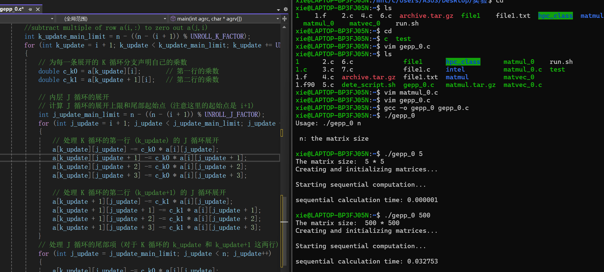

## 加速比和效率
并行计算旨在实现高性能和高速 。
### 加速比(Speedup)
- 衡量并行算法相对于解决给定问题的最快顺序算法的性能提升 。
- 定义： 最快顺序算法的计算时间与并行算法使用p个处理器时的计算时间之比 。 
- 设Ts​为使用单个处理器的计算时间 。
- 设Tp为使用p个处理器的计算时间 。
- 加速比S定义为：S=Tp/Ts
### 效率（Efficiency）
- 是并行算法有效利用处理器的比例 。
- 定义：E=S/p=Ts/pTp 
- 使用p个处理器解决问题时,我们通常不期望达到p倍的加速比，即不期望高效率。
### 并行程序开销 
并行程序通常会引入除了计算之外的额外开销，包括：

进程/线程间的通信或同步 。

可用处理器/线程间的工作负载不平衡 。

为管理计算和增加并行性而引入的额外工作 。

设To=pTp−Ts为总开销 。

效率E可以表示为：E=TS/pTp=Ts/(To+Ts)=1/(1+To/Ts)

效率E的范围是0≤E≤1 。

当To很大时，效率 E 会很小 。

### 理想加速比 
- 理想情况下，我们期望使用 p 个处理器时，加速比能增加 p 倍 。
- 图表显示了理想加速比随处理器数量线性增长的趋势 。
### 实际加速比 
- 实际中，解决问题的加速比通常小于理想加速比 。
- 并且随着处理器数量的增加，实际加速比的表现会更差 。
- 图表对比了实际加速比（红色曲线）和理想加速比（黑色曲线），显示实际加速比增长趋缓 。
## Amdahl 定律 
Amdahl 定律用于预测并行计算在使用多个处理器时的理论加速比 。

它表明并行程序中的串行部分对潜在加速比施加了严格限制 。

假设解决问题的总操作量分为两部分：
1. β部分是纯串行的 。
2. 1−β部分是完全可并行化的 。

使用p个处理器时的并行时间为：Tp=βTs+(1−β)Ts/p。
### Amdahl 定律的加速比 
加速比S为:S=Ts/Tp=Ts/(βTs+(1−β)Ts/p)=p/(1=β(p-1))

当 p 趋于无穷大时，加速比 S→1/β

这意味着 β（串行部分）成为限制因素 。

例如，如果程序只有5%是串行的（即β=0.05），无论使用多少处理器，加速比都不能大于20。
## 开销 
效率E=Ts/pTp=Ts/(To+Ts)=1/(1+To/Ts) 

除了单处理器性能不佳外，导致效率低下的主要原因是开销 。

因此，在设计和实现并行算法时，必须尽力减少所有不必要的开销 。
## 并行算法设计 
如何将问题规范转化为展现并发性、可伸缩性和局部性的算法是一个关键问题 。

并行算法设计不易简化为简单的“食谱”，它需要整合性的思维，通常被称为“创造力” 。

可能需要以前未研究过的新思想 。
### 通用设计流程 
通用设计流程包括两个阶段：
1. 机器无关阶段：
- 根据给定问题的特性识别并行执行的机会 。
- 分区（Partitioning）： 将大任务分解为多个可以并发执行的小任务 。
- 通信/同步（Communication/synchronization）： 协调并发任务的执行，并建立适当的通信/同步结构 。
2. 机器相关阶段：
- 分配（Assignment）： 根据特定机器的特性重新组织任务并将其分配给多个进程/线程 。
- 目标是最小化开销并平衡处理器间的工作负载 。
### 分区 
暴露并行执行的机会 。

重点是定义大量小任务，每个任务由计算及其操作的数据组成 。

典型的分区类型：
1. 任务分区（Task partitioning）： 先将计算分解成多个部分，然后将数据与这些计算关联起来 。
2. 数据分区（Data partitioning）： 先将数据分解成多个部分，然后将计算与这些数据关联起来 。

选择哪种分区取决于实际问题 。
### 通信/同步 
由分区生成的任务旨在并发执行，但通常不能独立执行 。

数据必须在任务之间传输，以使计算能够继续进行 。

通信/同步是管理数据传输和/或协调任务执行所必需的 。

以高效方式组织通信可能具有挑战性 。
### 示例：矩阵-向量乘法 
- 任务分区：
1. 将向量 y 分区，每个元素一个任务 。
2. 计算 y 的每个元素涉及矩阵 A 的一行和向量 b 。
3. 观察： 任务大小均匀，n 个任务之间没有依赖关系，属于“令人尴尬的并行”（Embarrassingly parallel） 。
- 数据分区：
1. 可以分区矩阵 A 和向量 b，然后将一个乘法运算与每一对数据项关联起来，一个来自 A，一个来自 b，作为任务 。
2. 这些小任务的结果只是中间结果，将被视为新数据，用于进一步的新任务构建 。
3. 这相当于将每个内积进一步分区为 n 个更小的任务 。
4. 观察： 任务大小均匀，适合细粒度并行 。
5. 但两个向量内积的任务之间存在依赖关系，需要通信/同步 。
## 算法的并行结构 
设计并行算法通常的第一步是检测顺序算法的并行结构 。

如果算法的并行结构确定了，许多后续决策就会变得显而易见 。

任务依赖图是识别程序并行结构的好技术之一 。
### 任务依赖图 
在任务依赖图中，每个节点代表一个任务，节点之间的箭头表示任务之间的依赖关系 。

主要目的是展示并行结构，以演示算法的各种属性，例如：
1. 并行结构模式 - 规律性 。
2. 边集特征 - 依赖性 。
3. 结构对输入数据的依赖 - 工作预测 。

通常只需呈现一个小型图 。

然而，为复杂算法构建图具有挑战性 。
### 示例：矩阵-向量乘法的任务依赖图 
每个节点代表 aij和bj的乘法 。

箭头表示顺序加法（数据依赖性） 。

每条垂直的箭头-节点线代表点积 yi的输出 。
## 数学结合律 
算法的并行结构是一个重要概念，但不应单独使用 。

为了评估算法的并行潜力，算法背后的数学原理同样重要 。

了解算法的数学基础可以增加并行度——这在实践中非常重要 。
### 示例：整数求和 
考虑 n 个整数的和：s=∑ai(i=0到i=n-1)

### 典型顺序程序：
```C
s = 0;
for (i=0; i<n; i++)
 s = s + a[i];
```
该算法的结构本质上是完全串行的 。
### 结合律的应用 
加法运算遵循结合律 。

对于求和，加法可以以任何顺序进行 。

我们可以得到一个新算法：∑ai(i=0到i=2n-1)=∑ai(i=0到i=n-1)+∑ai(i=n到i=2n-1) 

递归地进行成对加法 。

并行结构形成二叉树 。

并行度从 n 变为 1 。

### 分治技术 
- 分治技术：
1. 分（Divide）： 将数据分成 n 组，每组包含一个元素 。
2. 治（Conquer）： 递归地进行成对加法 。
该技术在实践中广泛用于归约操作 。

运算符不一定是加法，任何遵循结合律的操作都可以 。
## 实验：带展开的高斯消元 
- 修改程序 gepp_0.c，添加循环展开，展开因子为 4，适用于一般情况（即 n 可以不被 4 整除） 。
- 测试程序的正确性并检查性能 。


### 高斯消元 
对于给定大小为 N×N 的矩阵 A，将每行的倍数加到后面的行上，使 A 变为上三角矩阵 。

示例代码片段：
```C
// for each column i zero it out below the diagonal by adding
// multiples of row i to later rows
for i = 1 to n-1
 // for each row j below row i
 for j = i+1 to n
  // add a multiple of row i to row j
  tmp = A(j,i);
  for k = i to n
   A(j,k) = A(j,k) - (tmp/A(i,i)) * A(i,k)
```
图示展示了高斯消元过程中，矩阵逐渐变为上三角形式 。
### 存储乘数 
将乘数 m 存储在对角线以下的零化条目中，以备后用 。

示例代码片段：
```C
for i = 1 to n-1
 for j = i+1 to n
  A(j,i) = A(j,i)/A(i,i)
  for k = i+1 to n
   A(j,k) = A(j,k) - A(j,i) * A(i,k)
```
称乘数的严格下三角矩阵为 M，设 L=I+M 。

称最终矩阵的上三角部分为 U 。

引理（LU 分解）： 如果上述算法终止（不除以零），则 A=L⋅U 。
### 带部分主元的高斯消元 
当 A(i,i) 很小（不仅仅是零）时，算法可能终止但得到完全错误的答案 。 
这会导致数值不稳定性和舍入误差 。

解决方法： 进行主元选择（交换 A 的行），使 A(i,i) 较大 。

部分主元选择： 交换行，使 A(i,i) 成为列中最大的元素 。

示例代码片段：
```C
for i = 1 to n-1
 find and record k where |A(k,i)| = max{i ≤ j ≤ n} |A(j,i)|
 … i.e. largest entry in rest of column i
 if |A(k,i)| = 0
  exit with a warning that A is singular, or nearly so
 elseif k ≠ i
  swap rows i and k of A
 end if
 A(i+1:n,i) = A(i+1:n,i) / A(i,i) … each |quotient| ≤ 1
 A(i+1:n,i+1:n) = A(i+1:n , i+1:n ) - A(i+1:n , i) * A(i , i+1:n)
 ```
这意味着找到当前列中最大绝对值元素所在的行 k，并将其与当前行 i 交换，以确保 A(i,i) 不为零且尽可能大 。