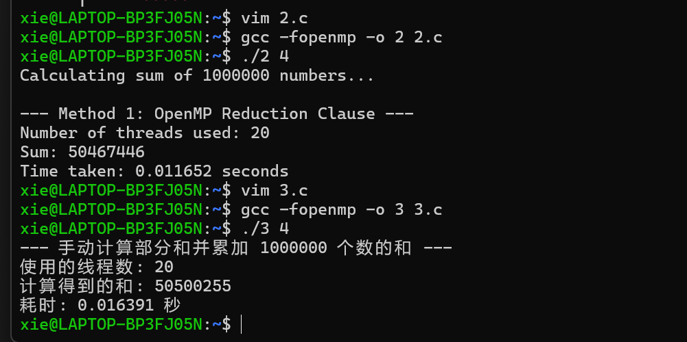
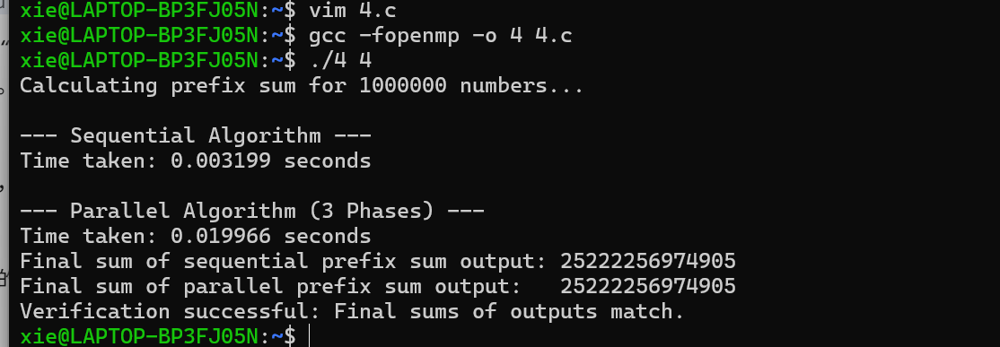

## 并行编程实践 
### 1. OpenMP 同步构造
在共享内存机器中，全局数据由多个线程共享，因此需要同步机制来保护对共享数据的访问，防止竞态条件（race conditions），并施加顺序约束 。OpenMP 支持多种同步构造，以下是其中几个主要概念：

#### 1.1 critical 指令
- #pragma omp critical 
- 作用： 确保同一时间只有一个线程可以执行临界区内的代码，实现互斥（mutual exclusion）。
- 位置： 必须在并行区域内部使用 。
- 示例： 多个线程递增计数器 ：
```C
#pragma omp parallel shared(count)
{
    // ...
    #pragma omp critical
    count++;
}
```
#### 1.2 atomic 指令
- #pragma omp atomic 
- 作用： 提供互斥访问，但仅适用于单个内存位置的更新操作 。
- 位置： 只应用于紧随其后的语句 。
- 示例： 多个线程累加部分结果 ：
```C
double sum = 0.0;
#pragma omp parallel shared(sum)
{
    double lsum;
    // ...
    #pragma omp atomic
    sum += lsum;
}
```
#### 1.3 barrier 指令
- #pragma omp barrier 
- 作用： 设置一个同步点，所有线程必须到达该点后才能继续执行 。
- 隐式屏障： OpenMP 的大多数构造在结束时都有一个隐式屏障 。
- nowait 子句： 用于移除构造末尾的隐式屏障 。
示例： 
```C
#pragma omp parallel shared(sum)
{
    // 所有线程做一些事情
    #pragma omp barrier // 线程在此等待直到所有线程都到达
    // 所有线程做另一些事情
}
```
### 2. 数据依赖性
数据依赖性是并行化代码时需要重点分析的因素，它决定了哪些部分可以安全地并行执行。

#### 2.1 指令级别数据依赖性
指令序列中的依赖关系 ：

1. 流依赖（Flow dependency / Read After Write - RAW）：
- 指令 A 写一个值，指令 B 随后读这个值。指令 B 必须在指令 A 之后执行。
- 示例：$a=b+c;d=a*e;（第二条指令读取第一条指令写入的 a） 
- 特点： 真正的依赖关系 。
2. 反依赖（Anti-dependency/Write After Read-WAR）：
- 指令A读一个值，指令B随后写这个值。指令B必须在指令A之后执行。
- 示例：$b=a+c;a=d*e;（第二条指令写入a，但第一条指令需要先读取旧的 a） 
- 特点： 不是真正的依赖关系，可以通过重命名变量消除 。
3. 输出依赖（Output dependency / Write After Write - WAW）：
- 指令A和指令B都写同一个值。
- 示例：$a=b+c;a=d*e; (两条指令都写入 a) 
- 特点：不是真正的依赖关系，可以通过重命名变量消除 。
#### 2.2 循环携带数据依赖性 (Loop-Carried Data Dependency)
在 OpenMP 中，并行化循环时主要关注循环携带依赖性 。

- 没有循环携带依赖的例子：
```C
for (i = 0; i < n; i++) {
    tmp = a[i];
    a[i] = b[i];
    b[i] = tmp;
}
```
这个循环中的三条指令内部存在数据依赖，但没有数据依赖会传递到下一个迭代。因此，该循环可以安全地并行化 。

- 存在循环携带依赖的例子：
```C
for (i = 0; i < n; i++) {
    a[i] = b[i] + e[i];
    d[i] = e * a[i+1];
}
```
展开循环后可以看到，d[0] 的计算依赖于 a[1]，而 a[1] 会在下一个迭代中被写入。这意味着存在循环携带的 WAR 依赖，导致潜在的竞态条件和错误的结果 。

- 处理循环携带依赖的方法：
对于上述例子，可以通过分离指令为两个独立的循环来消除依赖 ：
```C
for (i = 0; i < n; i++) {
    d[i] = e * a[i+1];
}
for (i = 0; i < n; i++) {
    a[i] = b[i] + e[i];
}
```
然后分别并行化这两个循环 ：
```C
#pragma omp parallel for
for (i = 0; i < n; i++)
    d[i] = e * a[i+1];

#pragma omp parallel for
for (i = 0; i < n; i++)
    a[i] = b[i] + e[i];
```
通过这种方式，可以获得正确的结果 。
- 另一种循环携带依赖：
当数组索引不等于当前循环索引，或者变量值随迭代改变时，也需要注意循环携带依赖 。
例如：
```C
int i, j, A[MAX];
j = 5;
for (i = 0; i < MAX; i++) {
    j += 2;
    A[i] = big(j);
}
```
这里的 j 的值在每次迭代中都会改变，并被下一个迭代使用。为了并行化，可以将 j 转换为与循环索引相关的独立计算 ：
```C
#pragma omp parallel for
for (i = 0; i < MAX; i++) {
    int j = 5 + 2 * (i + 1); // 消除循环携带依赖
    A[i] = big(j);
}
```
注意：循环索引 i 在 OpenMP 中默认是私有的 。

### 3. 归约操作 (Reduction Operation)
归约操作是指对数组中的所有元素应用一个关联操作符（如加、乘、最大值、最小值等）来计算一个单一结果 。

- 常见例子： 数组求和 S = a[0] + a[1] + ... + a[n-1] 。
- 顺序实现：
```C
S = a[0];
for (i = 1; i < n; i++)
    S = S + a[i];
```
- 挑战： 这种顺序实现本质上是递归的，S 的值随迭代变化，存在循环携带数据依赖，无法直接使用 OpenMP 的 for 指令并行化 。
#### 3.1 OpenMP reduction 子句
由于加法是关联且可交换的，我们可以将数组分成多个部分，每个线程计算一个部分和，然后将这些部分和累加得到最终结果 。OpenMP 提供 reduction 子句来简化这个过程 。

- reduction (op : list) 
- 工作原理：
1. 为 list 中的每个变量创建线程局部副本，并根据操作符 op 初始化（例如，+ 操作符初始化为 0） 。
2. 每个线程在其局部副本上执行更新操作 。
3. 所有线程的局部副本最终会被归约（合并）成一个单一的值 。
- 示例： 使用 reduction 求和 ：
```C
double S = 0;
#pragma omp parallel for shared(S, a), reduction(+:S)
for (int i = 0; i < n; ++i)
    S += a[i];
```
- 初始化值： 不同的操作符有不同的数学意义上的初始值 ：

|操作符	|初始值|操作符|	初始值|
|------|------|------|------|
|+	|0	|&&	|1|
|*	|1|	\|\||0|
|-	|0	|&	|~0|
|min|最大的正数|\||	0|
|max|最小的负数	|^	|0|

### 4. 扫描操作 (Scan Operation / Prefix Sum)
扫描操作（也称前缀和）是一个接收一个数组 A=[a_0,a_1,…,a_n−1] 和一个关联操作符⊕，然后生成另一个数组 C 的操作 ：

C=[a_0,(a_0⊕a_1),(a_0⊕a_1⊕a_2),…,(a_0⊕a_1⊕⋯⊕a_n−1)] 
- 示例：对于 A=[1,2,3,4,5,6]，加法扫描结果为 C=[1,3,6,10,15,21] 。
- 顺序实现：
```C
c[0] = a[0];
for (i = 1; i < n; i++)
    c[i] = c[i-1] + a[i]; // 假设操作符为加法
```
这个顺序实现只需要 n−1 次操作 。

- 并行化挑战： 顺序扫描操作具有严格的顺序依赖 (c[i] 依赖于 c[i-1])，不能直接使用 OpenMP 的 for 指令并行化 。需要设计新的并行算法。

#### 4.1 共享内存机器上的并行扫描算法
一个高效的并行扫描算法通常包含三个阶段 ：

1. 阶段 1：局部扫描
- 每个线程处理其分配到的 n/t 个元素块（块划分）。
- 每个线程对其块内的元素执行局部扫描操作。
- 除了最后一个线程，每个线程 i 将其局部扫描的最后一个元素 c_last 存储到一个工作数组 W[i+1] 中。W[0] 通常初始化为操作符的单位元（例如，加法为 0） 。
- 操作数量： t×(n/t−1)=n−t 。
- 同步： 此阶段结束后需要同步（隐式或显式） 。
2. 阶段 2：全局扫描（在工作数组 W 上）
- 由一个线程对工作数组 W 执行顺序扫描操作。
- 操作数量： t−1 （W 的大小为 t） 。
- 特点： 这是一个纯粹的顺序阶段，但由于共享内存机器上的线程数量通常较小，开销不会太重 。
- 同步： 此阶段结束后需要同步 。
3. 阶段 3：更新局部扫描结果
- 每个线程将其在阶段 2 中计算出的相应 W[i] 值与它在阶段 1 中计算出的所有局部扫描元素进行操作（例如，加法操作） 。
- 操作数量： n/t×t=n 。
- 总操作数量：$(n-t)+(t-1)+n=2n-1$ 。 
- 与顺序算法的 n−1 次操作相比，并行算法增加了约两倍的操作量 。
- 并行时间： 2n/t + t + 通信同步时间 。当线程数 t>2 时，并行算法通常能减少总计算时间 。
#### 4.2 OpenMP single 指令
在并行区域内，如果希望代码的某一部分只由一个（任意）线程执行，可以使用 single 指令 ：
```C
#pragma omp single
{
    // 这部分代码只由一个线程执行
}
```
所有其他线程会跳过 single 区域，并在该构造结束时的隐式屏障处等待，直到所有线程都到达 。这在并行扫描算法的第二阶段（全局扫描）中非常有用。

### 5. 实验与作业
- 归约操作练习： 编写 OpenMP 程序计算 n 个数的和。实现两种方法：一种使用 OpenMP reduction 子句；另一种让每个线程计算部分和，然后累加这些部分和。比较两种方法的性能 。

- 作业 3：并行扫描操作： 使用 OpenMP 实现上述并行扫描算法，并与顺序算法的性能进行比较 。
