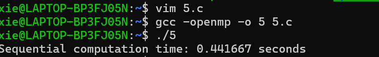
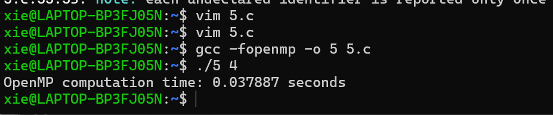
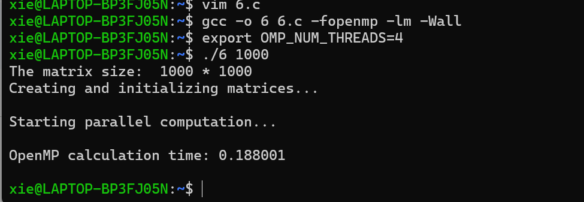

## 并行编程效率低下的原因 
在实践中，实际加速比通常低于理想加速比，并且随着处理器数量的增加，性能会变得更差 。导致效率低下的主要原因包括：

- 糟糕的单处理器性能：通常发生在内存系统中 。
- 过多的并行开销：包括同步、通信和冗余计算 。
- 负载不平衡：不同处理器之间工作量（计算和通信）不同 。
- 计算资源速度不同：例如，CPU和GPU的组合 。
- 为了设计高效的并行算法，必须尽量减少所有不必要的开销 。

## 任务分配 
根据Amdahl定律，少量的负载不平衡会显著限制最大加速比 。因此，需要好的任务分配策略来平衡进程/线程之间的工作负载 。任务分配策略主要分为两类：

1. 静态任务分配 
2. 动态任务分配 (动态作业调度或动态负载均衡) 
### 静态任务分配 
在静态分配中，任务到进程/线程的分配是预先确定的 。

- 优点：简单，运行时开销为零 。
- 适用场景：当任务量可预测时适用 。
- 质量影响：任务分配的质量与任务划分的质量直接相关 。
- 易处理问题：某些问题，如稠密矩阵计算和规则网格，可以很容易地分解成大小相等、数据依赖模式规则的任务，因此任务分配相对容易 。
- 复杂问题：其他问题，如稀疏矩阵、非结构化网格和图，更为复杂，需要考虑如何平衡工作负载、最小化通信开销和冗余计算 。
## 图划分 
图划分是将一个图分解成若干个更小的图 。

- 应用领域：在实践中具有广泛的应用，许多问题可以重新表述为图问题，例如科学计算、VLSI电路设计、计算机图形学和Web图分析 。
- 重要性：在并行机器上进行大型图计算/分析时，图划分是必不可少的预处理步骤 。

例如，许多求解偏微分方程（PDE）的方法是基于网格的 。2D空间被划分为多个三角形，每个三角形在相应的依赖图（或网格）中表示为一个顶点，并具有一个状态 。相邻的三角形通过边连接顶点 。顶点的状态更新涉及其相邻顶点的状态 。

### 图划分定义 
给定一个图 G=(N,E,W_N,W_E) ：
- N: 顶点集 
- W_N: 顶点权重，例如，N={任务}，W_N={任务成本} 
- E: 边集 
- W_E: 边权重，例如，边(j, k) ∈ E表示任务j向任务k发送W_E(j,k)个字 

目标是选择一个划分 N=N_1∪N_2∪⋯∪N_p 使得 ：
1. N_i 中所有节点权重的和大致相等 。
2. 连接所有不同对 N_i 和 N_j 的节点的所有边权重之和最小化 。

例如，平衡工作负载（具有相同的节点权重），同时最小化通信（最小化边割集） 。
#### 图二分法 
在实践中，我们通常有 N=2^k 。图二分法是通过递归地将图二分 k 次来划分图 。

图二分问题通常是一个NP（非确定性多项式）问题，因为对于图的二分法，可能的划分数量非常大，约为 $2^N\sqrt{2/(\pi N)}$ 。因此，我们需要好的启发式算法 。

#### 基于几何信息的图划分 
如果可以获得额外的信息，例如图是从2D或3D空间中的某个结构（如求解PDEs）派生出来的，并且可以将几何坐标附加到顶点，从而已知图的几何布局，那么这有助于解决图划分问题 。

#### 坐标二分法 
坐标二分法是最简单的基于坐标的划分方法 。
- 可以直接绘制一个垂直于x轴的超平面，将顶点分成两等份 。
2. 对于递归二分，我们交替地沿x、y和z坐标进行二分 。
3. 这会产生更好的纵横比，并有望降低边割集的大小 。
在2D空间中，选择一条垂直于x轴的直线L，其通过质心 $(\bar{x}, \bar{y})$，其中 $\bar{x}=\frac{1}{N}\sum_{i=1}^{N}x_i$ 和 $\bar{y}=\frac{1}{N}\sum_{i=1}^{N}y_i$ 。然后将所有网格点放置在 N_1 的左侧，将所有网格点放置在 N_2 的右侧 。

#### 缺点：
坐标依赖 。相同的结构在不同的坐标系中可能会有截然不同的划分 。例如，在某些情况下，边割集可能没有被最小化 。
#### 惯性二分法 
惯性二分法的基本思想是选择一个超平面，使得顶点到该超平面的距离平方和最小 。
- 通过旋转坐标，可以最小化网格点到直线L的距离平方和 。
- 我们希望通过解决最小化问题来找到一条直线L，即最小化 $\sum_{i=1}^{N}d_i^2$，其中 $d_i$ 是网格点 $(x_i,y_i)$ 到直线L的距离 。

#### 步骤：

1. 首先将原点移动到质心 $(\bar{x},\bar{y})$。 $(x_i,y_i)\to(x_i-\bar{x},y_i-\bar{y})=(x_i',y_i')$ 。
2. 然后将 $(x',y')$ 坐标旋转 $\theta$ 度：$x''=x'\cos\theta+y'\sin\theta$ 和 $y''=-x'\sin\theta+y'\cos\theta$ 。
3. $d_i=x_i''$ 。

设 $u^T=[v,w]$，其中 $v=\cos\theta$，$w=\sin\theta$。

设 $I_{xx}=\sum(x_i-\bar{x})^2$, $I_{xy}=\sum(x_i-\bar{x})(y_i-\bar{y})$ 和 $I_{yy}=\sum(y_i-\bar{y})^2$ 。

则 $\sum d_i^2=v^2I_{xx}+2vwI_{xy}+w^2I_{yy}=u^T\begin{pmatrix}I_{xx} & I_{xy} \\ I_{xy} & I_{yy}\end{pmatrix}u$ 。

为了最小化 $\sum d_i^2$，选择 u 作为矩阵 $\begin{pmatrix}I_{xx} & I_{xy} \\ I_{xy} & I_{yy}\end{pmatrix}$ 最小特征值对应的特征向量 。
### 不依赖几何信息的图划分 
坐标二分法等基于坐标的方法需要网格点的几何信息 。然而，在许多实际问题中，图中的顶点没有几何信息，例如万维网的模型，其中顶点是网页 。对于这类问题，需要不同的算法 。目前也有许多方法可以处理这类问题 。

### 时间与质量的权衡 
在图划分中，通常需要在执行时间和解决方案质量之间进行权衡 。

- 有些算法运行速度很快，但找到的解决方案质量一般 。
- 有些算法需要很长时间，但能提供出色的解决方案 。
- 还有一些算法可以在这两种极端之间进行调整 。

时间与质量的选择取决于预期的应用 ：
- 对于VLSI设计，更注重质量，因为即使是稍微好一点的解决方案也能节省实际成本 。
- 对于稀疏矩阵计算，我们只关心总时间 。图划分的执行时间必须小于并行矩阵计算所节省的时间 。

因此，没有一个单一的最佳解决方案适用于所有情况 。

## OpenMP for指令的schedule子句 
循环迭代的默认划分为块划分 。例如，对于 N=30 和 nthreads=4，迭代被划分为 (0..7), (8..15), (16..22), (23..29) 。在许多情况下，需要以不同的块大小划分迭代，甚至循环划分迭代（即，循环调度） 。解决方案是使用schedule子句 。

schedule子句描述了循环迭代如何在团队中的线程之间分配 。

#### schedule(static[, chunk]) 

- 将大小为“chunk”的迭代块分配给每个线程 。
- 静态调度在编译时完成 。
- 块大小由程序员预先确定且可预测——运行时工作量最少 。

#### 例如：
- schedule(static)——块划分 。
- schedule(static, 1)——循环划分 。

#### schedule(dynamic[, chunk]) 

- 每个线程从队列中获取“chunk”个迭代，直到所有迭代都已处理 。
- 动态调度在运行时使用复杂的调度逻辑 。
- 每次迭代的工作量不可预测，高度可变——运行时工作量最大 。
## 实验练习：矩阵乘法 C=AA^T 
编写一个OpenMP程序来计算 C=AA^T ，假设A的大小为 $N \times M$  。

- 注意结果矩阵C是一个对称矩阵：$C^T=(AA^T)^T=AA^T=C$ 。
- 当 $i=j$ 时，我们只需要计算上三角部分的元素，即 $i \le j$ 。
- 首先编写一个顺序程序，然后添加OpenMP指令来并行化程序  。
- 需要考虑负载均衡。

### 作业 4 
编写一个用于带部分主元的高斯消元法的OpenMP程序 。
- 修改 gepp0.c 文件，添加必要的OpenMP指令、子句和函数 。
