### 0.4 用好你的电脑1：环境配置，常用软件选择、安装与卸载
#### C++环境配置
- **主流C++编译器对比**

| 编译器 | 平台 | 特点 | 推荐场景 |
|--------|------|------|----------|
| GCC/MinGW | 跨平台 | 标准兼容性好 | 课程作业/开源项目 |
| Clang/LLVM | 跨平台 | 编译速度快 | macOS开发 |
| MSVC | Windows | 微软生态集成 | Windows应用开发 |

#### 编译器的选择
- **评测系统**：GCC编译器
- **语言标准**：C++17
- **开发建议**：
  - Windows: MinGW-w64 (GCC 14.1.0)
  - macOS: Homebrew安装原生GCC

#### Windows环境配置
- 什么是环境变量？path是什么？
环境变量是包含关于系统及当前登录用户的环境信息的字符串,一些软件程序使用此信息确定在何处放置、使用文件。path是一个环境变量。
- **安装流程**
1. **安装VS Code**：
   - 官网下载：https://code.visualstudio.com
   - 推荐插件：
     - C/C++ (ms-vscode.cpptools)
     - C/C++ Extension Pack

2. **配置MinGW**：
环境变量配置：
系统属性 → 高级 → 环境变量 → 系统变量Path → 新建C:\mingw64_14.1.0\bin
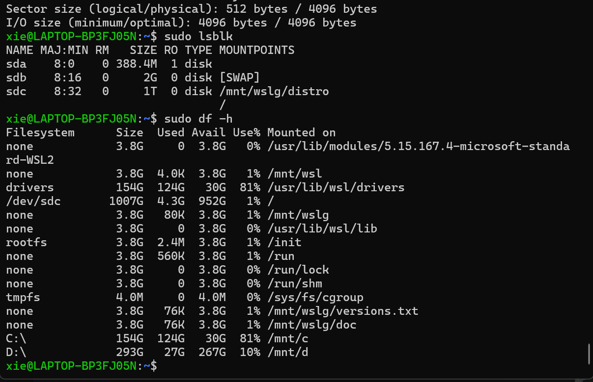

3. **VS Code工作区配置**

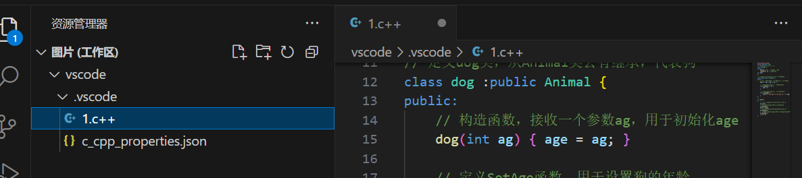

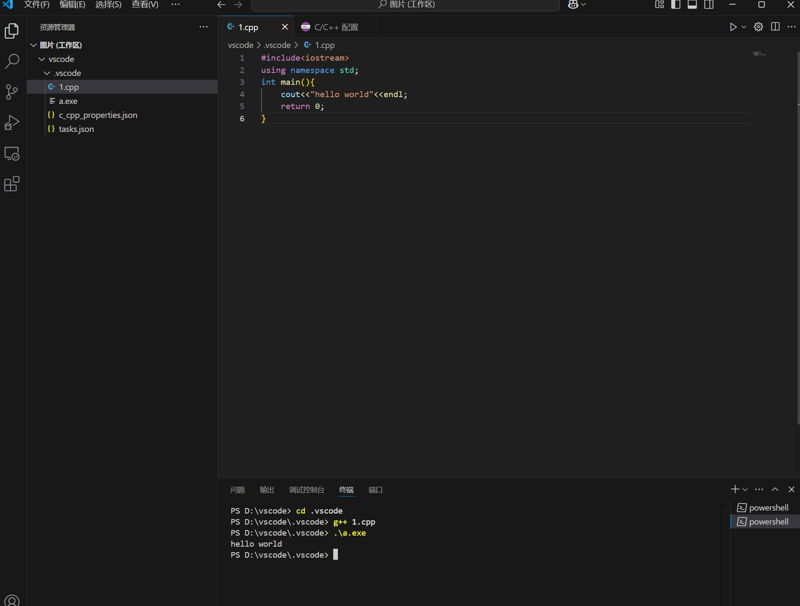

#### Python环境配置
- **Conda 是什么？**
- 跨平台开源软件包和环境管理系统
- 支持 Windows/macOS/Linux
- 快速安装、更新软件包及依赖
- 管理多个 Python 版本和虚拟环境

- **为什么推荐 Conda？**
- 版本隔离
- 环境独立
- 便捷管理

- **Miniforge 安装指南**
推荐使用 Miniforge：
✔️ 体积更小  
✔️ 包含 mamba  
✔️ 适合个人使用  

- **安装步骤**
1. 访问 [Miniforge官网](https://github.com/conda-forge/miniforge)
2. 下载对应系统安装包
3. 双击安装并配置环境变量
4. 终端验证：`conda -V`
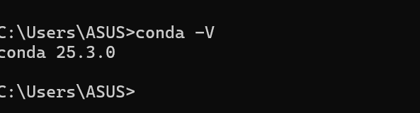

- **环境管理**

|命令|	说明|
|------|------|
|mamba env list|	查看环境|
|mamba list| 查看安装包名称|
|mamba create -n名称 python=版本|	创建环境|
|mamba activate 名称|	激活环境|

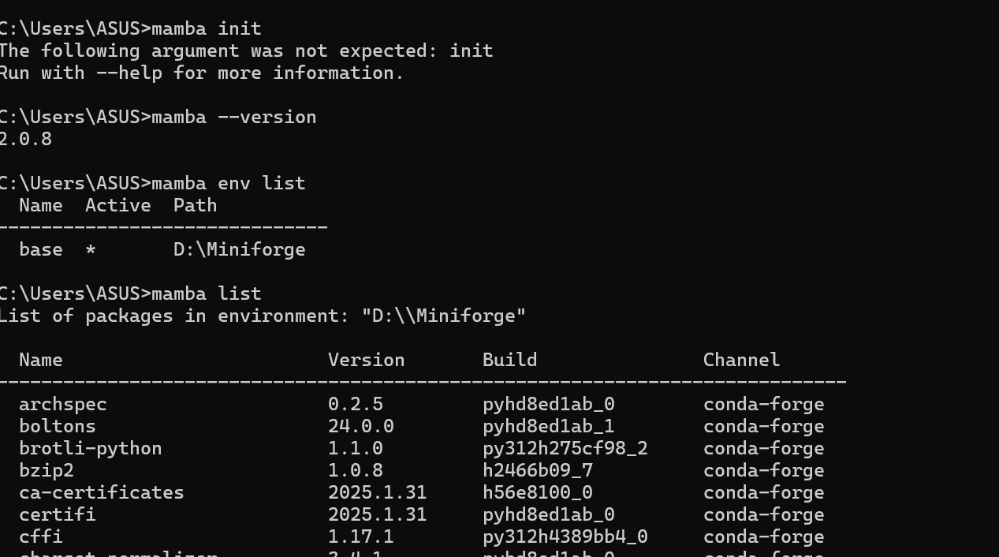

- **虚拟环境内包的安装**
1. 换源，执行以下命令：pip config set global.index-url https://mirrors.pku.edu.cn/pypi/web/simple

2. pip的常用命令：
- pip show：查看包的具体信息。例如 pip show pip。

- pip list：查看已经安装的包。

- pip install：安装指定的包。后面要接包名。

- pip freeze > requirements.txt：把包列表输出到文本文件。

- pip install -r requirements.txt：根据文本文件批量安装包。

- pip uninstall：卸载包。

- pip install --upgrade 包名称==版本号：更新包。

- python -m pip install --upgrade pip：更新 pip。

#### 终端环境配置：
- **Windows终端配置**
- PowerShell推荐理由：
-  微软官方开发的现代化命令行工具
-  深度集成Windows系统功能
-  语法更符合人类直觉
-  强大的扩展和定制能力

#### 1. 修改执行策略
Set-ExecutionPolicy RemoteSigned
#### 2. 配置文件操作
在powershell中输入start $PROFILE

#### 创建新配置(如果不存在)

|策略等级|	安全性|	适用场景|
|------|------|------|
|Restricted|	🔒🔒🔒🔒|	最高安全要求|
|AllSigned|	🔒🔒🔒|	企业环境|
|RemoteSigned|	🔒🔒	|推荐日常使用|
|Unrestricted|	🔒	|开发测试|
|Bypass|	🚫	|危险/临时使用|

#### 常用快捷键和一些指令

| 快捷键 | 功能 | 备注 |
|--------|------|------|
| `Ctrl+Shift+C/V` | 终端复制/粘贴 | Windows通用 |
| `Ctrl+C` | 终止程序 | SIGINT信号 |
| `Ctrl+Z` | 暂停程序 | 可`fg`恢复 |
| `Ctrl+A` | 全选内容 | 快速复制用 |
| **鼠标滚轮+拖动** | 多行选择 | 批量缩进调整 |

#### 实用指令示例

- ## 一些好用指令 ##
- ./a.out < in > output.txt： 把一个文件内容传送到另一个文件（**注意:这回删除out文件中的原来内容**）
- get-content in | .\a.exe > out：功能同上。（在 Windows PowerShell 中使用）
- cd：更改终端所在目录。

#### 文件系统精要
- ## 文件本质 ##
所有文件本质都是二进制序列
文本文件通过编码映射（ASCII/UTF-8等）转换为可读字符
示例：A → ASCII 01000001

- ## 文件后缀解析 ##

|类型	|常见后缀|	说明|
|------|------|------|
|文本	|.txt, .md|	纯文本内容|
|办公	|.docx, .xlsx|	Office文档|
|代码	|.cpp, .py	|源代码文件|
|媒体	|.mp4, .jpg	|音视频/图片|
|可执行|	.exe, .app	|应用程序|、

⚠️ 注意：修改后缀不改变文件内容，但可能影响打开方式

#### 文件系统的一些概念
- 目录（文件夹）：是包含文件和子目录的特殊文件，用于组织和管理文件。
- 文件路径：
1. 绝对路径：从根目录开始的完整路径，例如 /home/user/document.txt。
2. 相对路径：相对于当前工作目录的路径，例如 document.txt。
- 元数据：文件系统存储文件和目录的元数据，包括文件名、大小、创建时间、修改时间、权限等。

#### 文件系统的部分功能如下：
- 管理文件权限：
1. 文件系统管理文件和目录的访问权限，通常包括读取、写入和执行权限。
2. 在类 Unix 系统中，文件权限由所有者、所属组和其他用户的权限组成。
- 文件操作：文件系统提供基本的文件操作，如创建、删除、读取、写入、重命名、复制等。
- 挂载和卸载：文件系统可以挂载到操作系统的目录树中，使其内容可访问。卸载文件系统会断开这种连接。

- **文件系统对比**

|系统类型|	特点|	适用场景|
|------|------|------|
|NTFS|	Windows默认，支持大文件|	本地磁盘|
|ext4|	Linux主流，高性能|	服务器|
|APFS|	Apple优化，支持加密|	Mac/iOS|
|FAT32|	通用性强|	U盘/SD卡|

#### 文本
- 纯文本：各类系统中用 txt后缀区分
- **文本的编码**
编码：将字符转换为二进制数据的规则。保存文本文件和打开文本文件时，分别需要选择一种编码格式
- **文本的常见字体**
微软雅黑、宋体、黑体、Consolas。
- **各类文本和文档**
Word 文本、Excel 表格、PowerPoint 幻灯片、PDF、Markdown、LaTeX。、

#### GutHub上软件的下载
- 下载正确版本
- 查找Release资源
1. 项目主页 → "Releases"栏目
2. 展开"Assets"部分
- 架构选择指南

| 系统平台 | 处理器类型 | 应选文件特征 |
|----------|------------|--------------|
| **Windows** | Intel/AMD | `x64`/`amd64` + `.exe`/`.msi` |
| **macOS** | Intel芯片 | `x64` + `.dmg` |
| **macOS** | M1/M2芯片 | `aarch64`/`arm64` + `.dmg` |
| **Linux** | 通用 | `.deb`(Ubuntu)/`.tar.gz`(通用) |

- **安装注意事项**
 Windows系统正确做法：
- 仔细检查每个安装步骤
- 取消勾选捆绑软件
- 修改默认安装路径（尤其大型软件）
- 安装完成后再次检查

### 0.5 用好你的电脑2：版本控制，Git和文件备份
#### 系统类型对比
| 类型 | 代表工具 | 工作方式 | 特点 |
|------|----------|----------|------|
| **中心化** | SVN | 单服务器集中管理 | 依赖网络，权限控制严格 |
| **去中心化** | Git | 分布式版本库 | 本地完整历史，支持离线工作 |

> 📌 Git ≠ GitHub/GitLab：前者是工具，后者是托管平台

#### Git核心设计
- 核心抽象模型
graph TD
    A[Commit A] --> B[Commit B]
    A --> C[Commit C]
    B --> D[Commit D]
    C --> D
有向无环图(DAG)结构

#### 配置Git
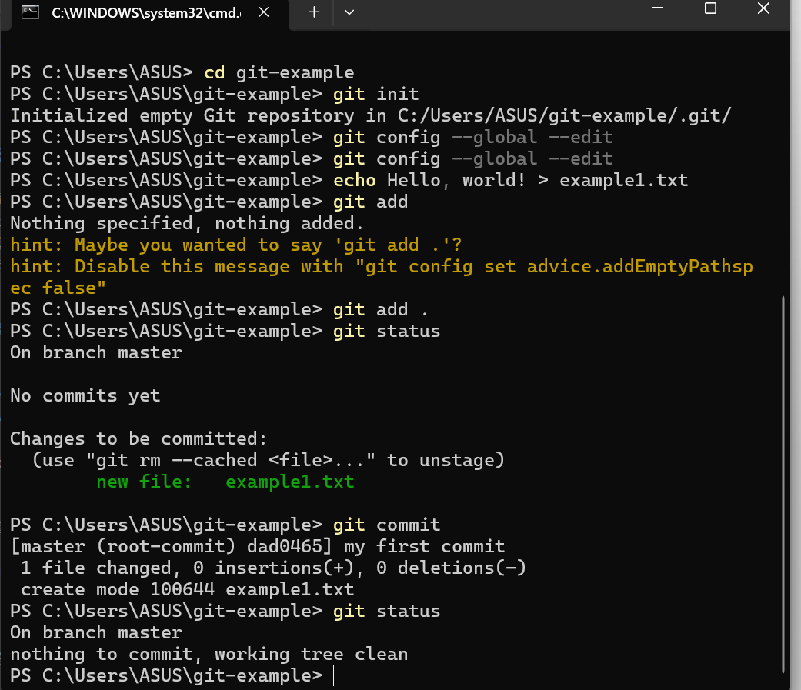
---
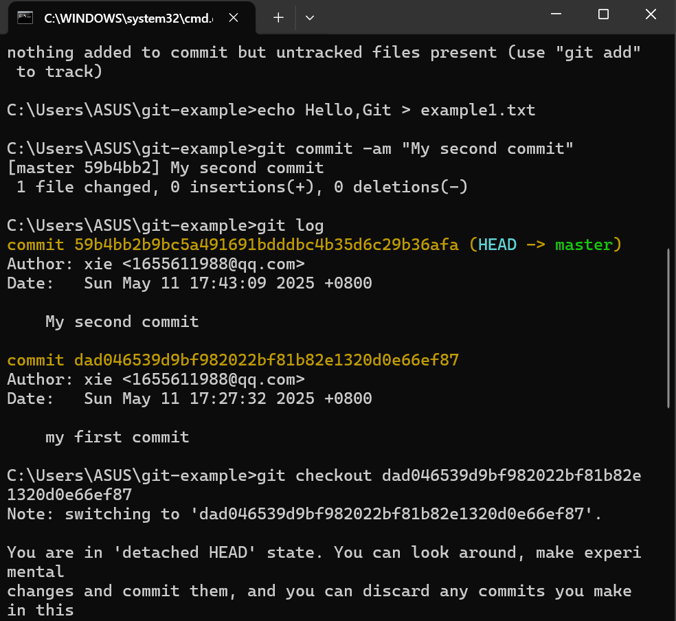
---
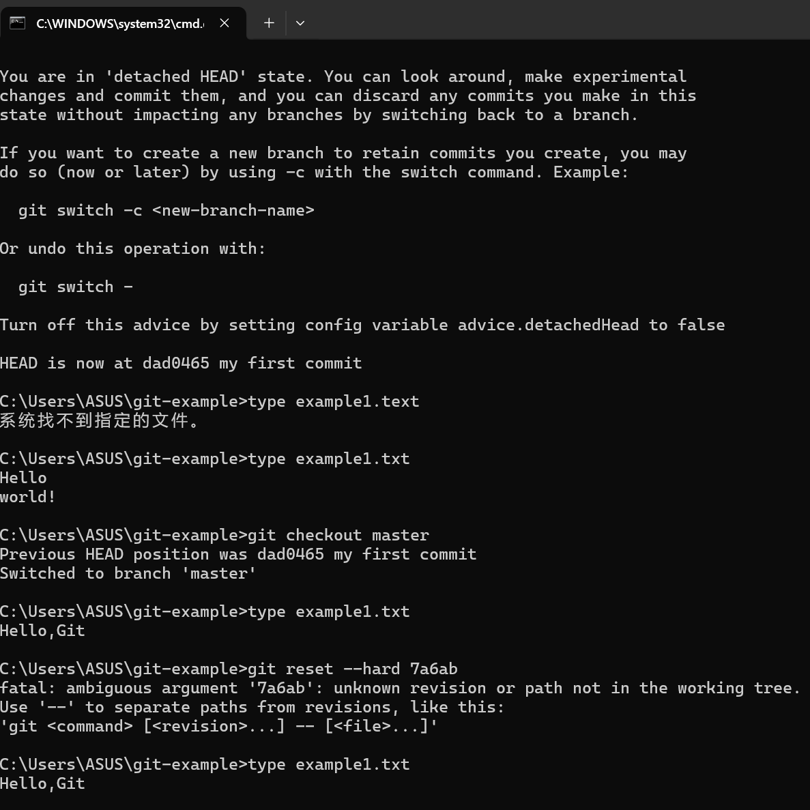
---
#### 排除特定的文件

---
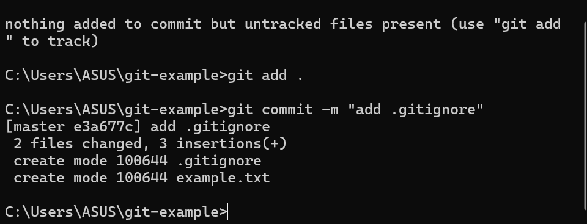

#### 分支管理

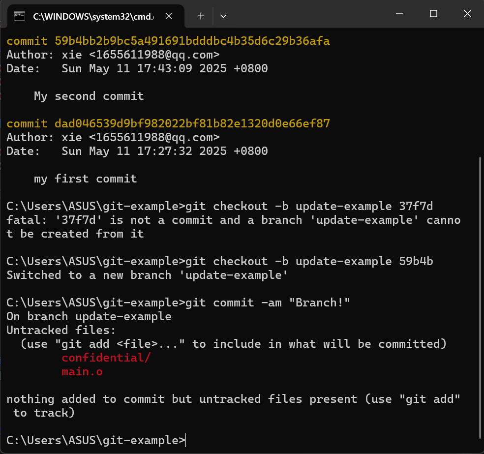
---
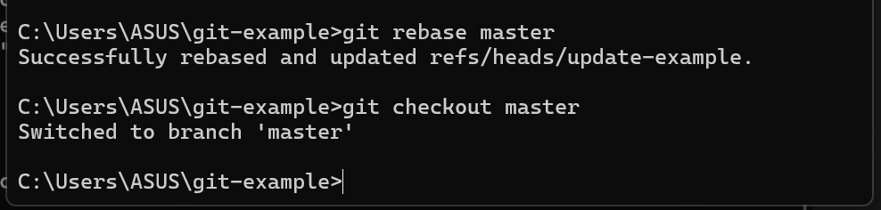
---

#### 合并分支与冲突解决

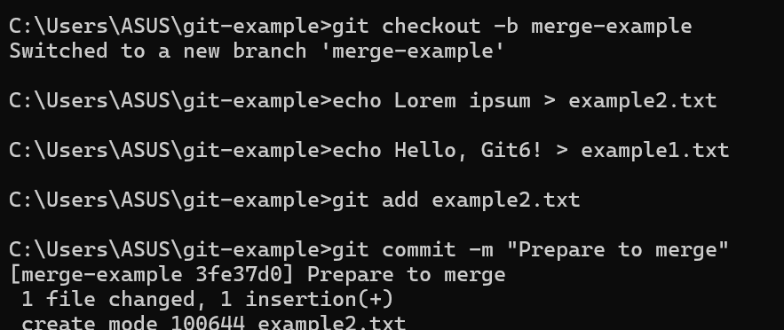
---

#### Git服务器与多人合作
1. 克隆仓库：git clone url://path/to/be/cloned
2. 拉取代码：有时候远端代码库已经更新，你需要更新本地代码（git pull）
3. 推送代码：在工作完成，提交完成之后，可以用这个子命令（git pull）将修改推送至远端

#### 分叉使用场景
- 无原仓库写权限时贡献代码
- 独立实验性开发
- 创建衍生项目

#### 分叉特性
+ 保留原仓库提交历史
+ 可自主管理分支策略
! 原仓库删除后变为独立仓库
- 默认分支(main/master)不建议直接修改

#### 合并请求(MR/PR)流程
- 发起请求步骤
- 在分叉仓库创建功能分支
- 开发并推送变更
- 平台创建PR/MR界面
- 选择目标仓库/分支
- 填写变更说明

#### 合并策略对比

|合并方式|	命令	|历史影响	|适用场景|
|------|------|------|------|
|Merge|	--no-ff|	保留完整提交历史|	标准协作流程|
|Rebase|	--rebase|	线性历史	|需要整洁提交记录|
|Squash|	--squash|	单提交点	|简化次要修改|

#### 图形化工具的使用
1. VScode:VSCode 自带 Git 管理功能，可以使用该功能进行可视化编辑和提交.
2. gitg:Gnome 桌面的 git 管理软件
3. kommit:KDE 桌面的 git 管理软件