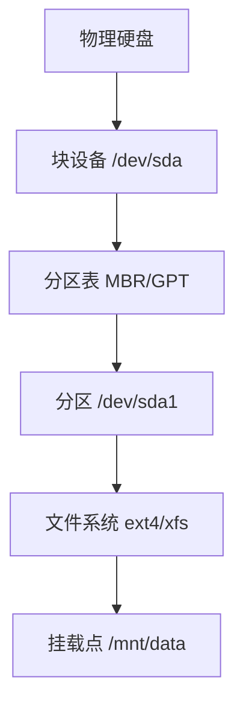
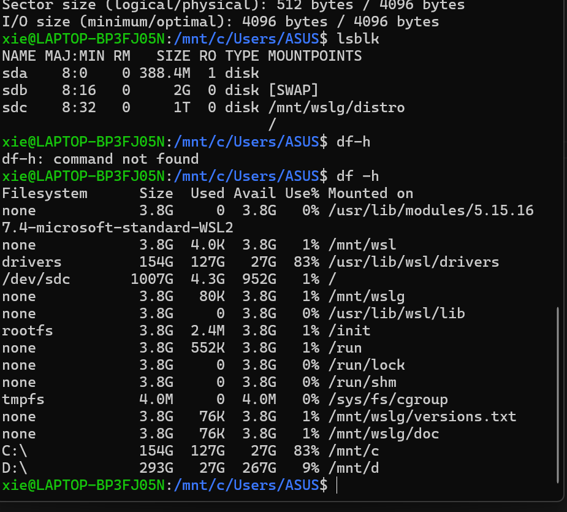
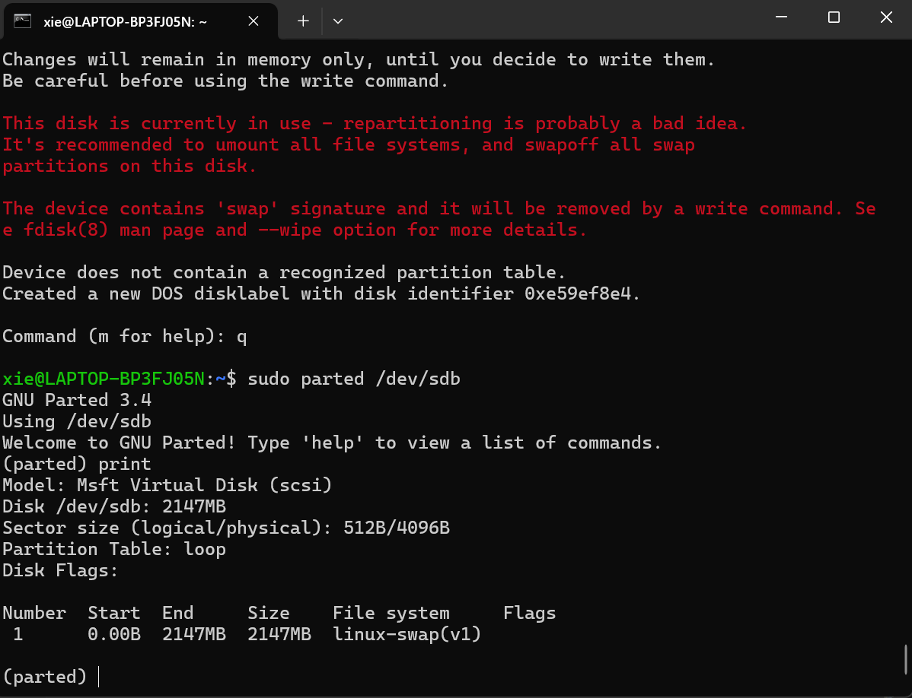
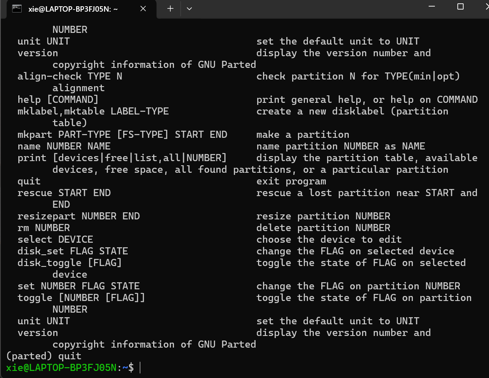
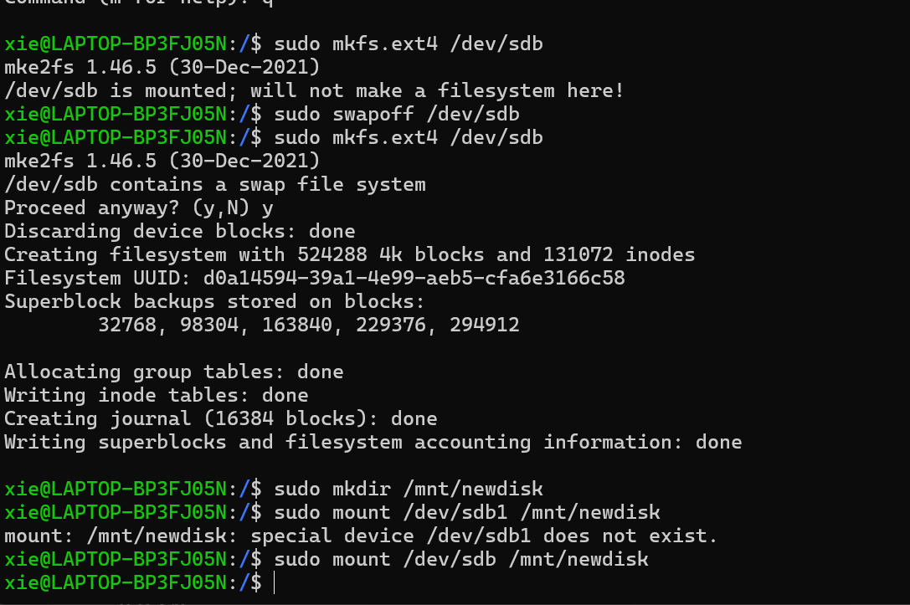

### 1.1 文本编辑：Markdown,LaTeX,Typst和Beamer
#### markdown(略)、
#### LATEX
- 1.1 文档结构模板
```latex
\documentclass{article} % 文档类型
\usepackage[UTF8]{ctex} % 中文支持包
\begin{document}
\title{文档标题}
\author{作者}
\date{\today}
\maketitle
\section{第一节}
这里是正文内容...
\end{document}
```

#### 常用文本格式

|功能|	语法|	示例|
|------|------|------|
|加粗|	\textbf{}|	\textbf{粗体}|
|斜体|	\textit{}|	\textit{斜体}|
|下划线|	\underline{}|	\underline{下划线}|
|强调|	\emph{}|	\emph{强调}|

#### 数学公式排版
- 公式环境对比
```latex
% 行内公式
勾股定理 $a^2 + b^2 = c^2$
% 单行公式
\[ E = mc^2 \]
% 多行对齐
\begin{align}
    f(x) &= x^2 + 2x + 1 \\
         &= (x + 1)^2
\end{align}
```

- 常用数学符号

|符号|	LaTeX|	符号|	LaTeX|
|------|------|------|------|
|α	|\alpha|	×	|\times|
|÷	|\div	|∑	|\sum|
|∫	|\int	|√	|\sqrt{}|

#### 核心功能包
```latex
\usepackage{graphicx} % 图片插入
\usepackage{listings} % 代码排版
\usepackage{algorithm2e} % 伪代码
\usepackage{hyperref} % 超链接
```
#### 配置示例
```latex
% 代码排版配置
\lstset{
    language=Python,
    basicstyle=\ttfamily\small,
    numbers=left
}
```
#### Beamer 幻灯片
```latex
\documentclass{beamer}
\usetheme{Berlin}
\begin{document}
\begin{frame}
\frametitle{标题}
\begin{itemize}
    \item 第一点
    \item 第二点
\end{itemize}
\end{frame}
\end{document}
```
#### Report 长文档
```latex
\documentclass{report}
\usepackage{tocloft} % 目录美化
\begin{document}
\tableofcontents
\chapter{引言}
\section{研究背景}
...
\end{document}
```
#### ModernCV 简历
```latex
\documentclass[11pt]{moderncv}
\moderncvtheme{classic}
\name{John}{Doe}
\title{简历标题}
\begin{document}
\makecvtitle
\section{教育背景}
\cventry{年份}{学位}{学校}{成绩}{}{描述}
\end{document}
```
#### 编译工作流
```bash
pdflatex main.tex     # 首次编译
bibtex main           # 参考文献处理
pdflatex main.tex     # 二次编译
pdflatex main.tex     # 最终编译
```

### 1.2 Windows 入门指南
- 启用超级管理员账户
```powershell
# 激活Administrator账户
net user administrator /active:yes
# 设置密码（可选）
net user administrator *
```
警告：慎用Administrator账户，操作不当可能导致系统崩溃

- UAC控制级别

|级别|	安全度|	便利度|	适用场景|
|------|------|------|------|
|最高|	🔒🔒🔒|	⚠️|	高风险环境|
|默认	|🔒🔒	|⚠️⚠️	|日常使用|
|关闭|	🔒|	⚠️⚠️⚠️|	开发测试|

#### 环境变量管理
```powershell
# 临时添加PATH
$env:Path += ";C:\Program Files\mingw64\bin"
# 永久修改系统变量（需要管理员）
[System.Environment]::SetEnvironmentVariable(
    "Path",
    [System.Environment]::GetEnvironmentVariable("Path", "Machine") + ";C:\new\path",
    "Machine"
)
```

#### 终端替代方案

|终端|	特点|	安装命令|
|------|------|------|
|Windows Terminal|	现代化多标签|	微软商店|
|PowerShell 7|	跨平台改进|	winget install PowerShell|
|Git Bash	|Linux命令兼容	|随Git安装|

#### Winget基础用法
```powershell
# 搜索软件
winget search python
# 安装软件
winget install Python.Python.3.11
# 升级所有软件
winget upgrade --all
# 导出已安装列表
winget export -o packages.json
```
#### 必备开发工具
```powershell
winget install Microsoft.VisualStudioCode
winget install Git.Git
winget install Python.Python.3.11
winget install Docker.DockerDesktop
```
### 0.1 进阶：运维方向，Linux文件系统
#### 1. 核心概念架构

- 设备识别

|设备类型|	设备文件|	查看命令|
|------|------|------|
|SATA/SCSI	|/dev/sdX	|lsblk|
|NVMe SSD|	/dev/nvme0n1|	lspci|
|虚拟磁盘|	/dev/vda	|fdisk -l|

- 分区工具对比
```bash
# 传统MBR分区
sudo fdisk /dev/sdb
# GPT分区（>2TB）
sudo parted /dev/nvme0n1
```

- 常见文件系统特性

|类型|	最大文件|	日志|	快照|	适用场景|
|------|-------|------|------|------|
|ext4	|16TB	|✓	|✗	|通用|
|xfs|	8EB|	✓	|✗	|大文件|
|btrfs	|16EB	|✓	|✓|	高级存储|
|NTFS|	16EB|	✓	|✗	|Windows兼容|

- 创建与检查
```bash
# 创建ext4
sudo mkfs.ext4 -L "DATA" /dev/sdb1
# 检查xfs
sudo xfs_repair /dev/sdc1
```

- 手动挂载示例
```bash
sudo mkdir /mnt/storage
sudo mount -t xfs -o noatime /dev/sdb1 /mnt/storage
```
- /etc/fstab配置
```ini
# 设备标识   挂载点   类型   选项       dump fsck
UUID=123... /data    ext4   defaults   0     2
LABEL=BACKUP /backup xfs    noatime    0     1
```
- 常用命令
```bash
# 扩展逻辑卷
sudo lvextend -L +5G /dev/vg01/lv_data
sudo resize2fs /dev/vg01/lv_data
```

- 常见问题解决
```bash
# 修复无法挂载
sudo fsck -y /dev/sdb1
# 查找大文件
sudo du -h --max-depth=1 / | sort -h
# 释放inode
sudo find / -xdev -type f | cut -d "/" -f 2 | sort | uniq -c | sort -n
```

- 应急恢复
```bash
# 只读模式挂载
mount -o remount,ro /
# 修复fstab错误
mount -n -o remount,rw /
```
- 最佳实践建议
- 分区策略：
1. /boot: 1GB (ext4)

2. /: 20-50GB (xfs/ext4)

3. /home: 剩余空间 (btrfs)

#### 附录
- ext4 文件系统
```bash
# 创建文件系统
sudo mkfs.ext4 -L "DATA_EXT4" /dev/sdb1
# 检查修复
sudo fsck.ext4 -f /dev/sdb1
# 调整大小（需先调整分区）
sudo resize2fs /dev/sdb1
```
- xfs 文件系统
```bash
# 创建文件系统
sudo mkfs.xfs -f -L "DATA_XFS" /dev/sdc1
# 检查修复
sudo xfs_repair /dev/sdc1
# 扩展容量（不支持缩小）
sudo xfs_growfs /mnt/xfs_data
```
- btrfs 文件系统
```bash
# 创建文件系统
sudo mkfs.btrfs -L "DATA_BTRFS" /dev/sdd1
# 子卷管理
sudo btrfs subvolume create /mnt/btrfs/subvol1
sudo btrfs subvolume snapshot /mnt/btrfs/subvol1 /mnt/btrfs/snap1
# 平衡空间
sudo btrfs filesystem balance /mnt/btrfs
```
#### LVM常用操作命令
```bash
# 物理卷操作
sudo pvcreate /dev/sde1
sudo pvdisplay
# 卷组管理
sudo vgcreate vg_data /dev/sde1
sudo vgextend vg_data /dev/sdf1
# 逻辑卷操作
sudo lvcreate -L 50G -n lv_home vg_data
sudo lvextend -L +10G /dev/vg_data/lv_home
sudo resize2fs /dev/vg_data/lv_home
```




