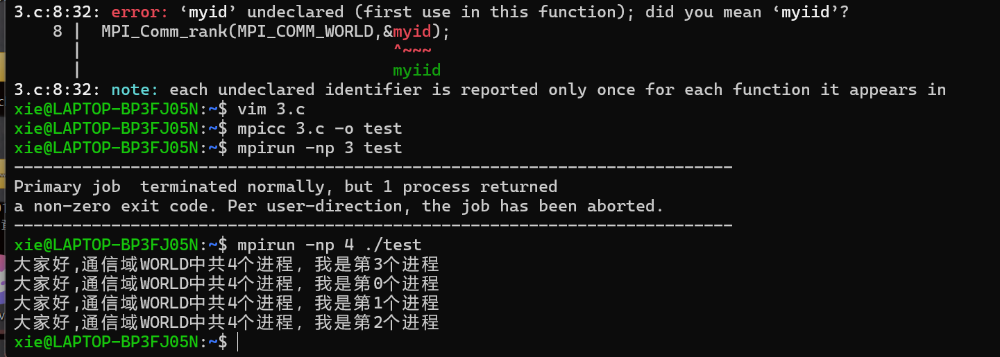

### MPI的基本知识
#### 并行计算机
- 共享内存并行计算机：
共享内存的并行计算机各个处理单元通过对共享内存的访问来交换信息协调各处理器对并行任务的处理．
- 分布式内存并行计算机：
分布式内存的并行计算机各个处理单元都拥有自己独立的局部存储器，各个处理器之间通过消息传递来交换信息，协调和控制各个处理器的执行
- 分布式共享内存并行计算机：
分布式共享内存的并行计算机结合了前两者的特点。可以提高系统的模块性和扩展性有利于快速构造超大型的计算系统

#### 并行程序设计
并行程序设计需要将问题的并行求解算法转化为特定的适合并行计算模型的并行算法。为了达到这一目的，首先是问题的并行求解算法必须能够将问题内在的并行特征充分体现出来，否则并行求解算法将无法利用这些并行特征，从而使问题的高效并行求解成为不可能。其次是并行求解模型要和并行计算模型尽量吻合这样就为问题向并行机上的高效解决提供了前提

#### 消息传输
消息传输是消息数据从一个处理器的内存拷贝到另一个处理器内存的方法。在分布式存储系统中，数据通常是以消息包的形式通过网络从一个处理器发送到另一个处理器。在消息包中，包含了消息头控制信息及消息体数据信息两部分。
> MPI _ SEND ( buf , count , datatype , dest , tag , comm )

#### 本地进程和非本地进程 
本地进程和非本地进程：如果在执行 MPI 程序过程中可能需要在另一个 MPI 程序上调用一些特定的语义或内容，则这个 MPI 程序是非本地的。

#### 发送和接受
发送和接收：消息通信包括数据传输从一个进程（发送）到另一个进程（接收）。要求两个进程协作完成消息发送和接收过程，发送进程一般要求指定发送数据的源、数据长度、数据类型及目的地，而接收操作也要求指定相应的操作与发送相匹配。

#### 进程的同步和异步
- 同步：一个任务的完成需要调用另外一个任务时，只有等待被调用的任务完成后，调用的任务才能算完成；
- 异步：一个任务的完成需要调用另外一个任务时，在调用发出后调用方可用继续执行后续操作，被调用方通过状体来通知调用者，或者通过回掉函数来处理这个调用。

### MPI介绍
#### MPI 含义

- MPI( MessagePassin Interface 消息传递接口）是一种消息传递编程模型，最终目的是服务于进程间的通信。
- MPI 是一种标准或规范的代表，不特指某一个对它的具体实现。
- MPI 是一个库，不是一门语言

#### MPI 的一般实现

|层次|说明|
|------|------|
| MPI| 通过 ADI 层提供的服务和平台无关的算法／数据结构实现 MPI 的标准接口|
| ADI| 通过底层通信库提供的 API 实现，把实现后的接口封装成一类抽象设备，上一层基于不同的硬件通信平台选择不同的抽象设备|
|底层通道API| 通常由操作系统或者特定网络产品生产商提供|

#### 编译指令
- mpicc - o helloworld helloworld . c 
- mpiicc - o helloworld helloworld . c ( intel )
- mpicxx - o helloworld helloworld . cpp mpiicpc - o helloworld helloworld . cpp ( intel )
- mpif90- o helloworld helloworld .f90
- mpiifort - o helloworld helloworld .f90( intel )

#### MPI 程序的基本构造
1. MPI 头文件
2. 初始化 MPI 环境
3. 消息交换处理及计算等
4. 退出 MPI 环境

#### MPI 操作分类
- MPI 操作是由 MPI 库为建立和启用数据传输和／或同步而执行的一系列步骤。。
- 它包括四个阶段：初始化、开始、完成和释放。
> MPI _ SEND ( buf , count , datatype , dest , tag , comm )

#### 内部参数名称的概念
- 序号：即进程的标识，是用来在一个进程组或一个通信器中标识一个进程。是唯一的。·通信域：它描述了一组可以互相通信的进程以及它们之间的联接关系等信息。 MPI 所有通信必须在某个通信器中进行。
- 消息： MPI 程序中在进程间传递的数据。它由通信器、源地址、目的地址、消息标签和数据
构成。
- 通信：通信是指在进程之间进行消息的收发、同步等操作
- 缓冲区：在用户应用程序中定义的用于保存发送和接收数据的地址空间

#### MPI 程序的一般形式
- C : error = MPI _ Xxxxx ( parameter ,...);
- MPI _ Xxxxx ( parameter ,...);
- 整型错误码由函数值返回
- C 包含文件# include " mpi . h "

- Fortran :
- CALL MPI XXXXX ( parameter ,.. IERROR )
- 整型错误码由函数的参数返回 
- Fortran 包含文件 Include ' mpif . h 

#### MPI基本语句
> MPI _ Init ( int * argc , char *** argv )
- 完成 MPI 程序初始化工作，通过获取 main 函数的参数，让每一个 MPI 进程都能获取到 main 函数
> MPI _ Comm _ rank ( MPI _ Comm _ comm , int * rank )
- 用于获取调用进程在给定的通信域中的进程标识号
- MPI _ Comm _ size ( MPI _ Comm comm , int * size )
> 调用返回给定的通信域中所包含的进程总数
- MPI _ Finalize ( void )
> MPI 程序的最后一个调用，清除全部 MPI 环境

### 第一个MPI程序
```c
#include <stdio.h>
#include "mpi.h"
 int main(int argc,char *argv[])
{
 int numprocs, myid;
 MPI_Init(&argc,&argv);
 MPI_Comm_rank(MPI_COMM_WORLD,&myid);
 MPI_Comm_size(MPI_COMM_WORLD,&numprocs);
 printf("大家好，通信域 WORLD 中共％d个进程，我是第％d个进程\n",numprocs,myid);
 MPI_Finalize();
}
```


