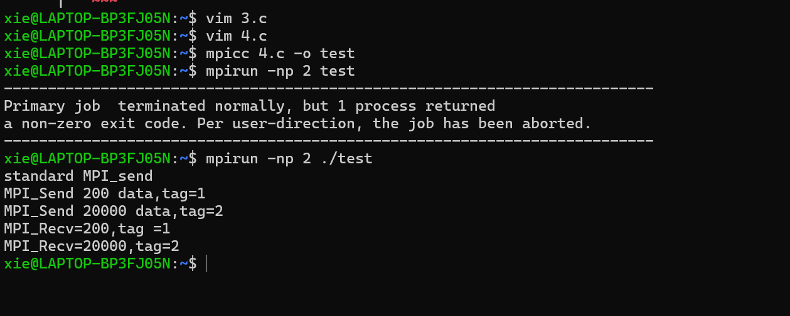
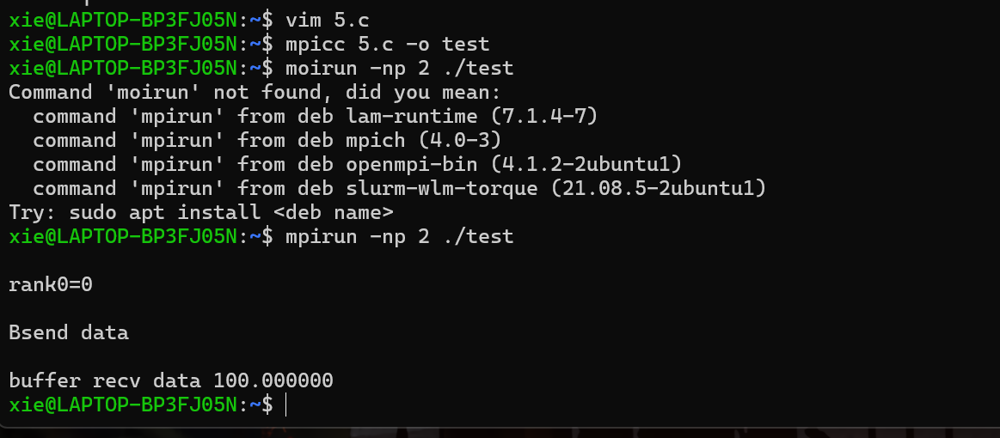
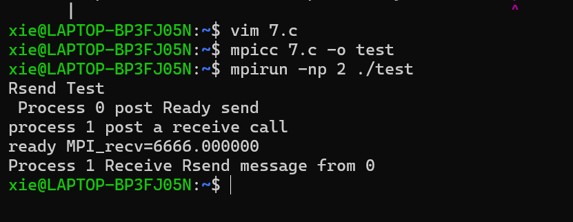

## 点对点通信
### MPI 四种通信模式
#### 发送操作
1. 标准通信（MPI _ SEND） 
2. 缓存通信（MPI _ BSEND） 
3. 同步通信（MPI _ SSEND）
4. 就绪通信（MPI _ RSEND） 

#### 接收操作
 MPI _ RECV（标准接收）

### 标准模式
- 标准发送
 MPI_Send(void*buf,int count,MPI_Datatype datatype,int dest,int tag,MPI_Comm comm)
- 标准接收
MPI_Recv(void*buf,int count,MPI_Datatype datatype,int source,int tag,MPI_Comm comm,status)
  
  buf            数据地址
  
  count          数据个数
  
  MPI _ Datatype 数据类型
  
  source         源进程号
  
  dest           目的进程号
  
  tag            进程标识
  
  MPI _ Comm     通信域
  
  status         状态

#### 任意源和任意标识
>MPI_SEND(buf,count,datatype,dest,tag,comm)
  
  MPI_ANY_SOURCE:接收者可以给 source 指定一个任意值 MPI _ ANY _ SOURCE 标识任何进程发送的消息都可以接收。
  
  MPI_ANY_TAG:如果给 tag 一个任意值MPI_ANY_TAG,则任何tag都是可接收。

#### MPI 环境的异常退出
> MPI_ABORT(comm,errorcode)
  
  IN comm: 退出进程所在通信域
  
  IN errorcode: 返回到所嵌环境的错误码
```c  
 MPI_Comm_size(MPI_COMM_WORLD,&size);
 if(size!=2)
{
 printf ("*** This program uses exactly 2 processes ! not %d ***\n",size);
 MPI_Abort(MPI_COMM_WORLD ,1);
}
```
#### 通信语句
  
 进程0：
  
  MPI_send(x,1,int,1,tag1,comm);发送信息1
  
  MPI_send(y,1,int,1,tag2,comm);发送信息2

 进程1：
  
  MPI_recv(x,1,int,0,tag1,comm);接收信息1

  MPl_recv(y,1,int,0,tag2,comm);接收信息2

#### MPI 程序死锁
```c
MPI_COMM_RANK(comm,rank)
if(rank==0)
MPI_Recv(recvbuf,count,datatype,1,tag,comm);
MPI_Send(sendbuf,count,datatype,1,tag,comm);
if(rank==1)
MPI_Recv(recvbuf,count,datatype,0,tag,comm);
MPI_Send(sendbuf,count,datatype,0,tag,comm);
```

#### 安全的发送接收序列
```c
MPI_COMM_RANK(comm,rank)
if(rank==0)
MPI_Send(sendbuf,count,datatype,1,tag,comm);
MPI_Recv(recvbuf,count,datatype,1,tag,comm);
if(rank==1)
MPI_Send(sendbuf,count,datatype,0,tag,comm);
MPI_Recv(recvbuf,count,datatype,0,tag,comm);
```
```c 
#include<stdio.h>
#include "mpi.h"
int main(int argc,char*argv[])
{
 int rank,size;
 int flag,rval,i; 
 int buffer_1,recv_1;
 int buffer_2,recv_2;
 MPI_Status status,statusl,status2,status3,status4;
 int src=0;
 int dest=1;
 MPI_Init(&argc,&argv);
 MPI_Comm_rank(MPI_COMM_WORLD,&rank);/*0 or 1*/
 MPI_Comm_size(MPI_COMM_WORLD,&size );/*2*/
 if (size!=2)
 {
 printf("*** This program uses exactly 2 processes ! not %d ***\n",size);
 MPI_Abort(MPI_COMM_WORLD,1);
 }
 if (rank==src)/*当前进程为发送进程*/
 {
 buffer_1=200;
 buffer_2=20000;
 printf("standard MPI_send \n");
 MPI_Send(&buffer_1,1,MPI_INT,dest,1,MPI_COMM_WORLD);
 MPI_Send(&buffer_2,1,MPI_INT,dest,2,MPI_COMM_WORLD);
 printf("MPI_Send %d data,tag=1\n",buffer_1);
 printf("MPI_Send %d data,tag=2\n",buffer_2);
 }
 else if (rank==dest)/*当前进程为接收进程*/
 {
/*标准消息接收消息长度 tag 为1*/
 MPI_Recv(&recv_1,1,MPI_INT,src,1,MPI_COMM_WORLD ,&status3);
 MPI_Recv(&recv_2,1,MPI_INT,src,2,MPI_COMM_WORLD,&status4);
 printf("MPI_Recv=%d,tag =1\n",recv_1);
/*标准消息接收 tag 为2*/
 printf("MPI_Recv=%d,tag=2\n",recv_2);
}
MPI_Finalize();
}
```

### 缓存模式
- 并行程序员的需求：
1. 对标准通信模式不满意
2. 希望对通信缓冲区进行直接控制
- 注意事项：
1. 并行程序员需要对通信缓冲区进行申请、使用和释放，
2. 通信缓冲区的合理与正确使用需要设计人员自己保证。

- MPI_BSEND(buf,count,datatype,dest,tag,comm) 
- IN buf 发送缓冲区的起始地址（可选数据类型）
- IN count 发送数据的个数（整型）  
- IN datatype 发送数据的数据类型（句柄）
- IN dest 目标进程标识号（整型）  
- IN tag 消息标志（整型）
- IN comm 通信域（句柄）  
- int MPI_Bsend(void*buf,int count,MPI_Datatype datatype,int dest,int tag,MPI_Comm comm)
- MPI_BSEND(BUF,COUNT,DATATYPE,DEST,TAG,COMM,IERROR)
- <type>BUF(*)
- INTEGER COUNT,DATATYPE,DEST,TAG,COMM,IERROR 

#### 申请缓冲区,提交给MPI作为发送缓存,不使用时.缓冲区释放。
```
 MPI_BUFFER_ATTACH(buffer,size)
 IN buffer 初始缓存地址（可选数据类型）
 IN size 按字节计数的缓存跨度（整型）
 int_MPI_Buffer_attach(void*buffer,int size)
 MPI_BUFFER_ATTACH(BUFFER,SIZE,IERROR)
 <typc> BUFFERR(*)
 INTEGER SIZE,IERROR 
```
``` 
 MPI_BUFFER_DETACH(buffer,size)
 OUT buffer 缓冲区初始地址（可选数据类型） 
 OUT size 以字节为单位的缓冲区大小（整型） 
 int MPI_Buffer_detach(void**buffer,int*size) 
 MPI_BUFFER_DETACH(BUFFER,SIZE,IERROR)
 <type>BUFFER(*) INTEGER SIZE,IERROR 
```
```c
#include<stdio.h>
#include<stdlib.h>
#include"mpi.h"
int main(int argc, char **argv)
{
 int rank;/* My Rank (0 or 1)*/
 double recv;
 double *tmpbuffer ;
 int size=1;
 int bsize;
 double data=100.00;
 MPI_Status status ;
 MPI_Init(&argc,&argv)；
 MPI_Comm_rank(MPI_COMM_WORLD,&rank);
 if (rank==0)
 {
 printf("\nrank0=%d\n",rank);
 MPI_Pack_size(size,MPI_DOUBLE,MPI_COMM_WORLD,&bsize);
 /*计算为发送SIZE个MPI_DOUBLE类型的数据所需要的空间*/
 /*若当前进程为发送进程*/
 tmpbuffer=(double*)malloc(bsize+MPI_BSEND_OVERHEAD);
 /*申请缓存发送所需要的空间*/
 MPI_Buffer_attach(tmpbuffer,bsize+MPI_BSEND_OVERHEAD);
 /*将申请到的空间递交给MPI从而MPI可以利用该空间进行消息缓存*/
 printf("\nBsend data \n");
 MPI_Bsend(&data,1,MPI_DOUBLE,1,2000,MPI_COMM_WORLD);
 MPI_Buffer_detach(&tmpbuffer,&bsize);
 }
 else if (rank==1)
 {
/*若当前进程为接收进程*/
 MPI_Recv(&recv,1,MPI_DOUBLE,0,2000,MPI_COMM_WORLD,&status);/*执行标准的接收文件*/
 printf("\nbuffer recv data %f \n",recv);
 }
 else
 { 
 printf ("*** This program uses exactly 2 processes !***\n");
/*本程序只能使用两个进程*/
 MPI_Abort(MPI_COMM_WORLD,1);
 }
 MPI_Finalize();
 }
 ```
 
### 同步模式
```
 MPI_SSEND(buf,count,datatype,dest,tag,comm)
 IN buf 发送缓冲区的初始地址（可选数据类型）
 IN count 发送数据的个数（整型）
 IN datatype 发送数据的数据类型（句柄）
 IN dest 目标进程号（整型）
 IN tag 消息标识（整型）
 IN comm 通信域（句柄）
 int MPI_Ssend(void*buf,int count,MPI_Datatype datatype,int dest,int tag,MPI_Comm comm)
 MPI_SSEND(BUF,COUNT,DATATYPE,DEST,TAG,COMM,IERROR)
<type>BUF(*)
 IN TEGER COUNT,DATATYPE,DEST,TAG,COMM,IERROR
 ```

### 就绪模型
```
 MPI_RSEND(buf,count,datatype,dest,tag,comm)
 IN bUf 发送缓冲区的初始地址（可选数据类型）
 IN count 将发送数据的个数（整型）
 IN datatype 发送数据的数据类型（句柄）
 IN dest 目标进程标识（整型）
 IN tag 消息标识（整型）
 IN comm 通信域（句柄）
 int MPI_Rsend(void*buf,int count,MPI_Datatype datatype,int dest,int tag,MPI_Comm comm)
 MPI_RSEND(BUF,COUNT,DATATYPE,DEST,TAG,COMM,IERROR)
<type> BUF(*)
 INTEGER COUNT,DATATYPE,DEST,TAG,COMM,IERROR 
 ```

- 就绪通信模式的特殊之处就在于它要求接收操作先于发送操作而被启动。因此，在一个正确的程序中，一个就绪发送能被一个标准发送替代，它对程序的语义没有影响，而对程序的性能有影响。

```c
#include<stdio.h>
#include"mpi.h"
 int main (int argc,char*argv[]){
 int rank,size;
 int act_size=0;
 int flag,rval,i;
 int buffer,recv;
 int sbuffer,srecv;
 int ssbuffer,ssrecv;
 int buffer1,recv1;
 MPI_Status status,status1,status2,status3,status4;
 int countl,count2;
 int src=0;
 int dest=1;
 MPI_Init(&argc,&argv);
 MPI_Comm_rank(MPI_COMM_WORLD,&rank);/*0 or 1*/
 MPI_Comm_size(MPI_COMM_WORLD,&size);/*2*/
 if(size !=2)
 {
 printf("*** This program uses exactly 2 processes ! not %d ***\n", size);
 MPI_Abort(MPI_COMM_WORLD,1);
 }
 if (rank==src)/*当前进程为发送进程*/
 {
 buffer=100;
buffer1=10000;
 sbuffer=200;
 ssbuffer=20000;
 printf("standard MPI_send \n");
 MPI_Send(&ssbuffer,1,MPI_INT,dest,3,MPI_COMM_WORLD);
 MPI_Send (&sbuffer,1,MPI_INT,dest,4,MPI_COMM_WORLD);
 MPI_Ssend(&buffer,1,MPI_INT,dest,1,MPI_COMM_WORLD);
 printf("MPI_Ssend %d data,tag=1\n",buffer);
 MPI_Ssend(&bufferl,1,MPI_INT,dest,2,MPI_COMM_WORLD);
 printf("MPI_Ssend %d data,tag=2\n",bufferl);
 }
 else if(rank==dest)/*当前进程为接收进程*/
 {
/*标准消息接收消息长度 tag 为1*/
 MPI_Recv(&srecv,1,MPI_INT,src,3,MPI_COMM_WORLD,&status3);
 MPI_Recv(&ssrecv,1,MPI_INT,src,4,MPI_COMM_WORLD,&status4);
 printf("from standard MPI_send done ! srecv=%d,ssrecv=%d \n",srecv,ssrecv);
 MPI_Recv(&recv,1,MPI_INT,src,1,MPI_COMM_WORLD,&status1);
 printf("MPI_Recv =%d,tag=1\n",recv);
/*标准消息接收 tag 为2*/
 MPI_Recv(&recv1,1,MPI_INT,src,2,MPI_COMM_WORLD,&status2);
 printf("MPI_Recv=%d,tag=2\n",recv1);
 }
 MPI_Finalize();
 }
```

```c
#include"mpi.h"
#include<stdio.h>
#include<stdlib.h>
 int main ( int argc,char*argv []){
 int rank,size;
 int next,prev;
 int tag,count;
 double buffer,recv;
 MPI_Status status;
 MPI_Request request;
 MPI_Init(&argc,&argv);
 MPI_Comm_rank(MPI_COMM_WORLD,&rank);
 MPI_Comm_size(MPI_COMM_WORLD,&size);
 tag=1;
 next=rank +1;
 if (next>=size)
 next=0;
 if (size!=2)
 {
 printf("*** This program uses exactly 2 processes ! not %d ***\n",size);
 MPI_Abort(MPI_COMM_WORLD,1);
 }
 if (0==rank)
 {
 printf("Rsend Test \n");
 buffer =6666.0f;
 }
 if (0==rank)
 {
 MPI_Recv(MPI_BOTTOM,0,MPI_INT,next,tag,MPI_COMM_WORLD,&status);//收到其接收进程通知，表示其接受操作已经启动
 printf (" Process %d post Ready send \n", rank );
 MPI_Rsend(&buffer,1,MPI_DOUBLE,next,tag,MPI_COMM_WORLD);//执行就绪模式发送
 }
 else 
 {
 printf("process %d post a receive call \n",rank);
 MPI_Irecv(&recv,1,MPI_DOUBLE,MPI_ANY_SOURCE,MPI_ANY_TAG,MPI_COMM_WORLD,&request);//启动就绪模式已经接受
 MPI_Send(MPI_BOTTOM,0,MPI_INT,next,tag,MPI_COMM_WORLD);//通知发送进程接收进程的接收操作已经启动
 MPI_Wait(&request,&status);
 printf("ready MPI_recv=%f \n",recv);
 printf("Process %d Receive Rsend message from %d \n",rank,status.MPI_SOURCE);
 }
 MPI_Finalize ();
 }
```


## 组通信概述
- 组通信一般实现了三个功能：
1. 通信：通信功能主要完成组内数据的传输(广播、收集、散发、组收集、全互换)
2. 同步：而同步功能实现组内所有进程在特定的地点在执行进度上取得一致
3. 计算：计算功能稍微复杂一点，要对给定的数据完成一定的操作

### 组通信概述——消息通信功能
对于组通信，按通信的方向的不同，又可以分为以下三种：一对多通信、多对一通信、和多对多通信。
 
### 组通信概述——计算功能
组通信除了能够完成通信和同步的功能外，还可以进行计算，完成计算的功能。从效果上，可以认为 MPI 组通信的计算功能是分三步实现的。
1. 组内消息通信
2. 相应进程消息
3. 结果存入接收

### 组通信——广播
MPI广播函数接口:MPI_Bcast(buffer,count,datatype,root,comm)
 
### MPI 广播程序部分代码
```
 int rank,value;
 MPI_Init(&argc,&argv);
 MPI_Comm_rank(MPI_COMM_WORLD,&rank);
 do { if (rank ==0)/*进程0读入需要广播的数据*/
 scanf("%d",&value);
 MPI_Bcast(&value,1,MPI_INT,0,MPI_COMM_WORLD);/*将该数据广播出去*/
 printf("Process %d got %d \n",rank,value);/*各进程打印收到的数据*/
} while(value>=0);
 MPI_Finalize();
 return 0;
```
