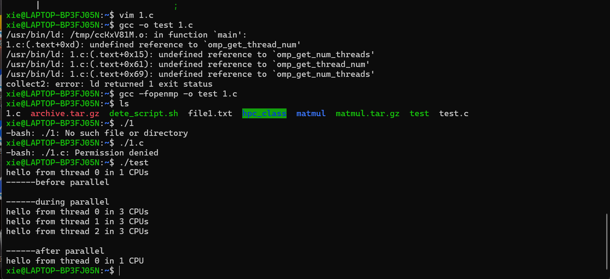

## 常用概念
#### 什么是并发？
并发性是指两个或多个事件在同一时间间隔内发生，其实质是物理CPU在若干程序之间多路
复用，并发性是对有限物理资源强制行使多用户共享以提高效率。
#### 什么是并行？
并行性是指两个或多个事件在同一时刻发生，在多个程序环境下，并行性使得多个程序同一时刻在可在不同CPU上同时执行。
#### 并行计算
是指同时使用多种计算资源解决计算问题的过程，是提高计算速度和处理能力的一种有效手段。
分为：时间上的并行和空间上的并行
#### 进程概念
广义：具有一定独立功能的程序关于某个数据集合上的一次运行活动，是系统进行资源分配和调度的一个独立单位
侠义：进程是正在运行的程序实例
#### 线程概念
是操作系统能够进行调度的最小单位。被包含在进程之中，是进程中的实际运作单位。一条线程指的是进程中单一顺序的控制流，一个人进程中可以并发多个线程，每条线程并发执行不同的任务。线程是独立调度和分派的基本单位。一个进程可以有很多线程，每条线程并行执行不同的任务。同一进程中的多条线程将共享该进程中的全部系统资源。但同一进程中的多条线程有各自的第调用栈，自己的寄存器环境，自己的线程本地存储。
#### 超线程
超线程技术把多线程处理器内部的两个逻辑内核模拟成两个物理芯片，让单个处理器就能使用线程级的并行计算，进而兼容多线程操作系统和软件。

### MPI与OpenMp
它们是并行计算领域中最为流行的编程模型。
- MPI主要针对粗粒级别的并行，主要应用在分布式计算机上，即将任务分配给集群中所有计算机上
- openmp主要针对细粒度的循环进行并行，即在循环中将每次循环分配给不同的线程去执行，主要应用与一台独立的服务器或计算机上。

### openmp的概念
openmp是由主要的计算机硬件和软件厂商共同制定的一种面向共享内存的多CPU多线程并行编程接口（支持的语言：C语言、c++、Fortran语言）

### openmp的特点
1. 编程模型：OpenMP 规范的核心是并行区域和并行共享结构。编程人员通过并行共享指令实现程序结构块的并行化和向量化。
2. 执行模式：OpenMP 对部分循环可采用指令 simd 显式地实现向量化。在并行区域采用的是线程的派生和缩并模式。
3. 数据环境：0penMP规定，在并行区域内，各个子线程拥有各自的私有变量，其他线程不能访问。全部线程均可对共享变量进行读写操作。
4. 线程同步：0penMP主要利用共享结构后的隐式同步来避免数据竞争，利用指令 flush 等显式同步来维护共享数据的一致性，利用 taskwait 、 taskgroup 实现任务的同步完成。
5. 并行计算：采用指令 task 、 taskwait 、 taskgroup 、 taskloop 等实现非规则循环和递归等的并行计算。
6. 异构设备：利用指令 target 、 task 、 taskwait 等实现异构计算。

### openmp由编译指导语句、库函数和环境变量三部分组成
指导思想是将工作划分为多个子任务分配给多个线程，从而实现多核并行处理单一的地址空间

#### 编译指导语句的格式为:
#pragma omp<directive>[clause[[,]clause]...]
- directive部分是编译指导语句的主要指令，用来指导多个CPU共享任务或指导多个CPU同步；
- clause部分是可选的子句，它给出了相应的指令参数，可以影响到编译指导语句的具体执行；
>注意：换行符是必选项。位于被这个指令包围的结构块之前 ，表示这条编译指导语句的终止。

#### 常用的指令如下：
1. parallel:用在一个结构块之前，表示这段代码将被多个线程并行执行；
2. for:用于 for 循环语句之前，表示将循环计算任务分配到多个线程中并行执行，以实现任务分担，但必须保证每次循环之间无数据相关性 
3. sections :用在要被并行执行的代码段之前，用于实现多个结构块语句的任务分担，可并行执行的代码段各自用 section 指令标出（注意区分 sections 和 section )
4. critical :用在一段代码临界区之前，保证每次只有一个 OpenMP 线程进入
5. single :用在并行域内，表示一段只被单个线程执行的代码
6. flush: 保证各个 OpenMP 线程的数据影像的一致性
7. barrier:用于并行域内代码的线程同步，线程执行到 barrier 时要停下等待，直到所有线程都执行到 barrier 时才继续往下执行

#### 常用的子句如下：
1. private ：
指定一个或多个变量在每个线程中都有它自己的私有副本
2. shared :
指定一个或多个变量为多个线程间的共享变量
3. default :
用来指定并行域内的变量的使用方式，缺省是 shared 
4. firstprivate: 
指定一个或多个变量在每个线程都有它自己的私有副本，并且私有变量要在进入并行域或任务分担域时，继承主线程中的同名变量的值作为初值
5. lastprivate :
是用来指定将线程中的一个或多个私有变量的值在并行处理结束后复制到主线程中的同名变量中，负责拷贝的线程是 for 或 sections 任务分担中的最后一个线程
6. reduction:
用来指定一个或多个变量是私有的，并且在并行处理结束后这些变量要执行指定的归约运算，并将结果返回给主线程同名变量
7. copyin :
用来指定一个 threadprivate 类型的变量需要用主线程同名变量进行初始化

#### openmp头文件/库函数
1. 在Linux系统中使用C/C++编译器时，要包含头文件:#include<omp.h>
2. OpenMP 提供的库函数可分为三种：运行时环境函数、锁函数和时间函数。常用的 OpenMP 库函数如下：
- omp _ in _ parallel：判断当前是否在并行域中
- omp _ set _ num _ threads： 设置后续并行域中的线程数量
- omp _ get _ num _ procs： 返回计算系统中处理器的个数
- omp _ get _ num _ threads： 返回当前并行域中的线程数
- omp _ get _ thread _ num：返回当前的线程号（0~线程数-1）
- omp _ get _ max _ threads ：返回当前并行域中可用的最大线程数
- omp _ get _ dynamic： 判断是否支持动态改变线程数量
- omp _ set _ dynamic：启用或关闭线程数量的动态改变
- omp _ init _ lock： 初始化一个简单锁
- omp _ set _ lock ：给一个简单锁上锁
- omp _ unset _ lock： 给一个简单锁解锁
- omp _ destroy _ lock：关闭一个锁并释放内存
- omp _ get _ wtime：相对于某个任意参考时刻而言已经经历的时间

#### 变量作用域
- 共享变量：所有线程共同有的变量
- 私有变量：个别线程拥有的变量

#### private子句
格式：private(变量列表)
作用：将一个或多个变量声明为线程的私有变量。每个线程都它自己的变量私有副本，其它线程无法访问。即使在并行区域外有同名的共享变量 ，共享变量在并行区域内也不起任何作用，并且并行区域内不会操作到外面的共享变量

#### shared子句
- 格式：shared(变量列表)
- 作用：将变量列表中一个或多个变量声明为线程组中子线程共享的变量。所谓变量共享，是指在一个并行区域的线程组内，所有线程只拥有该变量的一个内存地址，所有线程对共享变量的访问即是对同一地址的访问。

#### default子句
- 格式：default（shared|none）
- 作用：default子句用来控制并行区域内变量的共享属性，取值为shared或none，指定为shared表示在没有显示指定访问权限时，传入并行区域的变量访问权限为shared;指定为none意味着必须显示地为这些变量指定访问权限

#### reduction 0
- 格式:reduction(运算符；变量列表)
- 作用：可以对前后有依赖的循环进行规约操作的并行化，每个线程将创建参数的一个副本，在运算结束时，将各线程的副本进行指定的操作，操作的结果赋值给原始的参数。出现在变量列表中的变量是一个标量，其变量属性是私有变量，但它们不能同时出现在所在并行区域的private子句中。
