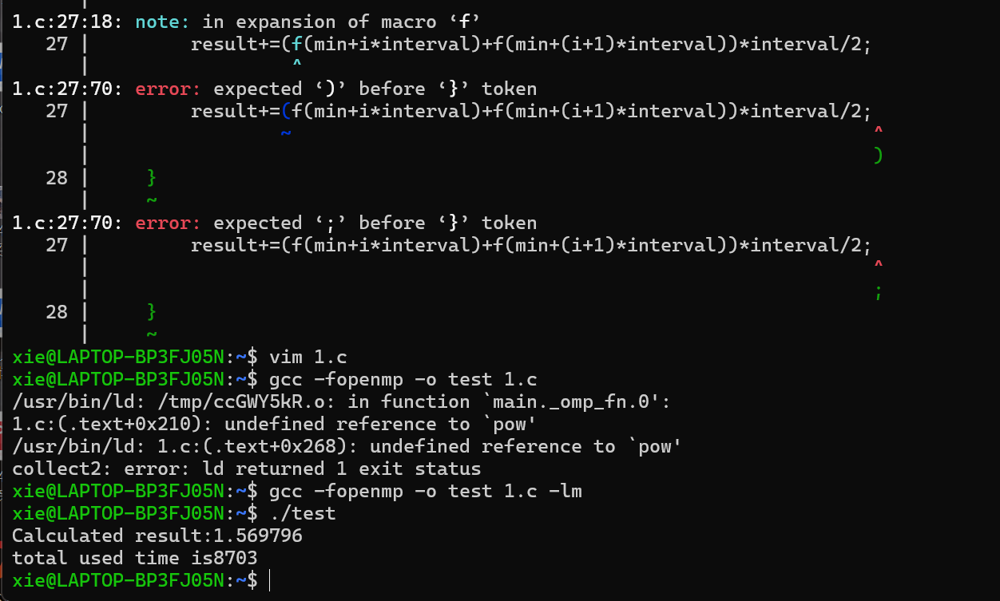
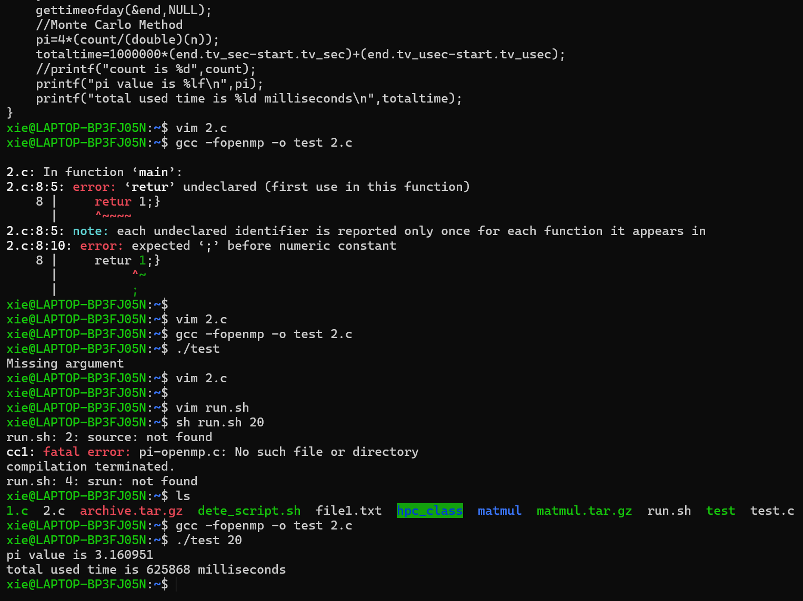

### 常用指令详解及代码展示
#### for循环并行：parallel for 
1. 指令 for 表示接下来的循环将被并行执行：前提是此区域已经被指令 parallel 初始化，否则以行的方式执行。
2. 利用 parallel 指令将 N 次循环置于并行区域内。
3. 利用 for 指令将 N 次循环进行任务分配。
4. 每个线程各自负责其中一部分循环工作，需要保证循环之间数据的独立性。
#### 嵌套循环
嵌套循环，又称多重循环，是指在一个循环体内包含有另外的循环体。将编译指导语句 parallel for 置于循环之前，就可实现对最近的循环语句进行并行化。
```c
 for {
        for{
        }
 }
```
#### 数据竞争
数据竞争是在parallel区域由两个以上的线程对相同的共享变量同时进行写操作而引起的。
```c
for(i=0;i<100:i++)
{
    a[i]=a[i]+a[i+1]
}
```
#### collapse :
嵌套循环中， collapse 可以使代码在不嵌套并行的情况下对多重循环进行并行。具体功能为将一个多重循环合并后，展开成为一个更大的循环，从而增加在线程组上划分调度的循环总数。
```c
# pragma omp parallel for collapse (2) shared ( a , b , c , M , N , P ) private ( j )
 for ( int i =0; i < M ; i ++)
 for ( int k =0; k < P ; k ++)
 for ( int j =0; j < N ; j ++)
 c [ i , k ]= c [ i , k ]+ a [ i , j ]* b [ j + k ];
```
#### 分段并行：
分段并行（ sections ）主要用于非循环的代码并行。若不同子任务之间不存在相互依赖的关系，可以将他们分配给不同的线程去执行。
```c
语法：
# pragma omp sections [ private firstprivate lastprivate reduction nowait ]
{
# pragma omp section section 
结构块
# pragma omp section  section 
结构块
}
```
#### Single 
1. 需要注意的是，在 single 后面会有一个隐含的栅障，因此在 single 部分执行期间，其他线程处于空闲状态。
2. single 只能由一个线程来执行，但是并不要求主线程。
3. 不执行的其余线程会在 single 结束后同步，如果指令存在 nowait ,则不执行 single 的其余线程可以直接越过 single 结构向下执行。
```c
# pragma omp single [ private firstprivate copyprivate nowait ]
{
结构块
}
```
> copyprivate 也是常用的一个子句，将线程里的私有变量在结构结束时广播给同一线程组的其余线程。

#### 私有变量的声明- private 
1. 子句 private 可以将变量列表里的变量声明为线程组中子线程的私有变量，然后指定每个线程都有这些变量的私有副本。
2. 并行区域内每个线程只能访问自己的私有副本，无法访问其他线程的私有副本。
```c++
 int i =100;
 float a =111.11:
 omp _ set _ num _ threads (4);
# pragma omp parallel private ( i , a )
{
 i = i +1;
 print ( thread number , i , a );
}
 print i 
```
> 在并行区域内，当完成对子线程私有变量的计算后， lastprivate 可以将它的值传递给并行区域外的原始变量。
```c
 int i =0;
 float a =111.11;
# pragma omp parallel {
# pragma omp sections lastprivate ( i ) private ( a ){
# pragma omp section {
 i = i + omp _ get _ thread _ num (;
 print ( i )
# pragma omp section {
原始变量 i :1
 i = i + omp _ get _ thread _ num ();
 print ( i )
}}}
 print ( i )
```
#### 规约操作
1. 写代码时，经常会遇到需要累加求和、求差、求积等运算操作，这类操作被称为规约操作 reduction 为进行规约操作的子句。 reduction 支持的运算如下

|运算类别|运算符|初始值|
|------|------|------|
|加|+|0|
|减|-|0|
|乘|*|0|
|逻辑 AND| &&|1|
|逻辑 OR |\|\||0|
|最大值|max|尽量小的负数|
|最小值|min| 尽量大的正数|
|按位 AND| &|所有位均为1|
|按位 OR |\||0|
|按位 XOR| ^|0|

#### reduction 的运行过程：
1. 并行区域开始时，将 reduction 子句变量列表中的变量定义为私有变量，并创建副本以及初始化。
2. 在并行过程中，各子线程通过指定的运算符进行规约计算，不断更新各子线程的私有变量副本。
3. 在并行区域结束的时候，将各子线程的私有变量通过指定的运算符进行规约计算，更新原始变量。
4. 由主线程将 reduction 子句变量带出并行区域。
```c
 int a =100;
 int i =0;
 omp _ set _ num _ threads (4);
# pragma omp parallel for reduction (+: a )
 for ( i =0; i <4; i ++){
 a += i ;
 printf ("% d % d \ n ", omp _ get _ thread _ num (), a );
 printf ("% d \ n ", a );
```

### 实例
#### 梯形积分法的并行化
1. 计算步骤：
- 求出单个梯形的面积
- 将所有梯形面积求和
2. 可调整的参数
- 分成多少个梯形
- 使用多少线程
```c
# define f(x) (1.0/(1.0+pow(x,2.0)))
# include<math.h>
# include<sys/time.h>
#include<stdio.h>

 int main (){
    // number of threads
    int thread_number=20;
    // interval Lower boandary of the function
    float min=0;
    // interval upper boundary of the function
    float max=1000;
    double result=0;
    double interval=0;
    int step=1e5;
    int i;
    //caLculatetheinterval of steps
    interval=(max-min)/step;
    // timer
    struct timeval start,end;
    long totaltime=0;
    gettimeofday(&start,NULL);
    // openmp
    # pragma omp parallel for reduction (+:result) num_threads(thread_number)
    for(i=0;i<step;i++){
        // calculate area
        result+=(f(min+i*interval)+f(min+(i+1)*interval))*interval/2;
    }
    gettimeofday(&end,NULL);
    totaltime=1000000*(end.tv_sec-start.tv_sec)+(end.tv_usec-start.tv_usec);
    printf("Calculated result:%1f\n",result);
    printf("total used time is%ld\n",totaltime);
}
```

#### 蒙特卡洛法进行Π值估计
一个正方形内部相切一个圆，圆和正方形的面积之比是Π/4.在这个正方形内部，随机产生n个点（这些点服从均均匀分布），计算它们与中心点的距离是否大于圆的半径，以此判断是否落在圆的内部。统计圆内的点数，与n的比值乘以4，就是Π的值，理论上，n越大，计算的Π值越准。
```c
#include<stdio.h>
#include<stdlib.h>
#include<time.h>
#include<sys/time.h>
#include<omp.h>
int main(int argc,char*argv[]){
    //threaad numbers
    int tn=atoi(argv[1]);
    int i=0;
    //counter
    int count=0;
    //pi value
    double pi=0;
    //x-coordinates
    double x=0;
    //y-coordinates
    double y=0;
    //sample size
    int n=1e9;
    //timer
    struct timeval start,end;
    long totaltime=0;
    gettimeofday(&start,NULL);
    //satrt openmp
    #pragma omp parallel num_threads(tn)
    {
        unsigned seed=time(NULL);
        #pragma omp for reduction(+:count) private(x,y)
        for(i=0;i<n;i+=1){
            //random generation of x and y
            x=rand_r(&seed)/(double)(RAND_MAX);
            y=rand_r(&seed)/(double)(RAND_MAX);
            //id the coordinate falls in the circle.counter +1
            if((x*y)+(y*y)<1){
                count++;
            }
        }
    }
    gettimeofday(&end,NULL);
    //Monte Carlo Method
    pi=4*(count/(double)(n));
    totaltime=1000000*(end.tv_sec-strat.tv_sec)+(end.tv_usec-start.tv_usec);
    //printf("count is %d",count);
    printf("pi value is %lf\n",pi);
    printf("total used time is %ld milliseconds\n",totaltime);
}
```
